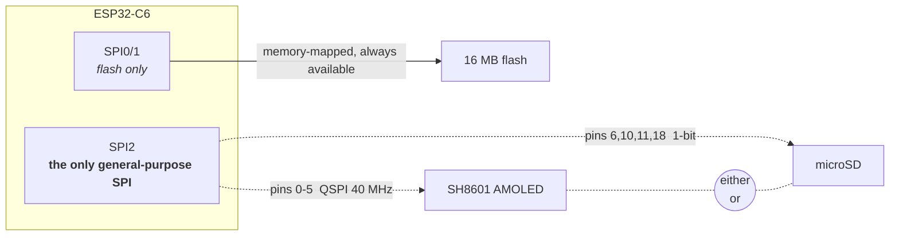
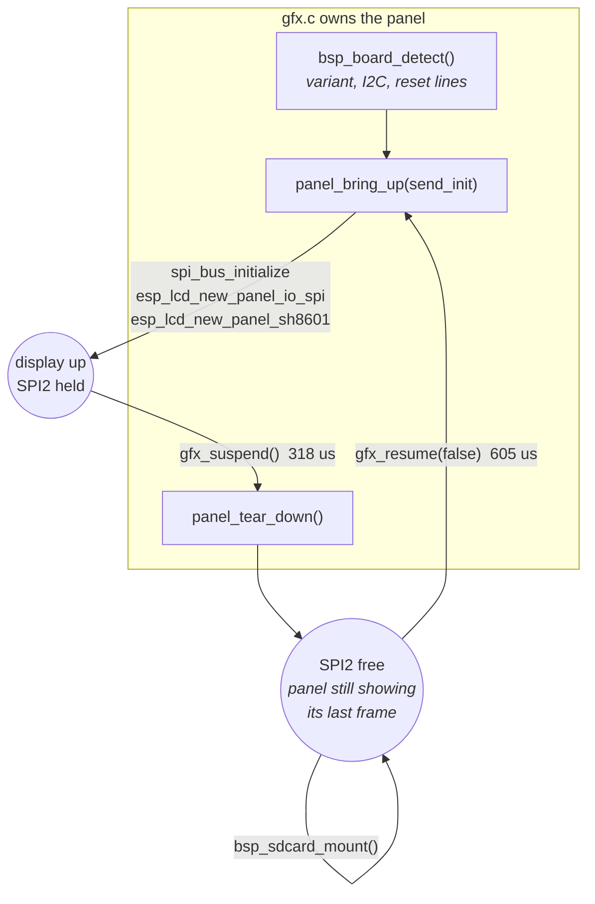

# ESP32-C6-Touch-AMOLED-1.8 — Platform Notes

Working notes for the Waveshare ESP32-C6-Touch-AMOLED-1.8. Everything here was
verified on the actual board or read out of the actual source — nothing is
copied from a spec sheet unless it is marked as such. Numbers come from boot
logs and `esp_timer` measurements taken in this repo.

Living document: correct it when the hardware disagrees with it.

---

## The board

Reported by the BSP at boot rather than assumed:

| Property | Value |
|---|---|
| Variant | **V1** — SH8601 display + FT5x06 touch |
| Display | 368 × 448, QSPI, RGB565 |
| Touch / peripheral I2C | port 0, SDA GPIO 8, SCL GPIO 7 |
| Flash | 16 MB |
| PSRAM | **none** |
| CPU | single core @ 160 MHz (`SOC_CPU_CORES_NUM 1`) |

### Hardware inventory

Everything on the board, and how to tell it is alive. The POST that ships in
the firmware probes each of these at boot and prints exactly this table — see
`main/post.c`.

| Peripheral | Part | Where | Notes |
|---|---|---|---|
| Display | SH8601 (V1) / CO5300 (V2) | QSPI, pins 0–5 | 368×448 RGB565, 40 MHz |
| Touch | FT5x06 (V1) / CST820 (V2) | I2C `0x38` / `0x15` | which address answers identifies the board revision |
| IO expander | TCA9554 | I2C `0x20` | drives display and touch reset lines |
| Power management | AXP2101 | I2C `0x34` | battery charging; the PWR button goes through it |
| IMU | QMI8658 | I2C `0x6b` | accelerometer + gyroscope; driver in `main/imu.c`, axes below |
| Real-time clock | PCF85063 | I2C `0x51` | |
| Audio codec | ES8311 | I2C, I2S pins 19–23 | speaker + mic; amp enable on expander pin 7 |
| microSD | — | SPI2, pins 6/10/11/18 | shares SPI2 with the display; see [time-multiplexing](#time-multiplexing-the-bus--the-actual-workaround) |
| Flash | — | SPI0/1 | 16 MB, memory-mapped, never contended |
| PSRAM | — | — | **none** — the constraint behind most decisions here |
| Wi-Fi 6 / BLE 5 / 802.15.4 | on-die | — | radios present; Thread and Zigbee capable |
| BOOT button | — | GPIO 9, pull-up | active low, bounces; also the flashing button |
| PWR button | via AXP2101 | I2C `0x34` | not wired to the SoC at all — see below |
| Temperature sensor | on-die | — | reads ~31 °C idle |

All the I2C parts share one bus (port 0, SDA 8, SCL 7), so a single probe per
address establishes whether each is addressable. That is the cheapest possible
health check and what the POST is built on.

Both awkward peripherals are genuinely tested rather than assumed:

- **SD card** — at boot, probed *before* `gfx_init()`, in the window where SPI2
  is still free. A re-run instead suspends the display and takes the bus, which
  costs under a millisecond. Either way it is a real mount, not an assumption. An
  absent card is reported as optional rather than failing the board. Doing this
  after the display is up would mean dismantling a running panel.
- **Audio codec** — the ES8311 sits behind the power-amp enable on the IO
  expander, so POST raises that rail before probing (and lowers it again).
  Probing without it reports a working codec as missing. Note the datasheet
  address 0x30 is 8-bit; I2C wants the 7-bit `0x18`.

There is a V2 of this board (CO5300 + CST820). The BSP auto-detects which one
it is by probing the touch controller's I2C address — CST816S at `0x15` means
V2, FT5x06 at `0x38` means V1. Always go through `bsp_board_detect()` rather
than hardcoding a driver.

Note the CO5300 (V2) needs an X-offset of `0x10` that the SH8601 (V1) does not.
The BSP applies it via `esp_lcd_panel_set_gap()`, so code that drives the panel
directly should not add its own.

---

## Memory — the constraint that shapes everything

There is no PSRAM. The entire budget is internal SRAM:

| Configuration | Free heap at startup |
|---|---|
| Raw panel access (`bsp_display_new`) | **~424 KiB** |
| With LVGL started (`bsp_display_start`) | ~357 KiB |

LVGL costs roughly **67 KiB** before you allocate anything of your own. If you
are not using its widgets, `bsp_display_new()` gives you the panel without it.

### What fits

| Buffer | Size | Verdict |
|---|---|---|
| Full-screen RGB565 framebuffer | 322 KiB | fits, ~109 KiB left over |
| Full-screen RGBA8 + float32 depth | ~1.3 MB | **3× more than the chip has** |
| One 64-row RGB565 strip | 46 KiB | trivial |

The second row is why a conventional software rasterizer does not work here.
`swrast` allocates colour *and* depth at 8 bytes/pixel and cannot be talked out
of it. `small3dlib` avoids both costs — it owns no framebuffer (it hands each
pixel to a callback) and with `S3L_Z_BUFFER 0` keeps no depth buffer, resolving
visibility by sorting triangles back-to-front instead. That is what makes a
real full-screen framebuffer affordable.

Sorted visibility is not pixel-exact — it cannot resolve intersecting geometry
— but for convex solids it is correct.

### Task stacks are not the heap

FreeRTOS gives each task its own small fixed stack, a few KiB. A large local
variable silently overruns it. This cost us a boot loop:

```
Guru Meditation Error: Core 0 panic'ed (Stack protection fault).
Detected in task "main" at 0x4200b2f8
--- app_main at <file>:23
```

Line 23 was the *opening brace* of `app_main` — a rasterizer context of roughly
5 KiB had been declared as a stack local. Anything that size must be
`malloc`'d. Note the panic points at the function's entry, not at any statement
inside it, which is the signature of blowing the stack on frame setup.

Also worth knowing: the AMOLED retains its last frame in its own GRAM, so a
crash-looping app shows a stale image rather than going black. A frozen picture
is not evidence the firmware is alive.

---

## Storage

### Flash — usable during rendering

Flash sits on its own bus (SPI0/1) and does not contend with the display. It is
memory-mapped via `esp_partition_mmap()`, so it reads like a normal array with
no I/O calls.

Current partition use is `nvs` + `phy_init` + 3 MB app ≈ 3.1 MB of 16 MB,
leaving **~12.8 MB** for a data partition. For scale, a 256×256 RGB565 texture
is 128 KB — about 100 of them at zero RAM cost.

Caveat: mapped reads go through the CPU cache. Sequential access is fast,
random access thrashes. For texture sampling that argues for a tiled/swizzled
layout rather than row-major — the same reason GPUs store textures tiled.

### SD card — not while the display holds the bus

The BSP refuses outright:

```c
if (lcd_spi_initialized || panel_handle != NULL) {
    ESP_LOGE(TAG, "Display and SD card cannot share SPI2 at the same time");
    return ESP_ERR_INVALID_STATE;
}
```

That guard is about *its* panel, though, not the hardware. `gfx.c` brings the
panel up itself rather than calling `bsp_display_new()`, so those statics stay
false and the guard never trips — which is what makes the time-multiplexing
below possible. See [Owning panel bring-up](#owning-panel-bring-up).

**This is a board wiring decision, not a chip limitation** — worth being precise
about, because sharing one SPI bus between a display and an SD card is
completely standard and Espressif
[documents it officially](https://docs.espressif.com/projects/esp-idf/en/stable/esp32/api-reference/peripherals/sdspi_share.html).
On boards that do it, the two devices sit on the *same wires* with separate CS
lines and take turns microseconds apart, with no visible effect.

It does not work here because they are wired to entirely separate pin sets:

| | CS | CLK | Data |
|---|---|---|---|
| Display | 5 | 0 | 1, 2, 3, 4 (QSPI, 4 lanes @ 40 MHz) |
| SD | 6 | 11 | MOSI 10, MISO 18 |

Espressif's guide is explicit that all devices must share the same
MOSI/MISO/SCLK pins. Combined with the C6 having exactly one general-purpose
SPI controller (`SOC_SPI_PERIPH_NUM 2` = SPI1-flash + SPI2) and **no SDMMC host
peripheral at all**, the two cannot run concurrently.



The dashed pair is the whole problem. One controller can be bound to one pin
mapping at a time, and Waveshare wired the two devices to different pins — so
switching devices means tearing down and re-initialising the bus, not just
asserting a different chip select. On a board that shared the wires (the common
case) both would work concurrently with no visible effect.

Flash, by contrast, sits on its own controller and is never in contention,
which is why it is the viable option for streaming data while rendering.

Waveshare presumably chose this deliberately: hanging an SD card on the
display's lines adds AC loading, which the same guide warns can prevent pins
toggling fast enough to hold 40 MHz timing. Display bandwidth won.

Multi-threading does not help. The obstacle is one peripheral that can only be
bound to one pin mapping at a time — two tasks would just queue on a mutex
around the same hardware.

### Time-multiplexing the bus — the actual workaround

Because the panel self-refreshes from GRAM, the MCU can stop talking to it and
the picture persists. So during SD access the screen shows a **frozen frame,
not black**.

This is implemented and measured. `gfx_suspend()` releases the panel, the IO
handle and the SPI bus; `gfx_resume(false)` rebuilds them *without* re-sending
the panel init sequence, because the SH8601 keeps its registers while powered.
The Diagnostics app does a full round trip on every entry.

Measured on hardware, six consecutive runs, ±15 µs:

| Step | Cost |
|---|---|
| `gfx_suspend()` — panel + IO + bus teardown | **318 µs** |
| SD probe (no card — the failure path, which times out) | 26.7 ms |
| `gfx_resume(false)` — rebuild, no init sequence | **605 µs** |
| **Display round trip** (suspend + resume) | **~0.92 ms** |

The earlier estimate of "single-digit milliseconds" was pessimistic by an order
of magnitude. The display cost is **sub-millisecond** — under 4% of one 25 ms
frame at 40 fps, small enough to disappear into a frame's slack.

Skipping the init sequence is exactly why this is cheap, and the gap is far
wider than the datasheet suggests. Measured by calling `gfx_resume(true)`
instead:

| | Cost |
|---|---|
| `gfx_resume(false)` — reattach only | **715 µs** |
| `gfx_resume(true)` — full init sequence | **230 ms** |

**321× more expensive.** The `0x11` sleep-out settle accounts for only 120 ms of
that; the rest is the remaining commands' own delays plus QSPI transaction
overhead. So pass `full_init = true` only if the panel actually lost power —
`suite_gfx.c` has a regression test that fails if anyone reintroduces it.

Note also what dominates: the SD layer, not the display, by a factor of thirty.
So budget the *card* access, not the switch.

| Use case | Verdict |
|---|---|
| Audio playback (128 kbps MP3 = 16 KB/s, 32 KB chunks → one switch per ~2 s) | comfortably viable |
| Level / asset loading between scenes | viable |
| Per-frame texture streaming | marginal — but the switch is not what makes it so |

Two things the frozen frame does cost you: no animation and no touch feedback
for the duration. Under a millisecond that is invisible; across a 27 ms card
access it is one dropped frame.

One ordering constraint if you build this: mount the SD **before** any other
SPI traffic. Once a card enters SPI mode it stays there until power-cycled, and
may otherwise respond randomly to bus activity.

### SD capacity limits

ESP-IDF's bundled FatFs has `FF_FS_EXFAT 0` — exFAT is compiled out.

- **≤ 32 GB** — ships FAT32, works as-is
- **> 32 GB** — ships exFAT, **will not mount**; reformat to FAT32 and it works
  (FAT32 + 32-bit LBA covers up to 2 TB)

Two more gotchas: `CONFIG_FATFS_LFN_NONE=y` means **8.3 filenames only**
(`TEXTURE.BIN` fine, `cube_texture_hi.bin` not), and SDSPI runs at
`SDMMC_FREQ_DEFAULT` = 20 MHz over 1-bit SPI, so expect ~1–2 MB/s.

---

## Owning panel bring-up

`gfx.c` does not call `bsp_display_new()`. It initialises SPI2, the panel IO and
the SH8601 itself, keeping `bsp_board_detect()` only for variant detection and
the reset lines on the IO expander.

That is not a preference. The BSP holds `panel_handle`, `io_handle` and
`lcd_spi_initialized` as private statics and offers **no teardown** — they are
cleaned up only on its own internal failure path. Since `bsp_sdcard_mount()`
gates on exactly those, a BSP-owned display can never give the bus back, and
the card becomes untestable the moment the screen comes up.

Owning bring-up costs one thing: Waveshare's `sh8601_lcd_init_cmds` array is a
private static too. It is nine commands, Apache-2.0, and is copied into `gfx.c`
with attribution — the driver's built-in defaults are *not* a substitute, since
Waveshare tuned `0x44`/`0x53`/`0x51` for this panel.



The framebuffer is untouched by all of this — it is ordinary RAM and has no
relationship to the bus, so nothing needs redrawing on resume.

One rule: nothing may call `gfx_present()` between suspend and resume. Today
that is guaranteed structurally, because the only caller is the shell's frame
loop and the re-run happens inside it, on the same task.

---

## Driving the panel directly

Going below LVGL means taking on four things it was doing for you. All four
fail *silently* — wrong output rather than an error.

**1. `esp_lcd_panel_draw_bitmap()` is asynchronous.** It queues a DMA transfer
that reads out of the buffer you passed. Touching that memory before the
transfer completes shreds the image: the CPU's fill and the DMA's read race
each other down the buffer, so only a narrow band of real content survives per
strip. Symptom looked like "two thin lines waving". Register
`on_color_trans_done` and wait for it.

**2. The completion semaphore must be counting, not binary.** A whole frame's
strips get queued before any is awaited, so several finish first. A binary
semaphore saturates at one and discards the rest — the second `take` blocks
forever. Symptom: clean boot log that stops dead after the last setup line.

**3. RGB565 must be byte-swapped.** `esp_lvgl_port` sets `swap_bytes = true`
for this panel; driving it directly you do it yourself.

**4. Coordinates want 2-pixel alignment.** The BSP installs a rounder callback
for LVGL that snaps areas to even boundaries. Full-width strips at multiples of
64 rows satisfy this naturally.

---

## Touch input

Three separate traps, and like the panel ones they all fail quietly — the
screen simply feels broken rather than reporting anything.

**1. The FT5x06 NACKs register reads while idle.** Polling it unconditionally
produces a failed I2C transaction every time, and each failure costs a bus
timeout. Doing that once per frame stalled the whole loop from 25 fps to
roughly 0.3 fps, with the console filling with:

```
lcd_panel.io.i2c: panel_io_i2c_rx_buffer(149): i2c transaction failed
FT5x06: esp_lcd_touch_ft5x06_read_data(186): I2C read error!
```

Gate reads on the INT line (GPIO 15, active low). That is what it is for.

**2. INT means "data ready", not "finger down".** It drops briefly mid-touch,
so treating every deassertion as a release makes a held finger flicker between
pressed and released. Require a quiet period — 60 ms works — before declaring
the finger gone.

**3. microui encodes a mouse's interaction model, and touch cannot satisfy
it.** This is the subtle one. `mu_update_control()` only establishes hover on a
frame where the button is *not* held, and a control only submits once it has
focus:

```c
if (mouseover && !ctx->mouse_down) { ctx->hover = id; }
if (ctx->hover == id) { if (ctx->mouse_pressed) { mu_set_focus(ctx, id); } }
```

That is "point at it, then click" — hover on one frame, press on the next. A
touchscreen never produces the first half, because the pointer does not exist
until a finger is already down. Send move and press together and hover is never
set, focus is never taken, and the control never fires.

The fix is to synthesise the missing frame: on a press deliver only the
position, and let the button-down land on the following frame. That costs one
frame of latency (~40 ms, imperceptible) and makes taps reliable.

Worth knowing because it is not specific to buttons — every microui control
resolves interaction through `mu_update_control()`, so anything that reacts to
a press has the same requirement.

The symptom, before the fix, was that a deliberate press of roughly 120 ms
worked while a quick tap did nothing. It "worked" only because the flickering
INT line from trap 2 occasionally faked a not-down frame between two down
frames — one bug accidentally papering over another.

**Sampling rate matters too.** Reading touch once per rendered frame is too
coarse: a frame is ~40 ms here (the blit alone is 25 ms) and a quick tap can be
shorter than that, so taps fall between samples entirely. Poll on a separate
task — 100 Hz is plenty and costs nothing next to rendering — and latch the
press/release edges so an event that happens wholly between two frames is still
delivered to the next one.

**On targets and gestures.** A small back button is fine to aim at with a mouse
and miserable with a fingertip. A swipe up from the bottom edge — what the
board's stock firmware used — has no target to miss, cannot be triggered
accidentally mid-app, and leaves the app the whole screen. Trigger it partway
through the swipe rather than on release, or it feels sluggish.

---

## Measured performance

Full-screen 368×448, Gouraud-shaded rotating cube, `small3dlib`, no PSRAM, no
GPU:

| Stage | Time | Share |
|---|---|---|
| Clear (32-bit fill) | 5.2 ms | 10% |
| Rasterize | 28.1 ms | 48% |
| Blit (QSPI DMA) | 25.0 ms | 41% |
| **Total** | **~59 ms → 15.5 fps** | |

The blit works out to ~13 MB/s effective over QSPI at 40 MHz.

Those cube figures predate two changes and are kept as a record of the starting
point: the build now uses -O2 rather than -Og, and the QSPI clock is 80 MHz
rather than 40, which roughly halves the blit row. See below.

Two results worth remembering because they contradict the intuitive guess:

- **Double-buffering the strips changed nothing** (11.1 → 10.7 fps). DMA was
  never the bottleneck.
- **Tiled rendering was *slower* than one full-screen pass** (10.7 → 15.5 fps).
  Rasterizing the scene once per strip meant doing it seven times per frame;
  the discarded-pixel path was cheap, but not free.

### The IMU's axes do not match the screen's

`main/imu.c` drives the QMI8658 (WHO_AM_I `0x05` at `0x6b`), configured for
+/-8 g and +/-512 dps, which is where 4096 counts per g and 64 counts per dps
come from. All six axes come from one twelve-byte burst read at `0x35` - worth
doing as one transfer, because reading them separately can straddle a sample
update and produce a vector that never physically existed.

How the chip is soldered relative to the panel is a board fact no datasheet can
tell you, and the obvious guess is wrong here:

| Screen direction | Sensor axis |
|---|---|
| down (+y) | `+ax` |
| right (+x) | `-ay` |

Mapping X to X and Y to Y makes the sand fall sideways. Determined by tilting
the board and watching which way it went; the mapping lives in two macros at
the top of `main/apps/sand/app_sand.c`.

One more distinction that is easy to get wrong: the **accelerometer** senses
gravity, so it is what tilting changes and what tells you which way is down.
The **gyroscope** senses rotation *rate*, which is zero however far the board is
tilted as long as it is held still - it tells you the board is being shaken or
spun, nothing about orientation.

### The two buttons are not the same kind of device

Worth separating, because a single "read the button" abstraction over them
would be a lie.

**BOOT** is a plain GPIO — pin 9, pulled up, shorted to ground when pressed, so
low means down. It is a *level*, and being a mechanical contact it bounces on
both make and break: read naively, one press becomes several. `button_fsm.c`
debounces it (pure, host-tested, 25 ms) into press and release edges.

**PWR is not connected to the SoC.** It goes to the AXP2101 power-management
chip, so there is no pin to read. The PMU debounces in hardware and latches a
completed *event* in an interrupt-status register, which has to be fetched over
the shared I2C bus and then cleared. It is an event, not a level — reporting a
`down` state for it would be fiction.

The registers, from the X-Powers datasheet:

| | |
|---|---|
| Enable | `0x41` (INTEN2), bit 3 = power key short press |
| Status | `0x49` (INTSTS2), same bit |
| Clear | write a **one** back to the bit |

Two traps in that. Clearing is write-one, not write-zero — the intuitive
"write 0 to clear" leaves the flag set and the button appears stuck down
forever. And clearing with `0xFF` would wipe every other latched event
(charging, battery insertion) that something else may care about, so clear only
the bit you consumed.

A **long** press is the PMU's own power-off. That is hardware and firmware
cannot override it.

Both arrive through `input_t` alongside touch, so an app never polls anything
itself. Polling runs at 50 Hz in its own task, deliberately decoupled from the
render loop — which now reaches 1000 fps and would hammer the shared I2C bus if
it read the PMU per frame.

### Raw sensor readings feel rigid, and it is not the sensor's fault

Feeding raw accelerometer output straight into anything feels bad, in two
distinct ways that need two distinct fixes. Worth separating, because fixing
only one leaves it feeling broken in the other.

**Noise and abruptness.** The sensor reports a few hundred counts of jitter on
a board sitting still, and a real tilt arrives as a step change. The fix is an
exponential moving average - a lerp toward the reading rather than a jump to it
(`main/apps/sand/tilt.c`). Two details matter more than the lerp:

- Define it by a **time constant**, not a per-frame fraction. "Move 10% each
  frame" changes meaning the moment the framerate does, and this project's has
  already gone 25 -> 43 -> 70 fps.
- Make it **adaptive using the gyroscope**. Heavy smoothing feels laggy when
  the board is genuinely moving; light smoothing feels noisy when it is not.
  The gyro reports rotation rate, which is near zero whenever the board is held
  still no matter how far it is tilted - so it says exactly when to stop
  smoothing and start tracking. Here the time constant slides from 260 ms when
  still to 40 ms when moving.

  This is the honest reason to read the gyro at all: it answers a question the
  accelerometer structurally cannot.

**Quantisation.** The second cause, and the larger one. Grains move to one of
eight neighbours, so a single simulation step can never express "17 degrees off
vertical" - and snapping to the nearest of eight makes a slow tilt arrive in
45-degree jerks. No amount of filtering helps: the filter output was already
smooth, and the quantiser threw that away.

The fix is to move the quantisation into **time**, where there is room for it.
Pick between the two directions bracketing the true angle each step, weighted by
the angle: at 17 degrees, about 62% of frames fall straight down and 38%
down-right. At 70 fps the eye integrates that into continuous flow. Exactly
dithering a colour ramp, applied to a direction, and it costs one random number
per step rather than per grain.

Getting the weight right needs `atan`, since at 22.5 degrees the component ratio
is 0.414 rather than 0.5. Rajan's approximation covers it in integers to within
a degree.

### Falling sand: what made it fit

The automaton runs a 184x224 grid (a cell per 2x2 pixels - a cell per pixel
would be 165 KB of grid, and the framebuffer has already taken 322 of the
chip's ~424 KB). Worst case is a grid half full of *falling* grains, where every
one attempts a move; a settled pile is far cheaper.

| Change | Step time |
|---|---|
| First working version, -Og | 9035 us |
| -O2 | 6664 us |
| Random number moved off the common path | **2857 us** |

3.2x in total, and the second change was worth more than the compiler.

The trick in the last one is worth remembering. The original drew a random
number for every grain, to decide which way to try sliding - but a grain in
open air just falls, and never needs it. Trying the gravity-ward move *first*
and only reaching for the generator when that fails skips it for almost every
grain. Two supporting changes: the three destination row pointers are computed
once per row instead of once per grain, and the bounds check became a single
unsigned compare.

### The blit is bus-bound, and the clock was half what it could be

The most useful number here. One frame is 322 KiB over four QSPI lanes, and at
40 MHz `gfx_present()` measured **17.6 ms against a theoretical 16.5** - 94% of
the bus's peak. That settles a question worth settling: the blit is *purely*
bandwidth-bound. No amount of CPU optimisation touches it. Only two things can:
send fewer bytes, or clock the bus faster.

The vendor driver defaults to 40 MHz, and `SH8601_PANEL_IO_QSPI_CONFIG` bakes
that in. The panel runs happily at 80:

| | 40 MHz | 80 MHz |
|---|---|---|
| `gfx_present()` | 17,602 us | **9,600 us** |
| Shell framerate | 43.5 fps | **70.0 fps** |

**80 MHz is the ESP32-C6's ceiling** for general-purpose SPI, so this lever is
now fully spent. Set by `GFX_QSPI_HZ` in `gfx.h`.

Be honest about what this is: an **overclock**. 40 MHz is the figure Waveshare
and Espressif validate; 80 is undocumented for this panel and was established by
running it. If a future unit shows tearing, wrong colours or noise, `GFX_QSPI_HZ`
is the first thing to put back.

### Partial updates: only send the bands that changed

With the clock maxed, the only remaining way to make the blit cheaper is to
send fewer bytes. `esp_lcd_panel_draw_bitmap()` takes an arbitrary rectangle and
sets the panel's address window per call, and the panel refreshes from its own
GRAM - so a band that is not sent simply keeps showing what it last received.
Because the framebuffer is full width, a full-width band is already contiguous
and needs no copy.

`gfx` tracks a dirty bit per band (7 bands of 64 rows, so one byte). Measured:

| Frame content | `gfx_present()` |
|---|---|
| Everything changed | 9,880 us |
| One band of seven | 1,406 us |
| Nothing changed | **3 us** |

An idle screen now costs essentially nothing, and the sand app swings between
about 60 fps while pouring and over 200 once the pile settles.

**Nothing had to change in the existing apps.** `gfx_clear()` marks the whole
screen, and the cube, the launcher and the POST report all clear before drawing
- so they were correct without knowing dirty tracking existed. The rule only
bites code writing through `gfx_framebuffer()` directly, which gfx cannot see:
that code must call `gfx_mark_dirty()`, and forgetting shows up as stale pixels
rather than a crash.

Two smaller things fell out of it:

- **Marking must be cheap.** `gfx_text_scaled()` calls `gfx_fill_rect()` once
  per set font pixel, so marking runs thousands of times on a screen of text.
  Routing that through the public entry point, with its re-clipping and call
  overhead, cost about 5% of the launcher's framerate; an inlined helper on the
  already-clipped path fixed it.
- **The launcher does not benefit.** microui is immediate-mode and clears every
  frame by design, so it pays the tracking overhead and gets nothing back -
  about one tick.

On the simulation side the same dirty information answers "what needs
redrawing" as well as "what needs sending", which is the point of the
[dirty-rect approach](https://80.lv/articles/noita-a-game-based-on-falling-sand-simulation)
Noita uses. `sand_track_dirty_rows()` records every row a grain left or entered.

### A variable framerate needs a fixed timestep

Worth writing down, because partial updates *created* this problem.

A grain moves one cell per step, so steps-per-second is literally how fast sand
falls. Stepping once per frame ties that to the framerate - survivable while the
framerate is flat, and not once it swings between 60 and 230 fps depending on
how much is moving. Sand would have fallen fastest when least was happening,
which is exactly backwards.

The fix is the standard accumulator: add the frame's elapsed time to a running
total, run whole fixed-size steps out of it, carry the remainder. Cap the
catch-up, or a long frame schedules extra steps that make the next frame longer
still.

The general lesson: **anything whose rate matters must be driven by elapsed
time, not by frame count.** The tilt filter already was, for the same reason.

### Resting sand was the most expensive thing on screen

Adding a lot of sand dropped the framerate even though most of it was sitting
still - which is backwards, and the profile says why. A settled grain runs the
*whole* decision path every step to conclude nothing: the gravity-ward move
fails, a random number is drawn, its load column is walked, and both slides
fail. A falling grain succeeds on its first attempt and costs a fraction of
that.

Measured on a host, before any sleeping:

| Grid | Cost per step |
|---|---|
| empty | 0.015 ms |
| settled, half full | 0.163 ms |
| settled, screen completely full | 0.323 ms |
| half a screen actively falling | 0.020 ms |

A motionless screen cost **twenty times an empty one**, and sixteen times a
screen of falling sand.

The fix is the [sleeping-chunk idea](https://80.lv/articles/noita-a-game-based-on-falling-sand-simulation)
from Noita, applied per row rather than per chunk - sand settles in horizontal
layers, so rows are the natural grain here and the dirty-row machinery already
existed. A row is skipped once it has been examined with nothing to do, and is
woken again by any movement in it or either neighbour. A grain can only move
one row, so nothing further away can change what it is resting on.

On device, a completely full settled grid now costs **15 us per step**, against
3.9 ms for a screen of falling sand.

**The subtlety that broke the first attempt:** the gravity direction is
dithered, and the two directions it alternates between do not offer the same
moves. Straight down allows the slides (-1,+1) and (+1,+1); down-right allows
(0,+1) and (+1,0), and that last one is purely sideways. A row that had nothing
to do under one direction may well have somewhere to go under the other, so a
single "settled" flag froze grains on a slope. The state has to be one bit per
direction. A test that settles the grid with sleeping on and then re-runs it
with sleeping off, requiring nothing to move, is what caught it.

### Falling sand looked like a falling brick

Every grain in open air took the same move on the same step, so a poured blob
kept its shape all the way down and landed as a blob. Real sand disperses,
because no two grains fall at quite the same rate or in quite the same line.

`sand_set_scatter()` gives a falling grain a small chance of doing something
other than falling straight: either **lagging** a step, which spreads the
stream vertically, or **drifting** to one side, which spreads it horizontally.
Neither invents a move that was not already legal, so it cannot push a grain
through a wall or into another grain.

Two things worth keeping in mind:

- **It is off by default.** Most tests want to say "a grain falls one cell per
  step" and mean it exactly. The randomness is an aesthetic choice, so the app
  makes it rather than the simulation assuming it.
- **A lag must still count as activity.** A grain that *chose* not to move
  looks identical to a settled grain, so without care the sleeping optimisation
  puts its row to sleep and strands it in mid-air for ever. Caught by a test
  that turns scatter up to 200/256 and requires the grain to reach the floor
  anyway; confirmed to go red when the flag is removed.

### Anything with a rate must be driven by elapsed time

A third instance of the same bug, found by the framerate swinging after partial
updates landed. Pouring spawned sand once per **frame**, so holding a finger
down delivered three times as much sand when the screen was quiet as when it
was busy - and the sand arrived faster than the simulation could move it,
piling up under the finger. Now on its own fixed-rate accumulator at 60 Hz.

The list of things that have needed this: the tilt filter's smoothing, the
simulation's step rate, and now the pour rate. The rule is worth stating
plainly - **if it has a rate, drive it from `dt_ms`, never from frame count** -
because each time it has been missed the symptom looked like something else
entirely.

### Still untapped

- Clear only the previous frame's bounding box rather than all 165k pixels.
- Skipping the launcher's redraw when nothing changed, which would let its bands
  go unsent too.

### A note on measurement noise

`sand_step` measured between 3.2 and 3.9 ms across builds that did not touch
that code path at all. The ESP32-C6 runs code from a 32 KB read-only flash
cache, so adding unrelated code shifts the layout and changes the hit rate.
Treat differences under about 20% as noise unless they reproduce, and leave
performance assertions enough margin that they are not a coin toss.

One thing worth being precise about, because it is easy to reach for
instinctively and does not apply on this chip: **there is no data cache in
front of RAM here.** The 32 KB cache above is an *instruction* cache for code
and constants running from flash-mapped `.text`/`.rodata` - it is why the
material table and the colour palette are `const` (see `material.h`), and it
is the whole reason the IRAM finding below measured nothing. The simulation
grid itself lives in DIRAM (plain heap SRAM) with no cache tier above it -
SRAM access already runs at the speed a cache would give on a bigger CPU, so
"lay the grid out for better cache hits" has nothing to bite on here. The only
way to go faster on the RAM side is to touch fewer bytes per step, which is
what the row-sleeping and `ROW_NO_LIQUID` skips already do.

**LP SRAM is not a faster tier either, in case that is ever tempting.**
Checked directly against Espressif's own docs rather than assumed: the 16 KB
LP SRAM region is "slightly slower to access" than regular DIRAM from the
main CPU, and exists for deep-sleep wake stubs, not as a performance
resource. Moving hot data there would be a regression, not a gain - and since
DIRAM sits at ~80% free, there is no capacity pressure to move anything cold
there either.

Two things NOT worth doing, measured or reasoned - true when written, no
longer entirely true for the first one, which is why it is worth restating
rather than deleting:

- ~~Micro-optimising the simulation further. At 3.2 ms worst case, against a
  blit that is usually now under 2 ms, it is the bottleneck only when the
  whole screen is moving.~~ **No longer holds.** That was sand alone, before
  water existed as a material. Measured since: `sand_step` (powder) ~5.5-6 ms
  worst case, but the liquid cross-flow and rebound pass now costs up to
  ~15 ms against its own 16 ms budget - water, not sand, is the actual
  bottleneck whenever a body of it is moving. If more simulation performance
  is worth chasing, that pass is where it is.
- **IRAM placement of the hot loops.** Espressif
  [recommends it](https://docs.espressif.com/projects/esp-idf/en/stable/esp32c6/api-guides/performance/speed.html)
  for hot functions, and the C6 runs code from a 32 KB read-only flash cache so
  it would help something - but not the part of the frame that actually costs.
  Still holds: this is about the *code* cache, unaffected by which function
  in `sand.c` happens to be hottest this month.

### Falling sand needs two kinds of friction, not one

The symptom was a floor of sand skating sideways on the faintest tilt. The
cause was that nothing in the rules distinguished "this grain is being poured"
from "this grain is being dragged".

**The angle of repose** is the one that fixes the reported behaviour. A grain
on a slope stays put until the slope exceeds the friction angle - the block on
an incline, `tan(theta) > mu`. Restated for a candidate move, which descends by
`m . g` and travels across the slope by `|m x g|`, it may only move when

    descent > mu * lateral

with `mu = 0.7`, about 35 degrees, which is dry sand. At zero tilt that permits
a diagonal topple while forbidding a purely sideways shuffle, and sideways only
becomes possible once the board is genuinely tipped. That is the difference
between sand tipping and sand being dragged.

It costs nothing: the test depends only on the direction, so it is evaluated
twice per step rather than per grain.

**Burial** is the second, and is what makes a deep bed behave differently from
a thin one. A grain counts how many grains are stacked against gravity above
it, and each one halves its chance of sliding; past five it cannot slide at
all. Falling is never affected - an unsupported grain drops whatever is on top
of it, which is what unsupported means.

Measured, pouring a bed down a slope well past the friction angle:

| Bed depth | Base ends at (with burial) | (without) |
|---|---|---|
| 4 rows | x = 3.0 | x = 8.1 |
| 1 row | x = 10.0 | x = 10.0 |

Burial moves the deep bed a long way and the thin bed not at all, which is
exactly the distinction it exists to draw.

One subtlety worth keeping. Load must be measured against the NEAREST gravity
direction, not the dithered one. The dithered direction looks up-and-left on
its diagonal steps, which reads empty above a vertical column - so a buried
grain was treated as a free surface grain about one step in eight, which is
more than enough to walk the base of a pile sideways. How much weight rests on
a grain is a property of the pile, not of how a particular frame rounded.

### An accelerometer does not measure gravity

It measures gravity plus whatever else is accelerating the device, and a single
reading cannot separate them. Pick the board up and the reading is mostly the
lift - which is what made the sand lurch sideways whenever it was handled.

The usable half-answer: at rest the magnitude is exactly 1 g. A sample whose
magnitude is far from 1 g is *known* to be contaminated, even though a clean one
cannot be proven honest. Those are ignored and the previous estimate held. Wide
bounds (0.7 g to 1.3 g), because rejecting a good sample costs a few
milliseconds of staleness and accepting a bad one throws sand across the screen.

This is also what makes the gyro-adaptive smoothing sound. Tracking *faster*
while the board moves would be exactly wrong if "moving" meant "being shoved" -
but rotation alone keeps the magnitude at 1 g, so genuine turning stays trusted
while handling fails the magnitude test. The two cases are separated, so
responding quickly to real rotation is safe.

### Rotating is not shaking, and the gyroscope cannot tell you which

These want opposite responses - a turn should be followed, a shake should
fluidise the pile - so telling them apart matters. The obvious sensor is the
wrong one.

Reading "shaken" off the gyroscope means every deliberate turn of the device
registers as a hard shake. In the sand app that unlocked friction *and* made
every grain prefer to slide sideways, so rotating the board threw the sand at
the walls. Logged while a board was merely being held and tilted, a
gyro-derived shake level sat between 160 and 255 out of 255 - effectively
pinned, the whole time.

Shaking means **accelerating** the device back and forth, and that is the
accelerometer's business. A smooth rotation keeps the magnitude at exactly 1 g
however fast it turns; shaking swings it far away. So the shake level is
derived from how far the magnitude departs from 1 g - the same quantity the
trust gate above already computes, read for its size rather than for which side
of a boundary it falls on.

The gyroscope keeps its honest job: saying when the board is genuinely turning,
which is what the filter's time constant responds to. Both sensors are used,
each for the question it can actually answer.

Two things this cost, worth knowing:

- **A rotation test has to preserve magnitude.** Sweeping `(k, ONE_G - k)` is
  not a rotation - it shrinks the vector to 0.71 g in the middle and reads as
  the device being dropped. Built from the 3-4-5 triangle instead, so the
  components stay exact in integers.
- **Shake smoothing must not be conditioned on the position filter priming.**
  A sample violent enough to be shaking is exactly one the trust gate rejects,
  so the position filter may never prime while the board is being shaken -
  tying the two together left the shake level unsmoothed and snapping to zero
  the instant the board was set down.

### A flat device, and why the simulation needs a throttle

Lying on a table, gravity points into the screen and the in-plane component
really is zero. Sand *should* stop - on a level tray it does - but it stopped
between one frame and the next, which reads as a crash rather than as settling.

The cause was not the sensor. **A grain moves one cell per step however strong
gravity is**, so the simulation had exactly two speeds: full and stopped. Sand
poured at the same rate down a 5-degree slope as a vertical one.

`tilt_strength()` supplies the missing dimension - how much of a g lies in the
plane, which is sin of the tilt - and the frame loop scales its step rate by it.
That is the actual physics (a grain on a tray is driven by `g·sin(theta)`), and
it means tipping the device flat brings the sand smoothly to rest.

It also disposes of an ill-conditioning problem quietly. Near flat, the flow
direction is the ratio of two noise values and is meaningless - but it is also
barely used, because the rate approaching zero is precisely what makes it
meaningless.

Free fall is a separate state, and needs the through-screen axis to detect: a
device lying flat and a device in free fall have *identical* in-plane readings,
and only the total magnitude tells them apart. In free fall the estimate is
deliberately held stale, so the flow rate has to be zeroed explicitly rather
than inferred.

Still not modelled: per-grain drag. Grains have no individual velocity, which
would need per-grain memory. Scaling the whole simulation rate covers what it
would have bought, and the catch-up cap (2 steps per frame) is the speed limit
- a grain moves one cell per step, so that cap *is* the maximum distance
anything can travel between two things the eye sees.

### The build was on -Og until it was measured

ESP-IDF defaults `CONFIG_COMPILER_OPTIMIZATION` to **Debug (-Og)**, and this
project sat there without anyone checking. It is the wrong default for a device
whose every frame is rasterising, cellular automata and pixel loops.

Switching to `CONFIG_COMPILER_OPTIMIZATION_PERF` (-O2):

| | -Og | -O2 |
|---|---|---|
| Falling-sand step, 184x224, 10304 grains | 9035 us | **6664 us** |
| `gfx_present()` | 18683 us | 17602 us |
| Display suspend/resume round trip | 730 us | 636 us |
| Shell framerate | 40.0 fps | **43.5 fps** |
| Image size | 0x5c140 | **0x5ae50** |

Faster *and* smaller, which is not the usual trade — -O2 inlines away enough
call overhead to more than pay for what it unrolls. `gfx_present()` barely
moves because it is waiting on DMA, not computing.

Nothing was lost: there is no debugger attached to this board, and the on-device
suite passes identically at either level.

### Release and diagnostics run at the same speed

Worth writing down because the first measurement said otherwise. The shell ran
at **41.7 fps in release and 40.0 fps in diagnostics**, which looks like the
test code costing ~4%. (Those figures are from the -Og era; the conclusion is
unchanged at -O2, only the numbers moved.)

It is not. Release registers one app and diagnostics registers two, so the two
builds were drawing a different number of buttons. Registering `app_cube` twice
in a release build reproduces 40.0 fps exactly — the entire difference is one
microui button.

The suites only ever run at boot; nothing test-related executes in the frame
loop. What the diagnostics build actually costs:

| | Release | Diagnostics |
|---|---|---|
| Shell framerate | 41.7 fps | 41.7 fps (like for like) |
| Boot to ready | 1029 ms | 1696 ms |
| Image size | 0x55f20 | 0x58d10 |

Two things this does expose:

- **One microui button costs about a millisecond.** The shell is not free, and
  the menu gets slower as apps are added.
- **The 1 ms tick quantises everything.** The frame loop ends in `vTaskDelay(1)`
  (`main.c`), so frame time is work rounded up to a whole tick. 24 vs 25 ms is
  one tick, which is why a small difference showed up as a clean 1.7 fps step.
  Any framerate comparison here is quantised to ~1.7 fps near 40 fps — compare
  microseconds of work, not the fps figure.

### There is no graphics acceleration

Verified, not assumed. `SOC_PPA_SUPPORTED` is defined **only for the ESP32-P4**
in ESP-IDF's SoC caps — the C6 has no Pixel Processing Accelerator, no 2D
blitter, no GPU. `esp_lvgl_port` does ship PPA rotation code and hand-written
SIMD blend routines, but the PPA path compiles only when `SOC_PPA_SUPPORTED` is
set, and the SIMD assembly is Xtensa (`_esp32.S`, `_esp32s3.S`), not RISC-V.
Everything on this chip is scalar C on one core.

If graphics throughput ever becomes the requirement, that is a board decision:
the ESP32-P4 has the PPA, PSRAM, *and* a real SDMMC host.

---

## Flashing and recovery

**The chip only accepts auto-reset while an app is actively running.** Once
firmware returns from `app_main` and goes idle, reset signalling stops working
entirely — `Hard resetting via RTS pin` does nothing, esptool reports
`No serial data received`, and manual DTR/RTS pulses produce zero bytes.

This is why the launcher's frame loop never exits, and why its error paths park
in a sleep loop rather than returning from `app_main`: the device has to stay
flashable even when startup fails.

If the board becomes unreachable:

1. Unplug USB-C
2. **Hold BOOT**
3. Plug USB-C back in while still holding
4. Keep holding ~2 s, release

That forces the ROM bootloader regardless of firmware state. Confirm you are in
download mode with:

```bash
esptool.py --chip esp32c6 -p COM3 --before no_reset flash_id
```

Connecting almost instantly (a few dots) means the chip is sitting in the
bootloader.

**After flashing this way, the board will not boot on its own** — `--after
hard_reset` uses the same non-functional RTS reset, so it stays in download
mode, silent, running nothing. **Unplug and replug normally** (no BOOT) to
start the app.

If it vanishes from USB entirely — no COM port, no `VID_303A` device — check
the cable first, then the PWR button: this board's power is managed by an
**AXP2101 PMIC**, so a long press cuts system power.

---

## Toolchain

- **ESP-IDF v5.5+ is required.** The Waveshare BSP declares `idf: ">=5.5"`;
  v5.4 will not resolve it. Both can coexist — they are keyed by `IDF_PATH`.
- BSP component: `waveshare/esp32_c6_touch_amoled_1_8` `^1.0.0`, which pulls 14
  dependencies including `lvgl` 9.5 and the display/touch drivers for *both*
  board variants.
- `sdkconfig.defaults` worth keeping: `CONFIG_ESPTOOLPY_FLASHSIZE_16MB=y` —
  without it the image header says 2 MB and the bootloader warns on every boot.

Console output reaches the USB CDC port because
`CONFIG_ESP_CONSOLE_SECONDARY_USB_SERIAL_JTAG=y`, even though the primary
console is UART0 on GPIO 16/17. The `GPIO 17 and 16 are used as console UART
I/O pins` line in every boot log refers to that primary, and is not evidence
that USB logging is off.

---

## Related

- `docs/Launcher-Architecture.md` — how the shell and its apps are built on
  top of the hardware facts above.
- `docs/Sand-Simulation.md` — the falling-sand app, whose performance
  numbers and memory choices are shaped directly by the constraints here.
- `docs/Testing-Guide.md` — how any of this gets verified on real hardware.
