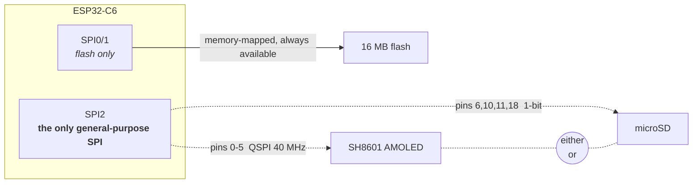

# ESP32-C6-Touch-AMOLED-1.8 — Platform Notes

Working notes for the Waveshare ESP32-C6-Touch-AMOLED-1.8. Everything here was
verified on the actual board or read out of the actual source — nothing is
copied from a spec sheet unless it is marked as such. Numbers come from boot
logs and `esp_timer` measurements taken in this repo.

Living document: correct it when the hardware disagrees with it.

---

## The board

Reported by the BSP at boot rather than assumed:

| Property | Value |
|---|---|
| Variant | **V1** — SH8601 display + FT5x06 touch |
| Display | 368 × 448, QSPI, RGB565 |
| Touch / peripheral I2C | port 0, SDA GPIO 8, SCL GPIO 7 |
| Flash | 16 MB |
| PSRAM | **none** |
| CPU | single core @ 160 MHz (`SOC_CPU_CORES_NUM 1`) |

### Hardware inventory

Everything on the board, and how to tell it is alive. The POST that ships in
the firmware probes each of these at boot and prints exactly this table — see
`main/post.c`.

| Peripheral | Part | Where | Notes |
|---|---|---|---|
| Display | SH8601 (V1) / CO5300 (V2) | QSPI, pins 0–5 | 368×448 RGB565, 40 MHz |
| Touch | FT5x06 (V1) / CST820 (V2) | I2C `0x38` / `0x15` | which address answers identifies the board revision |
| IO expander | TCA9554 | I2C `0x20` | drives display and touch reset lines |
| Power management | AXP2101 | I2C `0x34` | battery charging; the PWR button goes through it |
| IMU | QMI8658 | I2C `0x6b` | accelerometer + gyroscope |
| Real-time clock | PCF85063 | I2C `0x51` | |
| Audio codec | ES8311 | I2C, I2S pins 19–23 | speaker + mic; amp enable on expander pin 7 |
| microSD | — | SPI2, pins 6/10/11/18 | **cannot run while the display is up** |
| Flash | — | SPI0/1 | 16 MB, memory-mapped, never contended |
| PSRAM | — | — | **none** — the constraint behind most decisions here |
| Wi-Fi 6 / BLE 5 / 802.15.4 | on-die | — | radios present; Thread and Zigbee capable |
| Temperature sensor | on-die | — | reads ~31 °C idle |

All the I2C parts share one bus (port 0, SDA 8, SCL 7), so a single probe per
address establishes whether each is addressable. That is the cheapest possible
health check and what the POST is built on.

Both awkward peripherals are genuinely tested rather than assumed:

- **SD card** — probed *before* `gfx_init()`, in the window where SPI2 is still
  free. That means a real mount, with no teardown and nothing to restore. An
  absent card is reported as optional rather than failing the board. Doing this
  after the display is up would mean dismantling a running panel.
- **Audio codec** — the ES8311 sits behind the power-amp enable on the IO
  expander, so POST raises that rail before probing (and lowers it again).
  Probing without it reports a working codec as missing. Note the datasheet
  address 0x30 is 8-bit; I2C wants the 7-bit `0x18`.

There is a V2 of this board (CO5300 + CST820). The BSP auto-detects which one
it is by probing the touch controller's I2C address — CST816S at `0x15` means
V2, FT5x06 at `0x38` means V1. Always go through `bsp_board_detect()` rather
than hardcoding a driver.

Note the CO5300 (V2) needs an X-offset of `0x10` that the SH8601 (V1) does not.
The BSP applies it via `esp_lcd_panel_set_gap()`, so code that drives the panel
directly should not add its own.

---

## Memory — the constraint that shapes everything

There is no PSRAM. The entire budget is internal SRAM:

| Configuration | Free heap at startup |
|---|---|
| Raw panel access (`bsp_display_new`) | **~424 KiB** |
| With LVGL started (`bsp_display_start`) | ~357 KiB |

LVGL costs roughly **67 KiB** before you allocate anything of your own. If you
are not using its widgets, `bsp_display_new()` gives you the panel without it.

### What fits

| Buffer | Size | Verdict |
|---|---|---|
| Full-screen RGB565 framebuffer | 322 KiB | fits, ~109 KiB left over |
| Full-screen RGBA8 + float32 depth | ~1.3 MB | **3× more than the chip has** |
| One 64-row RGB565 strip | 46 KiB | trivial |

The second row is why a conventional software rasterizer does not work here.
`swrast` allocates colour *and* depth at 8 bytes/pixel and cannot be talked out
of it. `small3dlib` avoids both costs — it owns no framebuffer (it hands each
pixel to a callback) and with `S3L_Z_BUFFER 0` keeps no depth buffer, resolving
visibility by sorting triangles back-to-front instead. That is what makes a
real full-screen framebuffer affordable.

Sorted visibility is not pixel-exact — it cannot resolve intersecting geometry
— but for convex solids it is correct.

### Task stacks are not the heap

FreeRTOS gives each task its own small fixed stack, a few KiB. A large local
variable silently overruns it. This cost us a boot loop:

```
Guru Meditation Error: Core 0 panic'ed (Stack protection fault).
Detected in task "main" at 0x4200b2f8
--- app_main at <file>:23
```

Line 23 was the *opening brace* of `app_main` — a rasterizer context of roughly
5 KiB had been declared as a stack local. Anything that size must be
`malloc`'d. Note the panic points at the function's entry, not at any statement
inside it, which is the signature of blowing the stack on frame setup.

Also worth knowing: the AMOLED retains its last frame in its own GRAM, so a
crash-looping app shows a stale image rather than going black. A frozen picture
is not evidence the firmware is alive.

---

## Storage

### Flash — usable during rendering

Flash sits on its own bus (SPI0/1) and does not contend with the display. It is
memory-mapped via `esp_partition_mmap()`, so it reads like a normal array with
no I/O calls.

Current partition use is `nvs` + `phy_init` + 3 MB app ≈ 3.1 MB of 16 MB,
leaving **~12.8 MB** for a data partition. For scale, a 256×256 RGB565 texture
is 128 KB — about 100 of them at zero RAM cost.

Caveat: mapped reads go through the CPU cache. Sequential access is fast,
random access thrashes. For texture sampling that argues for a tiled/swizzled
layout rather than row-major — the same reason GPUs store textures tiled.

### SD card — cannot be used while the display is up

The BSP refuses outright:

```c
if (lcd_spi_initialized || panel_handle != NULL) {
    ESP_LOGE(TAG, "Display and SD card cannot share SPI2 at the same time");
    return ESP_ERR_INVALID_STATE;
}
```

**This is a board wiring decision, not a chip limitation** — worth being precise
about, because sharing one SPI bus between a display and an SD card is
completely standard and Espressif
[documents it officially](https://docs.espressif.com/projects/esp-idf/en/stable/esp32/api-reference/peripherals/sdspi_share.html).
On boards that do it, the two devices sit on the *same wires* with separate CS
lines and take turns microseconds apart, with no visible effect.

It does not work here because they are wired to entirely separate pin sets:

| | CS | CLK | Data |
|---|---|---|---|
| Display | 5 | 0 | 1, 2, 3, 4 (QSPI, 4 lanes @ 40 MHz) |
| SD | 6 | 11 | MOSI 10, MISO 18 |

Espressif's guide is explicit that all devices must share the same
MOSI/MISO/SCLK pins. Combined with the C6 having exactly one general-purpose
SPI controller (`SOC_SPI_PERIPH_NUM 2` = SPI1-flash + SPI2) and **no SDMMC host
peripheral at all**, the two cannot run concurrently.



The dashed pair is the whole problem. One controller can be bound to one pin
mapping at a time, and Waveshare wired the two devices to different pins — so
switching devices means tearing down and re-initialising the bus, not just
asserting a different chip select. On a board that shared the wires (the common
case) both would work concurrently with no visible effect.

Flash, by contrast, sits on its own controller and is never in contention,
which is why it is the viable option for streaming data while rendering.

Waveshare presumably chose this deliberately: hanging an SD card on the
display's lines adds AC loading, which the same guide warns can prevent pins
toggling fast enough to hold 40 MHz timing. Display bandwidth won.

Multi-threading does not help. The obstacle is one peripheral that can only be
bound to one pin mapping at a time — two tasks would just queue on a mutex
around the same hardware.

### Time-multiplexing the bus — the actual workaround

Because the panel self-refreshes from GRAM, the MCU can stop talking to it and
the picture persists. So during SD access the screen shows a **frozen frame,
not black**. The switch should also be cheaper than a cold start: the SH8601
keeps its register state while powered, so re-initialising the ESP32-side SPI
bus and panel IO without re-sending the panel init sequence ought to cost
single-digit milliseconds. *(Estimated, not yet measured — verify before
relying on it.)*

| Use case | Verdict |
|---|---|
| Audio playback (128 kbps MP3 = 16 KB/s, 32 KB chunks → one switch per ~2 s) | comfortably viable |
| Level / asset loading between scenes | viable |
| Per-frame texture streaming | marginal — a stall per frame |

One ordering constraint if you build this: mount the SD **before** any other
SPI traffic. Once a card enters SPI mode it stays there until power-cycled, and
may otherwise respond randomly to bus activity.

### SD capacity limits

ESP-IDF's bundled FatFs has `FF_FS_EXFAT 0` — exFAT is compiled out.

- **≤ 32 GB** — ships FAT32, works as-is
- **> 32 GB** — ships exFAT, **will not mount**; reformat to FAT32 and it works
  (FAT32 + 32-bit LBA covers up to 2 TB)

Two more gotchas: `CONFIG_FATFS_LFN_NONE=y` means **8.3 filenames only**
(`TEXTURE.BIN` fine, `cube_texture_hi.bin` not), and SDSPI runs at
`SDMMC_FREQ_DEFAULT` = 20 MHz over 1-bit SPI, so expect ~1–2 MB/s.

---

## Driving the panel directly

Going below LVGL means taking on four things it was doing for you. All four
fail *silently* — wrong output rather than an error.

**1. `esp_lcd_panel_draw_bitmap()` is asynchronous.** It queues a DMA transfer
that reads out of the buffer you passed. Touching that memory before the
transfer completes shreds the image: the CPU's fill and the DMA's read race
each other down the buffer, so only a narrow band of real content survives per
strip. Symptom looked like "two thin lines waving". Register
`on_color_trans_done` and wait for it.

**2. The completion semaphore must be counting, not binary.** A whole frame's
strips get queued before any is awaited, so several finish first. A binary
semaphore saturates at one and discards the rest — the second `take` blocks
forever. Symptom: clean boot log that stops dead after the last setup line.

**3. RGB565 must be byte-swapped.** `esp_lvgl_port` sets `swap_bytes = true`
for this panel; driving it directly you do it yourself.

**4. Coordinates want 2-pixel alignment.** The BSP installs a rounder callback
for LVGL that snaps areas to even boundaries. Full-width strips at multiples of
64 rows satisfy this naturally.

---

## Touch input

Three separate traps, and like the panel ones they all fail quietly — the
screen simply feels broken rather than reporting anything.

**1. The FT5x06 NACKs register reads while idle.** Polling it unconditionally
produces a failed I2C transaction every time, and each failure costs a bus
timeout. Doing that once per frame stalled the whole loop from 25 fps to
roughly 0.3 fps, with the console filling with:

```
lcd_panel.io.i2c: panel_io_i2c_rx_buffer(149): i2c transaction failed
FT5x06: esp_lcd_touch_ft5x06_read_data(186): I2C read error!
```

Gate reads on the INT line (GPIO 15, active low). That is what it is for.

**2. INT means "data ready", not "finger down".** It drops briefly mid-touch,
so treating every deassertion as a release makes a held finger flicker between
pressed and released. Require a quiet period — 60 ms works — before declaring
the finger gone.

**3. microui encodes a mouse's interaction model, and touch cannot satisfy
it.** This is the subtle one. `mu_update_control()` only establishes hover on a
frame where the button is *not* held, and a control only submits once it has
focus:

```c
if (mouseover && !ctx->mouse_down) { ctx->hover = id; }
if (ctx->hover == id) { if (ctx->mouse_pressed) { mu_set_focus(ctx, id); } }
```

That is "point at it, then click" — hover on one frame, press on the next. A
touchscreen never produces the first half, because the pointer does not exist
until a finger is already down. Send move and press together and hover is never
set, focus is never taken, and the control never fires.

The fix is to synthesise the missing frame: on a press deliver only the
position, and let the button-down land on the following frame. That costs one
frame of latency (~40 ms, imperceptible) and makes taps reliable.

Worth knowing because it is not specific to buttons — every microui control
resolves interaction through `mu_update_control()`, so anything that reacts to
a press has the same requirement.

The symptom, before the fix, was that a deliberate press of roughly 120 ms
worked while a quick tap did nothing. It "worked" only because the flickering
INT line from trap 2 occasionally faked a not-down frame between two down
frames — one bug accidentally papering over another.

**Sampling rate matters too.** Reading touch once per rendered frame is too
coarse: a frame is ~40 ms here (the blit alone is 25 ms) and a quick tap can be
shorter than that, so taps fall between samples entirely. Poll on a separate
task — 100 Hz is plenty and costs nothing next to rendering — and latch the
press/release edges so an event that happens wholly between two frames is still
delivered to the next one.

**On targets and gestures.** A small back button is fine to aim at with a mouse
and miserable with a fingertip. A swipe up from the bottom edge — what the
board's stock firmware used — has no target to miss, cannot be triggered
accidentally mid-app, and leaves the app the whole screen. Trigger it partway
through the swipe rather than on release, or it feels sluggish.

---

## Measured performance

Full-screen 368×448, Gouraud-shaded rotating cube, `small3dlib`, no PSRAM, no
GPU:

| Stage | Time | Share |
|---|---|---|
| Clear (32-bit fill) | 5.2 ms | 10% |
| Rasterize | 28.1 ms | 48% |
| Blit (QSPI DMA) | 25.0 ms | 41% |
| **Total** | **~59 ms → 15.5 fps** | |

The blit works out to ~13 MB/s effective over QSPI at 40 MHz.

Two results worth remembering because they contradict the intuitive guess:

- **Double-buffering the strips changed nothing** (11.1 → 10.7 fps). DMA was
  never the bottleneck.
- **Tiled rendering was *slower* than one full-screen pass** (10.7 → 15.5 fps).
  Rasterizing the scene once per strip meant doing it seven times per frame;
  the discarded-pixel path was cheap, but not free.

Untapped headroom, in rough order of value: raise the QSPI clock from 40 MHz
(the SH8601 will likely take 80, halving the blit), and clear only the previous
frame's bounding box instead of all 165k pixels. Together those put ~24 fps
within reach without touching the rasterizer.

### There is no graphics acceleration

Verified, not assumed. `SOC_PPA_SUPPORTED` is defined **only for the ESP32-P4**
in ESP-IDF's SoC caps — the C6 has no Pixel Processing Accelerator, no 2D
blitter, no GPU. `esp_lvgl_port` does ship PPA rotation code and hand-written
SIMD blend routines, but the PPA path compiles only when `SOC_PPA_SUPPORTED` is
set, and the SIMD assembly is Xtensa (`_esp32.S`, `_esp32s3.S`), not RISC-V.
Everything on this chip is scalar C on one core.

If graphics throughput ever becomes the requirement, that is a board decision:
the ESP32-P4 has the PPA, PSRAM, *and* a real SDMMC host.

---

## Flashing and recovery

**The chip only accepts auto-reset while an app is actively running.** Once
firmware returns from `app_main` and goes idle, reset signalling stops working
entirely — `Hard resetting via RTS pin` does nothing, esptool reports
`No serial data received`, and manual DTR/RTS pulses produce zero bytes.

This is why the launcher's frame loop never exits, and why its error paths park
in a sleep loop rather than returning from `app_main`: the device has to stay
flashable even when startup fails.

If the board becomes unreachable:

1. Unplug USB-C
2. **Hold BOOT**
3. Plug USB-C back in while still holding
4. Keep holding ~2 s, release

That forces the ROM bootloader regardless of firmware state. Confirm you are in
download mode with:

```bash
esptool.py --chip esp32c6 -p COM3 --before no_reset flash_id
```

Connecting almost instantly (a few dots) means the chip is sitting in the
bootloader.

**After flashing this way, the board will not boot on its own** — `--after
hard_reset` uses the same non-functional RTS reset, so it stays in download
mode, silent, running nothing. **Unplug and replug normally** (no BOOT) to
start the app.

If it vanishes from USB entirely — no COM port, no `VID_303A` device — check
the cable first, then the PWR button: this board's power is managed by an
**AXP2101 PMIC**, so a long press cuts system power.

---

## Toolchain

- **ESP-IDF v5.5+ is required.** The Waveshare BSP declares `idf: ">=5.5"`;
  v5.4 will not resolve it. Both can coexist — they are keyed by `IDF_PATH`.
- BSP component: `waveshare/esp32_c6_touch_amoled_1_8` `^1.0.0`, which pulls 14
  dependencies including `lvgl` 9.5 and the display/touch drivers for *both*
  board variants.
- `sdkconfig.defaults` worth keeping: `CONFIG_ESPTOOLPY_FLASHSIZE_16MB=y` —
  without it the image header says 2 MB and the bootloader warns on every boot.

Console output reaches the USB CDC port because
`CONFIG_ESP_CONSOLE_SECONDARY_USB_SERIAL_JTAG=y`, even though the primary
console is UART0 on GPIO 16/17. The `GPIO 17 and 16 are used as console UART
I/O pins` line in every boot log refers to that primary, and is not evidence
that USB logging is off.
