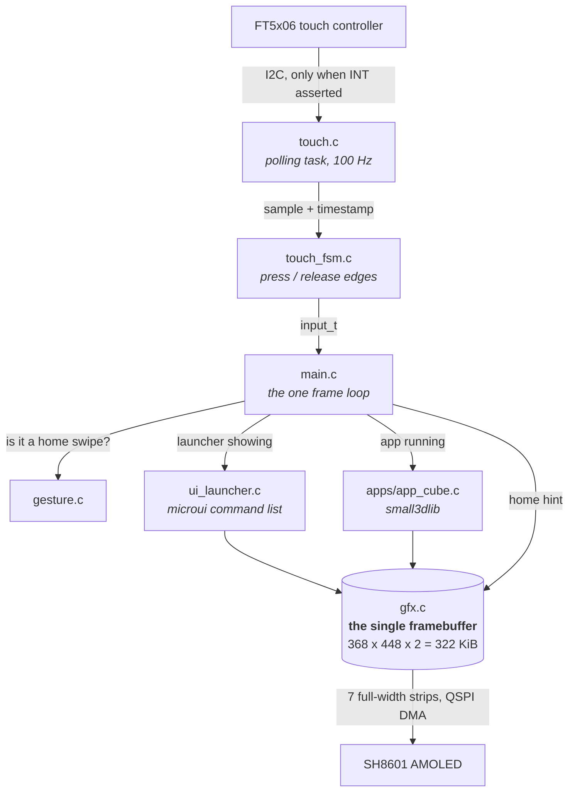
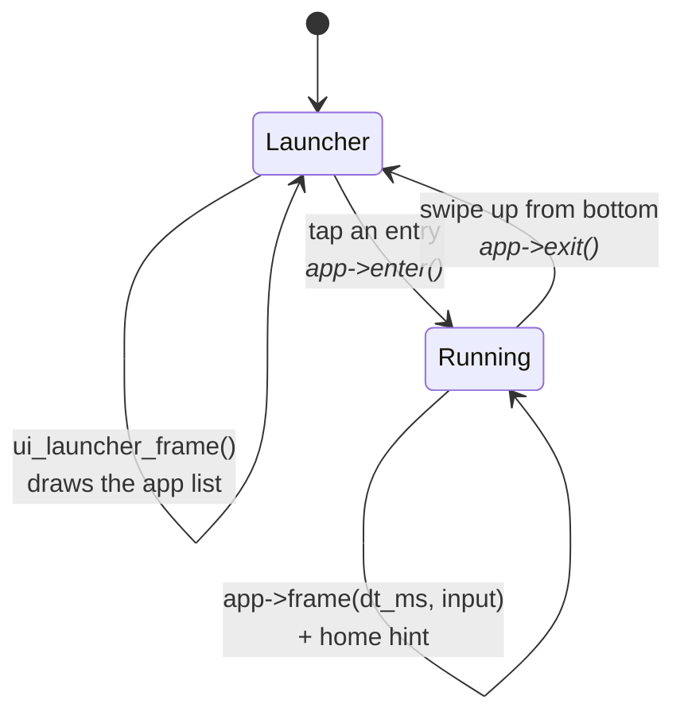
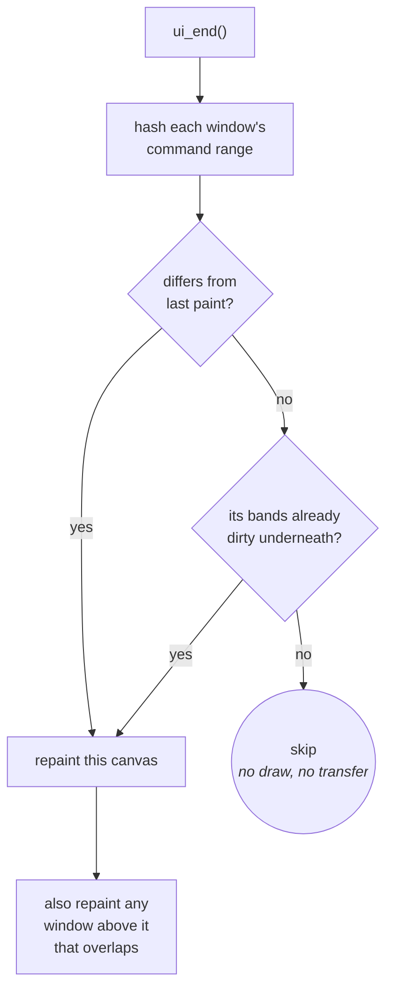

# Launcher Architecture

How the shell, the apps and the screen fit together, and why ownership is
arranged this way. Read this before adding an app or changing the frame loop.

Living document: update it when the structure changes.

---

## Layout

```
launcher/
├── components/
│   ├── microui/        MIT, patched for this chip (see below)
│   └── small3dlib/     CC0, header-only
└── main/
    ├── gfx.{h,c}       owns THE framebuffer, panel, primitives, text
    ├── touch.{h,c}     FT5x06 polling task
    ├── touch_fsm.{h,c} samples -> press/release events   (host-tested)
    ├── gesture.{h,c}   swipe recognition                 (host-tested)
    ├── app.h           the shell/app contract
    ├── ui_launcher.c   the home screen, built with microui
    ├── main.c          the frame loop and app switching
    └── apps/
        └── app_cube.c  3D cube
```

---

## How it fits together

Input flows up from the panel, drawing flows down into one framebuffer, and the
shell sits in the middle deciding who gets called.



Two things the diagram makes obvious that prose does not:

- **Every drawing path converges on one buffer.** Nothing else allocates
  pixels, because nothing else can afford to.
- **Hardware touches the system at exactly two points** — `touch.c` at the top,
  `gfx.c` at the bottom. Everything between them is ordinary logic, which is
  why `touch_fsm` and `gesture` can be tested on a laptop.

---

## Three rules that shape everything

### 1. There is exactly one framebuffer

368 × 448 × 2 bytes = **322 KiB**, out of roughly 424 KiB of RAM. A second one
is not affordable, so "who owns the pixels" is settled architecturally rather
than negotiated per app: `gfx` owns it, everything else draws into it.

This is also why the 3D renderer is small3dlib. It owns no framebuffer — it
hands back every rasterized pixel through a callback — and with `S3L_Z_BUFFER 0`
it keeps no depth buffer either, resolving visibility by sorting triangles
back-to-front. A conventional colour+depth rasterizer would want ~1.3 MB here.

### 2. There is exactly one frame loop, and it belongs to the shell

Apps do not loop, do not present, do not block and do not yield. An app's
`frame()` draws and returns. Consequences:

- switching apps is instant — no teardown of a running loop
- no app can wedge the device by forgetting to `vTaskDelay`
- the shell decides when to present, and can draw its own chrome afterwards

### 3. Apps are callbacks, not processes

One binary, one address space, one core. There is no isolation: a misbehaving
app can corrupt the shell. That is the accepted trade for instant switching and
no flash-partition machinery. Worth revisiting only if third-party apps ever
become a goal.

---

## The frame loop

The shell is a two-state machine. `current == NULL` means the launcher is
showing; anything else is the running app.



Only `enter()` and `exit()` run on the transitions, and both run exactly once,
which is why an app may assume `enter()` has happened before any `frame()` and
that `exit()` will follow the last one.

Each iteration:

```
touch_read()          latched press/release edges from the polling task
    |
    +-- launcher showing?  ui_launcher_frame()  -> returns chosen app or -1
    |
    +-- app running?       gesture_is_home_swipe()?  -> exit() and go home
                           otherwise app->frame(dt_ms, input) + home hint
    |
gfx_present()         blit, and wait for the DMA to drain
vTaskDelay(1)         yield so the idle task can feed the watchdog
```

Currently **~42 fps** on the launcher screen. The blit dominates at ~25 ms; the
cube app is slower because rasterizing costs ~28 ms on top.

`dt_ms` is clamped to 250 ms so a stall does not make animation jump.

---

## Adding an app

Three steps.

**1. Write `main/apps/app_yours.c`:**

```c
#include "../app.h"
#include "../gfx.h"

static void yours_enter(void) { /* reset state */ }

static void yours_frame(uint32_t dt_ms, const input_t *input)
{
    gfx_clear(gfx_rgb(0x101010));
    gfx_text(20, 20, "hello", gfx_rgb(0xFFFFFF));
}

static void yours_exit(void) { /* release what enter() took */ }

/* Exported as the struct, not a pointer to it, so the registry can take its
 * address in a static initializer. */
const app_t app_yours = {
    .name    = "Your App",
    .summary = "what it does",
    .enter   = yours_enter,
    .frame   = yours_frame,
    .exit    = yours_exit,
};
```

**2. Register it — from inside its own file:**

```c
APP_REGISTER(app_yours);
```

That is the whole registration. There is no central list, and **no other file
needs editing** — not `main.c`, not `CMakeLists.txt`.

### An app is a folder

Everything an app owns lives in `main/apps/<name>/`:

```
main/apps/sand/
├── app_sand.c        entry point: gfx, IMU, frame loop        (NOT host-portable)
├── material.c/.h     what a cell is made of                    (pure, const data)
├── tilt.c/.h         accelerometer -> steering direction        (pure)
├── sand.c/.h         the automaton: grid, movement, friction     (pure)
├── sand_liquid.c     cross-flow levelling, the wall-rebound splash (pure)
├── sand_gas.c        rising and dispersing, the reverse-order pass (pure)
├── sand_reactions.c  fire chemistry: ignition, spread, burnout      (pure)
├── sand_priv.h       small inline helpers shared by the .c files above
├── row_runs.c/.h     per-row dirty-span detection and reconciliation (pure)
├── suite_sand.c      tests for the automaton               (pure + a device block)
├── suite_row_runs.c  tests for row_runs                                (pure)
├── suite_tilt.c      tests for the tilt filter                         (pure)
└── tools/            sand-only host tooling (sweeps, report generators)
```

`tools/` is not new territory needing its own rule - it follows straight from
the one above. An app's `tools/` folder holds tools that reference ONLY that
app; anything spanning app *and* shell code (a sweep that touches a
shell-owned header alongside an app one, say) stays in the shared
`launcher/tools/` instead. `main/apps/sand/tools/block_size_sweep.ps1` is the
first tenant - it only ever touches `sand.h` - while
`launcher/tools/sweeps/row_leaf_sweep.ps1`, which sweeps a sand constant
*and* a `main/gfx_dirty.h` constant together, stays shared for exactly that
reason.

See `docs/Sand/Sand-Simulation.md` for how the pieces above fit together - the
material system, the water model, and why the liquid logic is split into its
own file.

Deleting the app is deleting the folder. Its code, its logic and its tests go
with it, and nothing is left dangling.

Three mechanisms make that true:

- **The build globs `apps/**/*.c`** (with `CONFIGURE_DEPENDS`, so a new folder
  is picked up without a manual reconfigure).
- **Apps register themselves.** `APP_REGISTER` emits a constructor into
  `.init_array`, which ESP-IDF runs before `app_main()`.
- **The glob excludes `apps/*/tools/`.** That same recursive glob would
  otherwise sweep an app's host-side tooling into the firmware image right
  alongside its real sources - and `WHOLE_ARCHIVE` (below) force-links
  whatever it finds, so a stray `main()` under a `tools/` folder would get
  compiled into the device build rather than dropped by `--gc-sections`.
  `launcher/main/CMakeLists.txt` filters `/apps/[^/]*/tools/` out of
  `discovered_apps` for exactly this reason, structurally rather than by
  naming each tool.

The naming convention the host test runner relies on: **`app_*.c` is the
hardware-facing entry point**, and everything else in the folder is portable
logic it can compile. That split is not bureaucracy — it is what forces an
app's logic to be separable from its wiring, and it is the only reason a
falling-sand automaton can be tested on a laptop.

> **`WHOLE_ARCHIVE` is load-bearing.** The component becomes `libmain.a`, and a
> linker only extracts an archive member that resolves an undefined symbol.
> Since nothing references an app by name any more — the entire point — the
> object would never be extracted, its constructor would never run, and the app
> would silently vanish from the menu. Not a link error: a smaller binary and a
> shorter list. This was caught by the release image shrinking *below* its
> pre-app size.

Menu order is by name. Constructor order follows link order, which is not
something to depend on, so the shell sorts before showing the list.

**Bench-only apps** live in `apps/diagnostics/`, excluded by folder when
`CONFIG_LAUNCHER_SELFTEST` is off — structural rather than a name check.
Diagnostics re-runs POST, which cycles the audio rail and takes the display off
SPI2, so it has no business being reachable in a shipped image. See
[Testing-Guide](Testing-Guide.md#release-builds-contain-no-test-code) — note in
particular that `REQUIRES` must **not** be gated this way.

### Drawing a UI, in the shell or in an app

`main/ui.c` owns the microui integration; `ui_launcher.c` is just one caller.
An app builds a UI the same way:

```c
mu_Context *ctx = ui_context();

ui_begin(input);
if (mu_begin_window_ex(ctx, "Settings", rect, opts)) {
    if (mu_button(ctx, "Clear")) { ... }
    mu_end_window(ctx);
}
ui_end(UI_NO_BACKGROUND);   /* draw over the app instead of clearing */
```

That gets the touch handling - which is not obvious, see the comment on
`feed_input()` - and the repaint logic below, for free.

#### Immediate mode versus dirty bands

These fight, and the fight would have hit apps, not just the launcher.
Immediate mode rebuilds and repaints the UI every frame, which means clearing
every frame, which marks every band dirty and forces a full 9.6 ms transfer -
discarding the saving that partial updates exist to provide.

The resolution: an immediate-mode UI is **rebuilt** every frame but not
necessarily **changed**. microui's command list is a complete description of
the output, so two frames that hash the same *are* the same picture.

A retained-mode engine knows what changed because changing it is an explicit
act - you mutate a node, it marks its canvas dirty. Immediate mode throws that
signal away by construction, so we recover it from the other end: compare
output where an engine compares intent. Same destination, opposite direction.

#### One window is one canvas

The canvas split comes free with it. microui already groups commands by root
container, each with its own rect, so each window is hashed, repainted and
band-marked on its own. A live readout in one window does not force a static
toolbar in another to repaint - which is the point of splitting canvases at
all.



Two rules that have to be respected:

- **Painter's order.** Windows are drawn back to front, so repainting one means
  repainting anything above it that overlaps, or the repaint erases what was on
  top.
- **`ui_invalidate()`.** If something replaced the screen in a way `ui_end()`
  cannot detect - returning to the launcher after an app has been running - the
  UI must be told its pixels are gone. Otherwise it compares an unchanged
  command list, skips, and leaves the app's last frame on screen.

Measured: an idle launcher went from 66.7 fps to the 1 kHz tick ceiling,
because it now paints and sends nothing at all. `test/suites/suite_ui.c` covers
the independence claim directly - it builds two windows, changes one, and
asserts the other's bands stay clean.

### What an app may and may not do

| | |
|---|---|
| Draw via `gfx_*`, or straight into `gfx_framebuffer()` | yes |
| Read `input_t` for touch | yes |
| Animate using `dt_ms` | yes |
| Call `gfx_present()` | **no** — the shell presents |
| Loop or block or `vTaskDelay` | **no** — return promptly |
| Keep a framebuffer of its own | **no** — there is only one |

Anything expensive belongs in `enter()`, not `frame()`.

---

## Input

`touch.c` polls the FT5x06 at 100 Hz on its own task, above the render loop's
priority. Sampling is decoupled from rendering on purpose: a frame is ~24 ms
and a quick tap can be shorter, so polling once per frame drops taps.

`touch_fsm` interprets the samples and latches press/release edges, so an event
that happens entirely between two frames still reaches the next one. Edges are
consumed when read, so each is delivered exactly once.

Two hardware facts drive the design, both documented in the platform notes:
reads are gated on the INT line because the controller NACKs when idle, and a
release needs a 60 ms quiet period because INT means "data ready" rather than
"finger down" and drops briefly mid-touch.

---

## Why microui, not LVGL

LVGL is present in the build - it is a transitive dependency of the Waveshare
BSP package, `main/idf_component.yml` pulls that in for the display and touch
drivers - but nothing here calls into it. `gfx.c` drives the panel directly
(`esp_lcd_new_panel_sh8601`, not `bsp_display_new()`/`bsp_display_start()`),
so it never runs; confirmed rather than assumed by checking the linked
binary, which carries zero `lv_*` symbols.

Three constraints, all already documented elsewhere in this project, point
the same direction once put next to each other:

**The memory budget has no room for it.** There is no PSRAM - the whole
budget is ~424 KiB of internal SRAM, and the framebuffer alone is 322 KiB of
that (see `docs/Notes/Board-and-Memory.md`). LVGL costs roughly **67 KiB**
before a single widget is allocated - about 16% of the entire chip's memory
gone before drawing anything. microui needed patching too (upstream sizes
`mu_Context` for desktop, 256 KiB for the command list alone), but that is a
one-time struct-layout edit down to a small fixed size, not a standing tax
on every frame the way a persistent widget tree and style system are.

**This device runs apps that own their entire framebuffer.** The falling-sand
simulation and the cube renderer each drive the panel directly, on their own
schedule, with no widget tree in between. A retained-mode toolkit wants to
own the display and the refresh cycle - exactly what those apps already do
for themselves. microui's command-list model asks for nothing: it turns a UI
description into a list of rectangles, text and icons once a frame, and
whoever is drawing paints that list whenever they like, into whatever they
like. It composes with an app that owns its own frame loop; a retained-mode
toolkit would compete with it for the same job.

**The whole render pipeline here is built around skipping unchanged frames**,
because a full transfer costs ~9.6 ms and most frames do not need one. An
immediate-mode command list is exactly the shape that trick needs - see
[Immediate mode versus dirty bands](#immediate-mode-versus-dirty-bands)
below for the mechanism. LVGL has its own separate invalidation and redraw
system, built around owning the display - adopting it would mean reconciling
two damage-tracking systems, or replacing the one already built for every
other app, rather than reusing it for free.

**The real cost, for balance:** microui encodes a mouse's interaction model
(point, then click), and a touchscreen cannot produce that sequence - the
pointer does not exist until a finger is already down. Every control needs a
synthesised hover frame to compensate, costing one frame (~24 ms) of input
latency on every tap. That friction is specific to picking an immediate-mode,
mouse-shaped toolkit; a touch-native widget system would not have it. It was
worth paying given the three constraints above, but it is a real trade-off,
not a free win.

## The microui integration

microui is immediate-mode and draws nothing itself: each frame it turns the UI
description into a list of rectangles, text and icons, and `ui_launcher.c` walks
that list painting into the framebuffer.

That command-list model is why it suits this device. A retained-mode toolkit
wants to own the display and the refresh cycle, which fights an app like the
cube that renders its own frames. Here the shell renders primitives whenever it
likes, into whatever it likes.

### Two things to know before touching it

**The vendored header is patched.** Upstream sizes `mu_Context` for desktop —
the command list alone is 256 KiB, which does not fit beside the framebuffer.
Sizes are reduced in `components/microui/include/microui.h`, with upstream
values in trailing comments. They are edited in the header rather than
overridden from our side because they determine the struct's layout, and two
translation units disagreeing would corrupt it silently.

**Touch needs a synthesised hover frame.** `mu_update_control()` only
establishes hover on a frame where the button is *not* held, and a control only
submits once focused — the mouse sequence "point, then click". A touchscreen
never produces the first half, because the pointer does not exist until a finger
is already down.

So `feed_input()` delivers a press across two frames: position only, then the
button-down. One frame of latency, ~24 ms, and taps register every time.

**This applies to every microui control**, not just buttons — anything reacting
to a press goes through `mu_update_control()`. Adding a slider or checkbox
requires nothing new, but reworking input handling means preserving this.

---

## Related

- `docs/Notes/` — the hardware constraints underneath all of this: memory
  budget, panel gotchas, touch quirks, flashing and recovery. Start at
  `docs/Notes/README.md`.
- `docs/Sand/Sand-Simulation.md` — the falling-sand app in depth: materials, the
  water model, momentum, and why its liquid logic is its own file.
- `docs/Testing-Guide.md` — how to test any of it.
