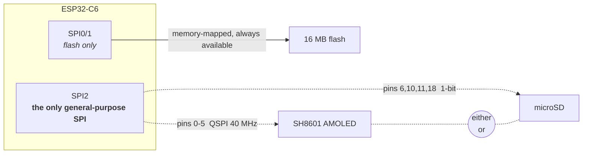

# Board and Memory

Part of the platform notes for the Waveshare ESP32-C6-Touch-AMOLED-1.8 - see
[`README.md`](README.md) for the full set. Everything here was verified on the
actual board or read out of the actual source - nothing is copied from a spec
sheet unless it is marked as such. Numbers come from boot logs and
`esp_timer` measurements taken in this repo.

Living document: correct it when the hardware disagrees with it.

---

## The board

Reported by the BSP at boot rather than assumed:

| Property | Value |
|---|---|
| Variant | **V1** — SH8601 display + FT5x06 touch |
| Display | 368 × 448, QSPI, RGB565 |
| Touch / peripheral I2C | port 0, SDA GPIO 8, SCL GPIO 7 |
| Flash | 16 MB |
| PSRAM | **none** |
| CPU | single core @ 160 MHz (`SOC_CPU_CORES_NUM 1`) |

### Hardware inventory

Everything on the board, and how to tell it is alive. The POST that ships in
the firmware probes each of these at boot and prints exactly this table — see
`main/post.c`.

| Peripheral | Part | Where | Notes |
|---|---|---|---|
| Display | SH8601 (V1) / CO5300 (V2) | QSPI, pins 0–5 | 368×448 RGB565, 40 MHz |
| Touch | FT5x06 (V1) / CST820 (V2) | I2C `0x38` / `0x15` | which address answers identifies the board revision |
| IO expander | TCA9554 | I2C `0x20` | drives display and touch reset lines |
| Power management | AXP2101 | I2C `0x34` | battery charging; the PWR button goes through it |
| IMU | QMI8658 | I2C `0x6b` | accelerometer + gyroscope; driver in `main/imu.c`, axes in [Input-and-Sensors.md](Input-and-Sensors.md) |
| Real-time clock | PCF85063 | I2C `0x51` | |
| Audio codec | ES8311 | I2C, I2S pins 19–23 | speaker + mic; amp enable on expander pin 7 |
| microSD | — | SPI2, pins 6/10/11/18 | shares SPI2 with the display; see [time-multiplexing](#time-multiplexing-the-bus--the-actual-workaround) |
| Flash | — | SPI0/1 | 16 MB, memory-mapped, never contended |
| PSRAM | — | — | **none** — the constraint behind most decisions here |
| Wi-Fi 6 / BLE 5 / 802.15.4 | on-die | — | radios present; Thread and Zigbee capable |
| BOOT button | — | GPIO 9, pull-up | active low, bounces; also the flashing button |
| PWR button | via AXP2101 | I2C `0x34` | not wired to the SoC at all — see [Input-and-Sensors.md](Input-and-Sensors.md) |
| Temperature sensor | on-die | — | reads ~31 °C idle |

All the I2C parts share one bus (port 0, SDA 8, SCL 7), so a single probe per
address establishes whether each is addressable. That is the cheapest possible
health check and what the POST is built on.

Both awkward peripherals are genuinely tested rather than assumed:

- **SD card** — at boot, probed *before* `gfx_init()`, in the window where SPI2
  is still free. A re-run instead suspends the display and takes the bus, which
  costs under a millisecond. Either way it is a real mount, not an assumption. An
  absent card is reported as optional rather than failing the board. Doing this
  after the display is up would mean dismantling a running panel.
- **Audio codec** — the ES8311 sits behind the power-amp enable on the IO
  expander, so POST raises that rail before probing (and lowers it again).
  Probing without it reports a working codec as missing. Note the datasheet
  address 0x30 is 8-bit; I2C wants the 7-bit `0x18`.

There is a V2 of this board (CO5300 + CST820). The BSP auto-detects which one
it is by probing the touch controller's I2C address — CST816S at `0x15` means
V2, FT5x06 at `0x38` means V1. Always go through `bsp_board_detect()` rather
than hardcoding a driver.

Note the CO5300 (V2) needs an X-offset of `0x10` that the SH8601 (V1) does not.
The BSP applies it via `esp_lcd_panel_set_gap()`, so code that drives the panel
directly should not add its own.

---

## Memory — the constraint that shapes everything

There is no PSRAM. The entire budget is internal SRAM:

| Configuration | Free heap at startup |
|---|---|
| Raw panel access (`bsp_display_new`) | **~424 KiB** |
| With LVGL started (`bsp_display_start`) | ~357 KiB |

LVGL costs roughly **67 KiB** before you allocate anything of your own. If you
are not using its widgets, `bsp_display_new()` gives you the panel without it.

### What fits

| Buffer | Size | Verdict |
|---|---|---|
| Full-screen RGB565 framebuffer | 322 KiB | fits, ~109 KiB left over |
| Full-screen RGBA8 + float32 depth | ~1.3 MB | **3× more than the chip has** |
| One 64-row RGB565 strip | 46 KiB | trivial |

The second row is why a conventional software rasterizer does not work here.
`swrast` allocates colour *and* depth at 8 bytes/pixel and cannot be talked out
of it. `small3dlib` avoids both costs — it owns no framebuffer (it hands each
pixel to a callback) and with `S3L_Z_BUFFER 0` keeps no depth buffer, resolving
visibility by sorting triangles back-to-front instead. That is what makes a
real full-screen framebuffer affordable.

Sorted visibility is not pixel-exact — it cannot resolve intersecting geometry
— but for convex solids it is correct.

### Task stacks are not the heap

FreeRTOS gives each task its own small fixed stack, a few KiB. A large local
variable silently overruns it. This cost us a boot loop:

```
Guru Meditation Error: Core 0 panic'ed (Stack protection fault).
Detected in task "main" at 0x4200b2f8
--- app_main at <file>:23
```

Line 23 was the *opening brace* of `app_main` — a rasterizer context of roughly
5 KiB had been declared as a stack local. Anything that size must be
`malloc`'d. Note the panic points at the function's entry, not at any statement
inside it, which is the signature of blowing the stack on frame setup.

Also worth knowing: the AMOLED retains its last frame in its own GRAM, so a
crash-looping app shows a stale image rather than going black. A frozen picture
is not evidence the firmware is alive.

---

## Storage

### Flash — usable during rendering

Flash sits on its own bus (SPI0/1) and does not contend with the display. It is
memory-mapped via `esp_partition_mmap()`, so it reads like a normal array with
no I/O calls.

Current partition use is `nvs` + `phy_init` + 3 MB app ≈ 3.1 MB of 16 MB,
leaving **~12.8 MB** for a data partition. For scale, a 256×256 RGB565 texture
is 128 KB — about 100 of them at zero RAM cost.

Caveat: mapped reads go through the CPU cache. Sequential access is fast,
random access thrashes. For texture sampling that argues for a tiled/swizzled
layout rather than row-major — the same reason GPUs store textures tiled.

### SD card — not while the display holds the bus

The BSP refuses outright:

```c
if (lcd_spi_initialized || panel_handle != NULL) {
    ESP_LOGE(TAG, "Display and SD card cannot share SPI2 at the same time");
    return ESP_ERR_INVALID_STATE;
}
```

That guard is about *its* panel, though, not the hardware. `gfx.c` brings the
panel up itself rather than calling `bsp_display_new()`, so those statics stay
false and the guard never trips — which is what makes the time-multiplexing
below possible. See [Display-and-Rendering.md](Display-and-Rendering.md)'s
"Owning panel bring-up".

**This is a board wiring decision, not a chip limitation** — worth being precise
about, because sharing one SPI bus between a display and an SD card is
completely standard and Espressif
[documents it officially](https://docs.espressif.com/projects/esp-idf/en/stable/esp32/api-reference/peripherals/sdspi_share.html).
On boards that do it, the two devices sit on the *same wires* with separate CS
lines and take turns microseconds apart, with no visible effect.

It does not work here because they are wired to entirely separate pin sets:

| | CS | CLK | Data |
|---|---|---|---|
| Display | 5 | 0 | 1, 2, 3, 4 (QSPI, 4 lanes @ 40 MHz) |
| SD | 6 | 11 | MOSI 10, MISO 18 |

Espressif's guide is explicit that all devices must share the same
MOSI/MISO/SCLK pins. Combined with the C6 having exactly one general-purpose
SPI controller (`SOC_SPI_PERIPH_NUM 2` = SPI1-flash + SPI2) and **no SDMMC host
peripheral at all**, the two cannot run concurrently.



The dashed pair is the whole problem. One controller can be bound to one pin
mapping at a time, and Waveshare wired the two devices to different pins — so
switching devices means tearing down and re-initialising the bus, not just
asserting a different chip select. On a board that shared the wires (the common
case) both would work concurrently with no visible effect.

Flash, by contrast, sits on its own controller and is never in contention,
which is why it is the viable option for streaming data while rendering.

Waveshare presumably chose this deliberately: hanging an SD card on the
display's lines adds AC loading, which the same guide warns can prevent pins
toggling fast enough to hold 40 MHz timing. Display bandwidth won.

Multi-threading does not help. The obstacle is one peripheral that can only be
bound to one pin mapping at a time — two tasks would just queue on a mutex
around the same hardware.

### Time-multiplexing the bus — the actual workaround

Because the panel self-refreshes from GRAM, the MCU can stop talking to it and
the picture persists. So during SD access the screen shows a **frozen frame,
not black**.

This is implemented and measured. `gfx_suspend()` releases the panel, the IO
handle and the SPI bus; `gfx_resume(false)` rebuilds them *without* re-sending
the panel init sequence, because the SH8601 keeps its registers while powered.
The Diagnostics app does a full round trip on every entry.

Measured on hardware, six consecutive runs, ±15 µs:

| Step | Cost |
|---|---|
| `gfx_suspend()` — panel + IO + bus teardown | **318 µs** |
| SD probe (no card — the failure path, which times out) | 26.7 ms |
| `gfx_resume(false)` — rebuild, no init sequence | **605 µs** |
| **Display round trip** (suspend + resume) | **~0.92 ms** |

The earlier estimate of "single-digit milliseconds" was pessimistic by an order
of magnitude. The display cost is **sub-millisecond** — under 4% of one 25 ms
frame at 40 fps, small enough to disappear into a frame's slack.

Skipping the init sequence is exactly why this is cheap, and the gap is far
wider than the datasheet suggests. Measured by calling `gfx_resume(true)`
instead:

| | Cost |
|---|---|
| `gfx_resume(false)` — reattach only | **715 µs** |
| `gfx_resume(true)` — full init sequence | **230 ms** |

**321× more expensive.** The `0x11` sleep-out settle accounts for only 120 ms of
that; the rest is the remaining commands' own delays plus QSPI transaction
overhead. So pass `full_init = true` only if the panel actually lost power —
`suite_gfx.c` has a regression test that fails if anyone reintroduces it.

Note also what dominates: the SD layer, not the display, by a factor of thirty.
So budget the *card* access, not the switch.

| Use case | Verdict |
|---|---|
| Audio playback (128 kbps MP3 = 16 KB/s, 32 KB chunks → one switch per ~2 s) | comfortably viable |
| Level / asset loading between scenes | viable |
| Per-frame texture streaming | marginal — but the switch is not what makes it so |

Two things the frozen frame does cost you: no animation and no touch feedback
for the duration. Under a millisecond that is invisible; across a 27 ms card
access it is one dropped frame.

One ordering constraint if you build this: mount the SD **before** any other
SPI traffic. Once a card enters SPI mode it stays there until power-cycled, and
may otherwise respond randomly to bus activity.

### SD capacity limits

ESP-IDF's bundled FatFs has `FF_FS_EXFAT 0` — exFAT is compiled out.

- **≤ 32 GB** — ships FAT32, works as-is
- **> 32 GB** — ships exFAT, **will not mount**; reformat to FAT32 and it works
  (FAT32 + 32-bit LBA covers up to 2 TB)

Two more gotchas: `CONFIG_FATFS_LFN_NONE=y` means **8.3 filenames only**
(`TEXTURE.BIN` fine, `cube_texture_hi.bin` not), and SDSPI runs at
`SDMMC_FREQ_DEFAULT` = 20 MHz over 1-bit SPI, so expect ~1–2 MB/s.

---

## Related

- [Display-and-Rendering.md](Display-and-Rendering.md) — panel bring-up and
  the rest of the SPI2 story, on top of these constraints.
- [Flashing-and-Toolchain.md](Flashing-and-Toolchain.md) — including the
  `gfx_resume(true)` cost referenced above, exercised by the panel-recovery
  path.
