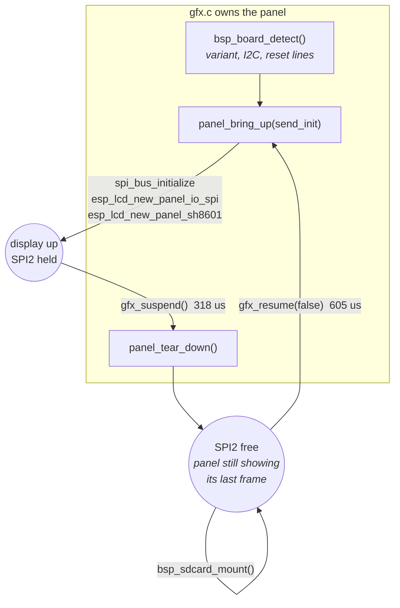

# Display and Rendering

Part of the platform notes for the Waveshare ESP32-C6-Touch-AMOLED-1.8 - see
[`README.md`](README.md) for the full set. Everything here was verified on the
actual board or read out of the actual source. See
[Board-and-Memory.md](Board-and-Memory.md) for the SPI2 wiring and
time-multiplexing story this builds on.

---

## Owning panel bring-up

`gfx.c` does not call `bsp_display_new()`. It initialises SPI2, the panel IO and
the SH8601 itself, keeping `bsp_board_detect()` only for variant detection and
the reset lines on the IO expander.

That is not a preference. The BSP holds `panel_handle`, `io_handle` and
`lcd_spi_initialized` as private statics and offers **no teardown** — they are
cleaned up only on its own internal failure path. Since `bsp_sdcard_mount()`
gates on exactly those, a BSP-owned display can never give the bus back, and
the card becomes untestable the moment the screen comes up.

Owning bring-up costs one thing: Waveshare's `sh8601_lcd_init_cmds` array is a
private static too. It is nine commands, Apache-2.0, and is copied into `gfx.c`
with attribution — the driver's built-in defaults are *not* a substitute, since
Waveshare tuned `0x44`/`0x53`/`0x51` for this panel.

The framebuffer is untouched by all of this — it is ordinary RAM and has no
relationship to the bus, so nothing needs redrawing on resume.

One rule: nothing may call `gfx_present()` between suspend and resume. Today
that is guaranteed structurally, because the only caller is the shell's frame
loop and the re-run happens inside it, on the same task.

---

## Driving the panel directly

Going below LVGL means taking on four things it was doing for you. All four
fail *silently* — wrong output rather than an error.

**1. `esp_lcd_panel_draw_bitmap()` is asynchronous.** It queues a DMA transfer
that reads out of the buffer you passed. Touching that memory before the
transfer completes shreds the image: the CPU's fill and the DMA's read race
each other down the buffer, so only a narrow band of real content survives per
strip. Symptom looked like "two thin lines waving". Register
`on_color_trans_done` and wait for it.

**2. The completion semaphore must be counting, not binary.** A whole frame's
strips get queued before any is awaited, so several finish first. A binary
semaphore saturates at one and discards the rest — the second `take` blocks
forever. Symptom: clean boot log that stops dead after the last setup line.

**3. RGB565 must be byte-swapped.** `esp_lvgl_port` sets `swap_bytes = true`
for this panel; driving it directly you do it yourself.

**4. Coordinates want 2-pixel alignment.** The BSP installs a rounder callback
for LVGL that snaps areas to even boundaries. Full-width strips at multiples of
64 rows satisfy this naturally.

---

## Measured performance

Full-screen 368×448, Gouraud-shaded rotating cube, `small3dlib`, no PSRAM, no
GPU:

| Stage | Time | Share |
|---|---|---|
| Clear (32-bit fill) | 5.2 ms | 10% |
| Rasterize | 28.1 ms | 48% |
| Blit (QSPI DMA) | 25.0 ms | 41% |
| **Total** | **~59 ms → 15.5 fps** | |

The blit works out to ~13 MB/s effective over QSPI at 40 MHz.

Those cube figures predate a build-flag change and are kept as a record of the
starting point: the build now uses -O2 rather than -Og (see
[Flashing-and-Toolchain.md](Flashing-and-Toolchain.md)). An 80 MHz QSPI clock
was also tried twice since - it would roughly halve the blit row, but both
times introduced real pixel corruption on device and was reverted; see
"The blit is bus-bound" below for why.

Two results worth remembering because they contradict the intuitive guess:

- **Double-buffering the strips changed nothing** (11.1 → 10.7 fps). DMA was
  never the bottleneck.
- **Tiled rendering was *slower* than one full-screen pass** (10.7 → 15.5 fps).
  Rasterizing the scene once per strip meant doing it seven times per frame;
  the discarded-pixel path was cheap, but not free.

### The blit is bus-bound, and the clock was half what it could be

The most useful number here. One frame is 322 KiB over four QSPI lanes, and at
40 MHz `gfx_present()` measured **17.6 ms against a theoretical 16.5** - 94% of
the bus's peak. That settles a question worth settling: the blit is *purely*
bandwidth-bound. No amount of CPU optimisation touches it. Only two things can:
send fewer bytes, or clock the bus faster.

The vendor driver defaults to 40 MHz, and `SH8601_PANEL_IO_QSPI_CONFIG` bakes
that in. The panel runs at 80 without complaint on the surface:

| | 40 MHz | 80 MHz |
|---|---|---|
| `gfx_present()` | 17,602 us | 9,600 us |
| Shell framerate | 43.5 fps | 70.0 fps |

Tempting, and tried twice - but **80 MHz is not actually usable on this panel**,
and both attempts ended the same way: small, corner-shaped pixel corruption on
real hardware, disappearing when the exact same region was redrawn a moment
later. Not corrupted data at rest, in other words - a transient race that a
retry always won.

The first time was during the per-row prototype below; reverted along with
that idea, so the clock was not the obvious suspect yet. The second time was
after the grid-and-gathered-runs design (see "Partial updates" below) had
fully replaced it and settled - re-tried specifically on the theory that the
*old* artifacts might have been an artefact of that abandoned prototype's own
transfer pattern rather than the clock. They were not: the same corner
corruption came back on the new, unrelated design too, which rules out
"it was that one prototype" and points at the bus margin itself.

**Root cause, as far as it has been pinned down:** the vendor SH8601 driver's
`draw_bitmap()` (`esp_lcd_sh8601.c`) sends three separate QSPI transactions per
call, not one - `LCD_CMD_CASET` (column window), then `LCD_CMD_RASET` (row
window), then `LCD_CMD_RAMWR` with the pixel data. The panel has to latch both
address-window commands into its internal counters before the pixel burst
starts writing into the right place; a corner-shaped corruption is exactly
what a race between "counters settled" and "burst started" looks like - only
the first pixels written land wrong. At 80 MHz there is measurably less time
between the address commands and the burst for that latch to complete.

This also explains why the *first* prototype tripped over it and the original,
fixed-full-band-only design never had: the old design called `draw_bitmap()`
at most 7 times a frame, always with the same handful of fixed windows. Both
newer designs call it far more often, with a window that changes shape and
position every time - more rolls of the same rare, clock-margin-dependent
dice, not a different or worse bug. The race is native to running this panel
at 80 MHz at all; a higher transaction count just makes it easier to observe.

A synthetic cost independently regressed at 80 MHz too, for an unrelated
reason worth keeping in mind if this is ever revisited: gathering two small,
far-apart regions instead of sending the whole band costs about 1,916 us at
either clock, because that cost is almost entirely the *fixed* per-transaction
overhead above, not bandwidth - two gathers means two CASET/RASET/RAMWR
triples, largely clock-independent. The full band it is being compared
against, by contrast, **is** bandwidth-bound and drops from 3,405 us to about
1,405 us at 80 MHz. So the same gather that comfortably wins at 40 MHz
(1,916 < 3,405) loses at 80 (1,916 > 1,405) - not because gathering got worse,
but because the alternative it is competing against got proportionally
cheaper. `GATHER_MAX_PIXELS` and the run-merging thresholds in `gfx.c` are
tuned against the 40 MHz numbers; they would need re-measuring, not just
reusing, if the clock ever changes.

**Settled on 40 MHz.** Set by `GFX_QSPI_HZ` in `gfx.h`, along with this
history - read the comment there before trying 80 again.

An in-between clock looked like the obvious next thing to try - more margin
than 80, still faster than 40 - and is exactly what 60 MHz was tried as. It
is not available on this chip. GPSPI2's clock is derived from an 80 MHz
source through an integer `pre`/`n` divider
(`spi_ll_master_cal_clock()` in the IDF's `spi_ll.h`): a request over 60 MHz
uses that 80 MHz source directly, and anything at or under 60 MHz is bound
by the divider search's `n >= 2` floor to at most `80/2 = 40`. There is no
integer divider that lands near 60 - the 60 MHz request measured
byte-identical to plain 40, including matching millisecond-since-boot log
timestamps across independent reboots, because it silently *was* plain 40.
Every achievable value in this range is one of exactly two clocks; there is
no third option to chase here.

### Partial updates: only send the bands that changed

With the clock settled, the only remaining way to make the blit cheaper is to
send fewer bytes. `esp_lcd_panel_draw_bitmap()` takes an arbitrary rectangle and
sets the panel's address window per call, and the panel refreshes from its own
GRAM - so anything not sent simply keeps showing what it last received.

This went through three designs before settling. The first, simplest one - a
dirty *bit* per 64-row band, sending a band whole or not at all - shipped
first. Its numbers, for reference (measured at 80 MHz, the clock in use at
the time - not the 40 MHz everything below this point was measured at, so
do not compare these two tables against each other directly):

| Frame content | `gfx_present()` |
|---|---|
| Everything changed | 9,880 us |
| One band of seven | 1,406 us |
| Nothing changed | **3 us** |

That was strips-only: real savings only along one axis. Rotate the device and
whichever axis used to be "narrow" becomes "tall", and every band ends up
touched regardless of how little actually changed - the strips never adapt to
orientation. A per-row-transfer prototype (send only a strip's real width, one
`draw_bitmap()` call per row) was tried next to fix that and measured **5.4x
slower**, not faster - the real fixed cost of a QSPI transaction on this chip
turned out to be about 118 us, roughly 59x the ~2 us DMA-descriptor-only figure
an estimate had assumed. See "Still untapped" below for that finding kept in
full, since the number it established shaped everything after it.

**What actually shipped:** the screen is a fixed 7×4 grid - 64-row bands the
same as before, now also split into `GRID_COLS = 4` columns of 92 px each -
28 cells in total. Each cell tracks a real `(x0,x1)×(y0,y1)` box, not just a
bit, via `gfx_mark_dirty()`; a caller that only touched part of a cell sends
only that part. Within one row, contiguous dirty *columns* merge into a single
gathered transfer (`collect_dirty_runs()`/`run_box()` in `gfx.c`) - adjacent
activity pays the ~118 us fixed cost once, not once per cell, while two
genuinely separate dirty regions in the same row still skip the untouched
middle between them rather than being forced into one box that spans it. If
any single run's box grows past `GATHER_MAX_PIXELS` (128×64), the *whole row*
falls back to one full-width send instead of a partial gather plus a
full-width send double-covering part of it.

This is the fix for the strips-only problem above: a grid has no privileged
axis, so a device rotation does not leave one direction permanently unable to
benefit the way pure horizontal strips did. Is it actually a win, though, and
not just a better-reasoned design? Measured directly, same session, same
40 MHz clock throughout, so this table and the "one band" cost it is compared
against are directly comparable to each other in a way the historical table
above is not:

| Change shape | `gfx_present()` | vs. one full band (3,405 us) |
|---|---|---|
| 20 px-wide strip, single cell | 747 us | 4.6x cheaper |
| 300×8 px, spans all 4 columns, one merged run | 591 us | 5.8x cheaper |
| Two 15×15 px, opposite corners, two separate runs | 1,916 us | 1.8x cheaper |

The comparison is a fair one, not a favourable framing: the strips-only design
had no move for any of these three shapes *except* sending the full band -
whatever changed within a 64-row strip, the whole strip went out, because a
bit has no notion of "how much". So "one full band" here is not a strawman,
it is genuinely what the predecessor design would have cost for the exact
same three changes. All three beat it, including the two-corners case, where
two independent gathers still cost less than resending the whole thing despite
paying the fixed per-transaction cost twice - the grid design is a measured
win over strips-only, not just an orientation-independence argument on paper.

(The two-corners comparison specifically flips at 80 MHz - 1,916 us either
way, since it is fixed-overhead-bound, against a full band that drops to
about 1,405 us - but that is the clock margin problem covered above, not a
property of the grid design itself.)

Two bugs surfaced by this that are worth remembering if the design is ever
touched again:

- **The gather buffer needs `MALLOC_CAP_DMA`.** A plain `static` array only
  guarantees the alignment its element type needs, not what the GDMA engine
  actually requires - a source buffer it cannot read cleanly does not fail
  loudly, it reads back subtly wrong. Allocated the same way as the real
  framebuffer now.
- **The completion semaphore has no identity.** `strip_sent` is a plain
  counting semaphore; a `Take()` right after queuing a gather can be satisfied
  by *any* transfer that happens to finish first, not necessarily that
  gather's own - including an unrelated, already-queued full-width send.
  Fixed by draining every outstanding queued transfer before a gather touches
  the shared buffer, relying on same-device SPI transactions completing in
  the order they were queued.

**Nothing had to change in the existing apps.** `gfx_clear()` marks the whole
screen, and the cube, the launcher and the POST report all clear before drawing
- so they were correct without knowing dirty tracking existed. The rule only
bites code writing through `gfx_framebuffer()` directly, which gfx cannot see:
that code must call `gfx_mark_dirty()`, and forgetting shows up as stale pixels
rather than a crash.

Two smaller things fell out of it:

- **Marking must be cheap.** `gfx_text_scaled()` calls `gfx_fill_rect()` once
  per set font pixel, so marking runs thousands of times on a screen of text.
  Routing that through the public entry point, with its re-clipping and call
  overhead, cost about 5% of the launcher's framerate; an inlined helper on the
  already-clipped path fixed it.
- **The launcher does not benefit.** microui is immediate-mode and clears every
  frame by design, so it pays the tracking overhead and gets nothing back -
  about one tick.

On the simulation side the same dirty information answers "what needs
redrawing" as well as "what needs sending", which is the point of the
[dirty-rect approach](https://80.lv/articles/noita-a-game-based-on-falling-sand-simulation)
Noita uses. `sand_track_dirty_rows()` records every row a grain left or entered
- see [Simulation-Lessons.md](Simulation-Lessons.md).

**A development-only visualizer** makes this concrete on real hardware
instead of only in synthetic tests: `gfx_set_debug_overlay(true)` (a checkbox
on the Diagnostics app's second page, BOOT to reach it) outlines whichever
cells are actually being sent each frame - yellow for a gathered run, cyan for
a full-row fallback, each cell bordered at its own tight bounds rather than
one box drawn around a whole merged run, so a border can never land on the
fixed line shared with a neighbouring cell. Declared only under
`CONFIG_LAUNCHER_DEVELOPMENT`, in both the header and the implementation - not
just compiled out of a release build, but undefined there: a caller outside a
development-only file that forgets to guard a call to it fails to compile
rather than silently doing nothing.

### Still untapped

Rendering ideas raised and reasoned through, deliberately not built yet -
kept here so the reasoning survives to whoever picks one up.

- ~~A 2D dirty bounding box, sent per row instead of per strip.~~ **This
  specific prototype does not pay off - kept for the reasoning, not as a
  next step.** A *different* 2D design, built afterward with this finding in
  hand, did ship - see "Partial updates" above for the grid-and-gathered-runs
  design that replaced plain strips. The difference is call count: this
  prototype could reach up to 64 `draw_bitmap()` calls for one band, which
  the ~118 us/call figure below rules out categorically; the shipped design
  bounds a row to at most `GRID_COLS/2` gathered calls (2, here) by merging
  adjacent dirty columns into one transfer first and falling back to a
  single full-width send whenever a run would still be too big to be worth
  gathering - it never reaches for "one call per dirty unit" the way this
  one did.

  The theory: `esp_lcd_panel_draw_bitmap()` takes one flat buffer per call
  with no stride parameter, so a full-width band is contiguous in the
  framebuffer for free but an arbitrary sub-rectangle is not; a single
  row's sub-range, though, is already contiguous (`fb + y*GFX_WIDTH + x`),
  so a tracked (min x, max x, min y, max y) box could be sent as one
  `draw_bitmap()` call per row inside it - no copy needed - and
  `gfx_present()` already queues every strip's transfer before waiting on
  any of their semaphores, so this should not have added a wait per row.
  Espressif's docs put DMA descriptor setup at ~2 us per transaction,
  which is what the estimate was built on.

  Built and measured directly (`test_a_narrow_change_costs_less_than_a_full_band`
  in `suite_gfx.c`, since reverted): a 20 px-wide strip sent one row at a
  time across a 64-row band cost **7,567 us**, against **1,407 us** for the
  same band sent as a single full-width call - **5.4x slower**, not
  faster. `7567 / 64 rows` is almost exactly 118 us/transaction, which
  means the real, measured fixed cost per `draw_bitmap()` call is roughly
  **59x higher** than the ~2 us figure the estimate used. That 2 us covers
  only DMA descriptor linking; it does not cover whatever the rest of
  `esp_lcd_panel_io_tx_color()` and the SPI master driver's transaction
  setup actually costs per call on this chip. Confirmed by feel on device
  too: a narrow single-finger pour was visibly choppier with this path
  active, matching the number.

  The conclusion generalises past this one threshold: at ~118 us/call, any
  design that trades "send fewer bytes" for "make more `draw_bitmap()`
  calls" needs the call count itself to be very small - rough breakeven
  against one 1,407 us full-band call is somewhere under a dozen calls,
  not the up-to-64 a per-row scheme can reach. A version gated on the
  *number of individually dirty rows* rather than pixel width might still
  clear that bar in a genuinely sparse case, but it was not judged worth
  the added correctness surface (the row-span bookkeeping, the semaphore
  resize, the union logic to avoid leaving stale pixels behind) for a
  narrower win than originally hoped.
- **A smaller `STRIP_HEIGHT`.** Still open. The *horizontal* equivalent of
  this - splitting each band into narrower columns - already shipped as
  `GRID_COLS`; this is the same idea for the vertical axis, unexplored so
  far because `GRID_COLS` alone was enough to fix strips-only design's real
  problem (no benefit after a device rotation). Re-read against the
  ~118 us/transaction figure rather than the original 2 us guess: a shorter
  band still needs no copy - any full-width vertical range stays contiguous
  - and does not multiply transaction count the way the per-row idea did,
  since it changes the grid's fixed shape rather than adding a call per
  dirty unit. It only helps when the active vertical range is smaller than
  the new, shorter band, and can lose when an active range straddles two
  shorter bands that a single taller one would have covered in one call.
  Only worth trying with real numbers either side of that trade, not
  assumed.
- **A quadtree, subdividing further than the fixed 7x4 grid.** Raised, not
  yet built or measured. The open question is whether it earns its keep
  against the grid's *worst* case rather than its best: with the screen
  mostly or fully occupied - a full pour, a settled screen mid-collapse -
  a quadtree has nothing coarse-grained left to skip and pays real
  traversal/bookkeeping cost the flat grid does not, so it could plausibly
  come out *behind* the current design exactly when the current design is
  already cheapest to fall back on the whole row. Where it could still win
  is the opposite case: a small amount of activity inside an otherwise idle
  screen, where a quadtree could stop descending into whole idle subtrees
  that the current fixed 92x64 cells cannot subdivide any further - the
  gfx send path being the heaviest single cost on screen (see "Measured
  performance" above) is what would make even a small win there worth
  having. Not started: needs the worst case measured first, since a design
  that loses there is not a net win no matter how well it does elsewhere.
- **Fixing 80 MHz at the driver level, instead of just not using it.**
  Raised, not started. The corner-shaped corruption traced back to
  `panel_sh8601_draw_bitmap()` in
  `managed_components/waveshare__esp_lcd_sh8601/esp_lcd_sh8601.c` sending
  `LCD_CMD_CASET`, `LCD_CMD_RASET` and `LCD_CMD_RAMWR` as three separate,
  back-to-back QSPI transactions with no settle time between them - the
  theory being that the panel's address counters have not always finished
  latching the window before the pixel burst starts writing, at the
  margin 80 MHz leaves (see "The blit is bus-bound" above for the full
  reasoning and how this was pinned down). Two directions worth trying,
  neither attempted yet:
  - **A small delay between the address commands and the burst** - even a
    handful of dummy cycles or a short explicit wait right before
    `tx_color()`'s `LCD_CMD_RAMWR` call, if the panel's actual latch time
    turns out to be the bottleneck rather than the QSPI clock itself.
    Cheap to try, and would settle whether this is really a clock-margin
    problem or a missing-delay problem - currently assumed to be the
    former, not confirmed.
  - **A second, slower-clocked `esp_lcd_panel_io` on the same SPI2 bus**,
    used only for `CASET`/`RASET`, with `RAMWR` staying on the fast 80 MHz
    one - the address commands are a handful of bytes each, so paying
    40 MHz there costs almost nothing, while the actual pixel burst (the
    part that is genuinely bandwidth-bound) keeps the full 80 MHz benefit.
    More invasive: `panel_sh8601_draw_bitmap()` would need to stop being
    used as-is, since it issues all three commands through one `io`
    handle - this means either forking the vendor function or bypassing
    `esp_lcd_panel_draw_bitmap()` for something gfx-specific.

  Either way, `esp_lcd_sh8601.c` lives under `managed_components/`, which
  the component manager can overwrite on a dependency update - a real fix
  needs to move into (or be reapplied from) a location this project
  actually owns, not edited in place and forgotten.
- **A tiled (swizzled) framebuffer - parked on purpose, not a next step.**
  Store pixels in fixed NxN tile order instead of scanline order, so a
  whole tile - not just one row of it - is a single contiguous run and
  transfers with no copy and one `draw_bitmap()` call, the property a
  full-width strip already gets today. Real, standard technique (GPU
  texture memory does the same thing), and with power-of-two tile
  dimensions the address math is shifts, same trick as `STRIP_HEIGHT`.
  Parked because `gfx.c` owns the framebuffer for the *whole device*, not
  just the sand app - every `gfx_fill_rect()`, every glyph, the cube
  renderer, and `ui.c`'s canvas painting all currently address a pixel
  with one multiply-add assuming scanline order. Tiled storage replaces
  that with a permanent tile-index-plus-offset computation on every draw
  call, system-wide, to buy a transfer-side win only the sand app's dirty
  pattern would exploit. The ~118 us/transaction figure above cuts the
  other way for this one too, if it is ever revisited: it only pays off
  with tiles large enough to keep the transaction count low, same
  constraint that just sank the per-row idea - many small tiles would
  reintroduce exactly the problem tiling was meant to solve.
- Clear only the previous frame's bounding box rather than all 165k pixels.
- Skipping the launcher's redraw when nothing changed, which would let its bands
  go unsent too.

---

## There is no graphics acceleration

Verified, not assumed. `SOC_PPA_SUPPORTED` is defined **only for the ESP32-P4**
in ESP-IDF's SoC caps — the C6 has no Pixel Processing Accelerator, no 2D
blitter, no GPU. `esp_lvgl_port` does ship PPA rotation code and hand-written
SIMD blend routines, but the PPA path compiles only when `SOC_PPA_SUPPORTED` is
set, and the SIMD assembly is Xtensa (`_esp32.S`, `_esp32s3.S`), not RISC-V.
Everything on this chip is scalar C on one core.

If graphics throughput ever becomes the requirement, that is a board decision:
the ESP32-P4 has the PPA, PSRAM, *and* a real SDMMC host.

---

## Related

- [Board-and-Memory.md](Board-and-Memory.md) — the SPI2 wiring and
  time-multiplexing this all sits on top of.
- [Simulation-Lessons.md](Simulation-Lessons.md) — how the sand app makes use
  of `gfx_mark_dirty()` and the dirty-row machinery.
- [Flashing-and-Toolchain.md](Flashing-and-Toolchain.md) — the -O2 build-flag
  history referenced above.
