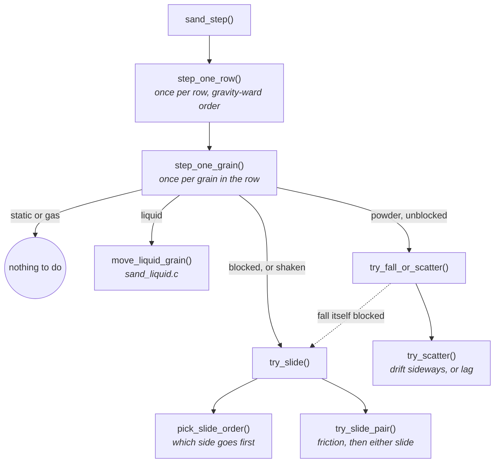
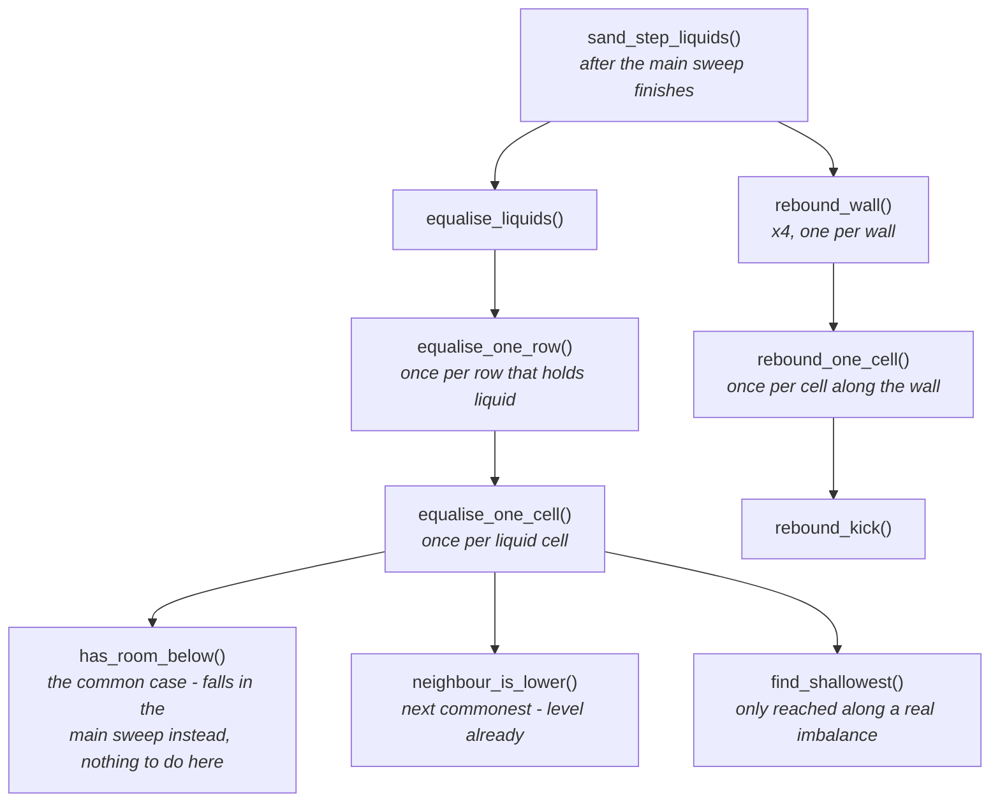

# The Falling-Sand Simulation

What `main/apps/sand/` actually is: a cellular automaton with a handful of
materials, tilt-steered by the accelerometer, that has to run inside a
memory and time budget tight enough that most of its design decisions were
forced by measurement rather than chosen for elegance.

This document is the "why" behind it - the material encoding, the movement
rules, the water model, and the performance discipline that shaped all of
them. For the app-registration mechanics (how `main/apps/*` plugs into the
shell), see `docs/Launcher-Architecture.md`. For the hardware constraints
underneath everything here, see `docs/Notes/README.md`. The discovery
narrative behind the fixes below - the bugs found and the reasoning at the
time - lives in `docs/Notes/Simulation-Lessons.md`.

---

## The grid is one byte per cell, and always will be

At the simulation's resolution (184 x 224, `CELL = 2` px) a one-byte cell is
41 KB; two bytes would be 82 KB, against roughly 90 KB actually free once the
framebuffer (322 KB of the chip's ~424 KB internal SRAM, no PSRAM) is
accounted for. That budget is why the encoding is this tight:

```
high nibble   material id, 0 meaning empty  -> 15 materials, MATERIAL_MAX = 16
low nibble    a variant, meaning depends on the material's kind
```

What the low nibble means is not fixed - it is reused per material, on
purpose:

- **Powder** (`KIND_POWDER`, e.g. sand): a *shade*, so a pile has texture
  rather than reading as one flat block of colour. Travels with the grain
  rather than being derived from its position, because position-derived
  colour makes a falling pile shimmer as it moves.
- **Liquid** (`KIND_LIQUID`, e.g. water): a *fill level*, 1-15
  (`MASS_MAX`). This is what lets water level itself using only its
  immediate neighbours - see [The water model](#the-water-model) below.
- **Transient** (not implemented yet - fire, steam): would be *life
  remaining*, counting down to nothing. Reusing the nibble is what makes
  that free instead of needing its own byte.

## Materials are a flash-resident table, not code

`materials[MATERIAL_MAX]` (`material.c`) is `const`, so it is memory-mapped
from flash and costs **zero bytes of RAM** - confirmed via `idf.py size`,
not assumed. Adding a material is a row in that table, not a branch in the
movement code:

```c
typedef struct {
    uint8_t kind;      /* how it moves - see material_kind_t */
    uint8_t density;    /* heavier displaces lighter */
    uint8_t slip;       /* resistance to being buried, 255 = none (a liquid) */
    uint8_t repose;     /* angle of repose x10, 0 = none (a liquid) */
    uint8_t scatter;    /* chance a falling grain drifts, for visual dispersion */
    const char *name;   /* cold - last, so it cannot push the hot fields apart */
} material_t;
```

The table is padded to the full 16 the nibble can address
(`MATERIAL_MAX = 16`), with the unused slots filled inert (`KIND_STATIC`,
`density = 255`). That turns every lookup into a plain array index with no
bounds check - worth doing because it happens several times per cell, per
step, and a corrupt cell byte becomes an immovable block instead of
undefined behaviour.

The 256-entry colour palette (`material_palette()`) is built the same way -
16 shades per material, interpolated at compile time into another `const`
table, so drawing a cell is one array index and zero colour maths at
runtime.

## Movement: one rule, and one invariant that has to be right

Every grain gets the same rule: try to move the way gravity points; failing
that, try the two directions either side of it. Angle of repose, heaps that
collapse when undermined, sand pouring through a gap - none of that is
modelled explicitly. It all falls out of those three attempts.

**The sweep order is the one thing that cannot be wrong.** A grain only ever
moves into a cell in the gravity-ward half of its neighbourhood, so sweeping
the grid *against* the direction of travel guarantees a cell's destination
has already been visited this step - a grain that moves cannot be picked up
and moved again in the same frame. Sweep the other way and a falling grain
teleports to the floor in one frame instead of falling one cell at a time.
Every pass in this codebase (the main sweep, and the liquid cross-flow pass
below) is built around this same guarantee, each with its own sweep order
derived from whichever direction *it* moves things in.

**Friction is two separate things**, because burial alone does not explain
the reported symptom (a floor of sand skating sideways on the faintest
tilt):

- **Angle of repose** - a grain on a slope stays put until the slope exceeds
  the friction angle: `descent > mu * lateral`, the same test as a block on
  an incline. `mu` is `repose / 10`; sand's `repose = 7` is ~35 degrees. A
  liquid's `repose = 0` means no angle of repose exists at all - it slides
  sideways however level the surface is, which is what makes it a liquid.
- **Burial** - a grain counts how many grains are stacked directly against
  gravity above it, and each one halves its chance of sliding
  (`SAND_SLIP_CHANCE = 96` in 256, halving per grain, capped hard past
  `SAND_LOAD_CAP = 5`). A liquid's `slip = 255` means load never holds it at
  all - water at the bottom of a pool flows exactly as freely as water at
  the top.

**Gravity's direction is dithered, not snapped to nearest-of-eight.**
Snapping makes a slow tilt arrive in 45-degree jerks. Instead, each step
randomly picks one of the two octants bracketing the true angle, weighted so
the long-run average matches it - the same trick as dithering a colour ramp,
applied to a direction. At 60 fps the eye integrates the two directions into
one smooth angle.

## The water model

Water went through three designs this project, in order, each one replaced
because it was measurably wrong rather than because it looked wrong:

1. **Cell-count, no amount.** A cell is either water or not. Two adjacent
   cells at "full" and "empty" have no legal move that leaves a valid state
   in between - a wide pool freezes into a staircase. This is a genuine
   fixed point of any rule shaped like this, not a bug in one attempt at it.
2. **Local mass diffusion only** (an amount per cell, shared only with
   immediate neighbours). Correct per the literature, and measurably too
   slow: levelling a pool 184 cells wide by neighbour-to-neighbour diffusion
   alone takes tens of thousands of steps, because information only moves
   one cell per step. Measured: a real-width pool was still 6 cells proud
   after 5,000 steps. Not a tuning problem - an `O(n^2)` bound on any rule of
   that shape.
3. **Mass, plus a bounded surface scan** - what shipped. A liquid cell
   carries an amount, 1-15 (`MASS_MAX`). Two rules, in the main sweep, in
   order:
   - **Down, then down-the-slope** (`move_liquid_grain()`, `sand_liquid.c`):
     fill the cell below if it has room, then share what is left with the
     two diagonal downhill neighbours. Still only immediate neighbours,
     still gravity-ward, so it carries the same no-double-move guarantee
     every other move in the main sweep does.
   - **Cross-flow** (`equalise_liquids()`, `sand_liquid.c`): a *second*,
     separate sweep, perpendicular to gravity, that looks up to
     `SAND_LIQUID_SIGHT` (8) cells along the surface for somewhere shallower
     and moves half the difference there. This is deliberately not local -
     it is the cheap stand-in for pressure, which in real water travels far
     faster than the water itself does, and it is why every falling-sand
     game has some version of it.

**Why cross-flow cannot live in the main sweep.** The main sweep's
no-double-move guarantee depends on sweeping against gravity - but once
gravity is tilted, that pins the sweep on *both* axes, and of the two
directions across the flow, only the one the sweep has already passed is
ever safe to use. Water could cross a slope one way and never back: a
tilted pool did not level at all, it walked into the low corner and set
there in steps. A separate pass has its own sweep order, chosen to fit
whichever cross-flow direction it is using that step (the two alternate
every step, so both directions become available over time).

**`SAND_LIQUID_SIGHT` is 8, not larger, and that number is measured, not
guessed.** A longer sight distance hands mass directly to a cell far away,
skipping everything between - so water visibly vanishes from one spot and
reappears in another, and because the sweep direction alternates every
step, it sloshes straight back the next. Measured residual unevenness after
settling: 4 -> 1.6 cells, 8 -> 0.8, 16 -> 0.5, 32 -> 0.2 (but visibly wrong
while it gets there - "huge waves"). 8 was picked as the point where a 4x
reduction in cost costs only ~0.6 cells of extra unevenness, which is
smaller than a pixel at this grid's resolution.

**A subtle correctness bug, worth knowing if this code is ever touched
again:** cross-flow's own axis was, for a while, taken from the *dithered*
gravity direction - which by design alternates between two octants almost
every step once off-axis. That made the axis a "is this level" search runs
along change out from under it constantly, and a settled pool could read as
wildly unbalanced along the direction it *wasn't* just checked against,
swinging large amounts of mass back and forth every step or two - visible as
water that looked settled flashing between shades and resettling. Fixed by
taking the axis from the *nearest* (non-dithered) direction instead, the
same fix friction's burial check already used for the identical reason. See
`test_a_settled_pool_does_not_flicker` in `suite_sand.c`.

## Momentum and the wall-rebound splash

Everything above reacts to where gravity *points*. Nothing reacted to how
fast it was *changing* - so a wave that had just piled against a wall had no
reason to do anything but sit there, indistinguishable from a slow tilt to
the same angle. `sand_step()` tracks a single shared momentum vector
(`mom_x_q8`, `mom_y_q8`, Q8 fixed point - not a per-cell velocity field,
which would cost another byte per cell) from how much gravity's direction
has turned, step over step, and decays it (`SAND_MOMENTUM_DECAY = 220/256`
per step). When that momentum is large and pointed into a wall, cells
touching that wall kick a little mass back into the grid
(`SAND_REBOUND_GAIN = 8`, `SAND_REBOUND_MAX = 10` per cell per step, above
`SAND_REBOUND_THRESHOLD = 160`).

**The direction and the speed deliberately come from different signals.**
`(gx, gy)` is already smoothed before `sand_step()` ever sees it - it has to
be, or every grain would jitter with sensor noise - and that smoothing caps
how far its own frame-to-frame delta can move, which makes it the *wrong*
thing to measure speed from: a real flick and a slow tilt to the same angle
become nearly indistinguishable once the filter has settled. So direction
still comes from `(gx, gy)`; how far to push comes from
`sand_set_flick()`, fed once a frame from the gyroscope's raw rotation rate
(`imu_rotation_level()`) - never run through the position filter, and
already read every frame to steer *its* responsiveness anyway. Calibrated
against a real capture rather than guessed: ordinary handling measured
21-159 (Q8 units), and a genuine flick 162-737 - comfortably past
`SAND_REBOUND_THRESHOLD = 160`, with a real gap between the two clusters
rather than a fuzzy boundary. Most of a flick's range sits at the low end of
that (162-350), which is why the gain is 8, not smaller - at the old value
of 3, a typical flick's kick was only 1-2 mass out of 15, barely visible.

## Performance discipline

Every number below came from `esp_timer_get_time()` on real hardware, via
the device-only tests in `suite_sand.c` (`#ifdef DEVICE_BUILD`), not
estimated:

| Scenario | Cost | Budget |
|---|---|---|
| Settled screen of sand | ~19-24 us | (dwarfed by anything else) |
| Full-screen sand step, worst case | ~5.5-6 ms | 8 ms |
| Water cross-flow + rebound, worst case | up to ~15 ms | 16 ms |
| Full-screen panel blit | ~9.6 ms | (fixed hardware cost) |

Water, not sand, is the actual bottleneck whenever a body of it is moving -
see the correction in `docs/Notes/Simulation-Lessons.md`'s "A note on
measurement noise", which used to say the opposite before water existed as
a material.

Three techniques account for most of the gap between "walk every cell every
step" and the numbers above:

- **Row sleeping.** A row that produced no movement under the current
  gravity direction, and whose neighbours have not moved either, is skipped
  entirely next step (`row_state`, in `sand.c`). Motionless sand costs
  roughly 1,000x less than the same sand while it is actually falling.
- **`ROW_NO_LIQUID`.** The same idea for the liquid pass specifically - a
  row scanned and found dry is skipped until something writes to it again.
- **Bitmasks over flash-table reads, inside a hot loop.** Asking
  `materials[id].kind` per cell is a flash read and a likely cache miss (the
  32 KB code/constant cache on this chip, not a data cache - see
  `docs/Notes/Simulation-Lessons.md`). Precomputing a 16-bit "is this id a
  liquid" bitmask once per pass, instead of once per cell, measurably
  mattered: it alone was the difference between a settled screen of sand
  costing 17 us and costing 5.5 ms.

## Why the liquid logic is its own file

`sand.c` and `sand_liquid.c` used to be one file. Measured with a cognitive
complexity analyzer (`launcher/tools/cognitive_complexity.py`, cross-checked
against `idf.py clang-check`'s real clang-tidy run until the two agreed
exactly): `sand_step()` alone scored 191 against Sonar's own "worth a look"
line of 25. Two things were true about that number - `equalise_liquids()`
(85) and the wall-rebound pass (27) were already separate *functions*, just
not a separate *domain*, since both are liquid-only and already shared
helpers with each other.

The split moved everything about a liquid that is **not** gravity-ward
(cross-flow, the rebound splash, the momentum accessors) into
`sand_liquid.c`, and extracted the one piece that had to stay in `sand.c`'s
sweep (`move_liquid_grain()`, since it obeys the same gravity-ward guarantee
every other move there does) into its own function. That extraction alone
dropped `sand_step()` from 191 to 134 - a real complexity cut, not just
relocated lines, because it collapsed nesting that had been compounding the
score.

`dest_row()` and `mark_rows()`, needed on both sides of the split, stay
`static inline` in a shared `sand_priv.h` rather than becoming ordinary
`extern` functions - both sit on the hottest path in the simulation, and a
call across translation units is not guaranteed to inline the way a call
within one file is. Confirmed on device rather than assumed: the
frame-budget tests above are what would have caught it if splitting the
file had cost anything.

## The sweep and the cross-flow pass, broken down further

134 and 85 are still well over Sonar's *default* line, which is 15, not the
25 used above - that line only ever applied to the standalone check, not to
what the project actually holds itself to. Both functions were later broken
down the same way again, one level deeper: nested per-cell and per-row logic
pulled into small named functions, until every function in `main/` scored 15
or under (`sand_step()` itself: 6; `equalise_liquids()`: 13).

The main sweep, per grain:



The cross-flow pass, per liquid cell:



**The extraction was not free.** `has_room_below()`,
`neighbour_is_lower()`, `find_shallowest()`, `equalise_one_cell()` and
`give_mass()` are all on the per-cell path above, and none of them were
marked `inline` when they were pulled out - unlike `pour_into()`/`room_in()`,
the pair already living in that file. A full screen of water went from the
~15 ms in the table above to 18 ms against its 16 ms budget, caught directly
by `test_a_screen_of_water_fits_in_the_frame_budget` on device, not
noticed by eye. Marking those five `inline` restored it. The lesson from
the file split above held a second time: a call this hot has to be
confirmed on device, not assumed free because the source now reads as
several small functions instead of one large one.

---

## Related

- `docs/Launcher-Architecture.md` - how an app (this one included) plugs
  into the shell; the folder layout every app follows.
- `docs/Notes/` - the hardware constraints underneath all of this: the
  memory budget, the flash/RAM cache distinction, panel and touch gotchas.
  Start at `docs/Notes/README.md`; `docs/Notes/Simulation-Lessons.md`
  specifically is this app's own discovery narrative.
- `docs/Testing-Guide.md` - how the host and device test suites work, and
  why release builds carry none of the test code.
- `launcher/tools/cognitive_complexity.py` - the complexity analyzer
  mentioned above, with its own reasoning documented in its module comment.
