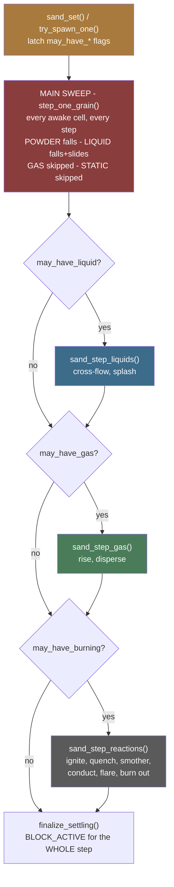
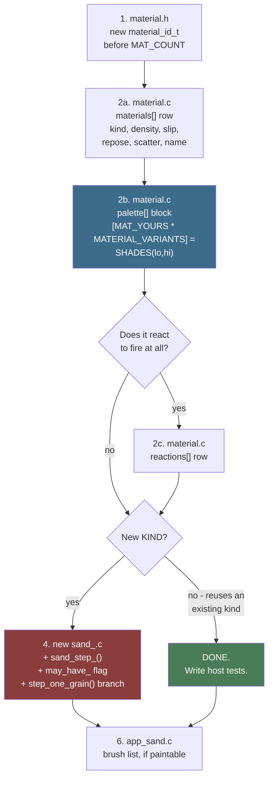
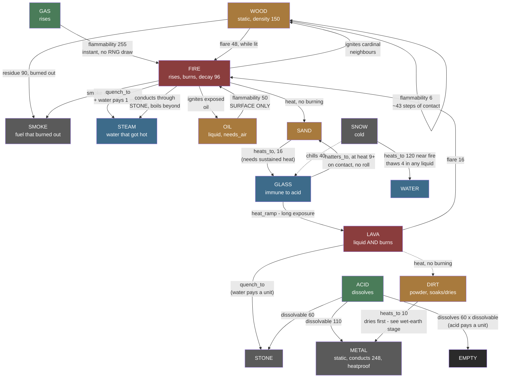
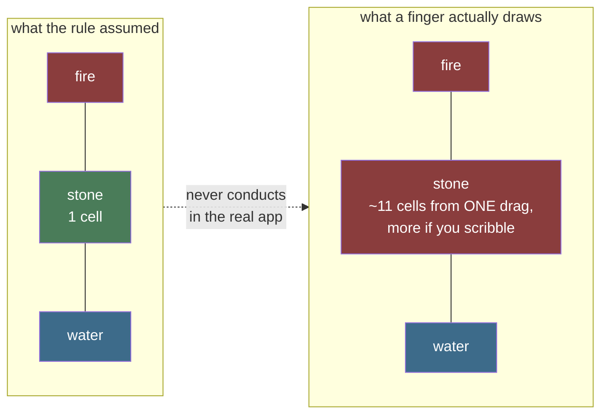
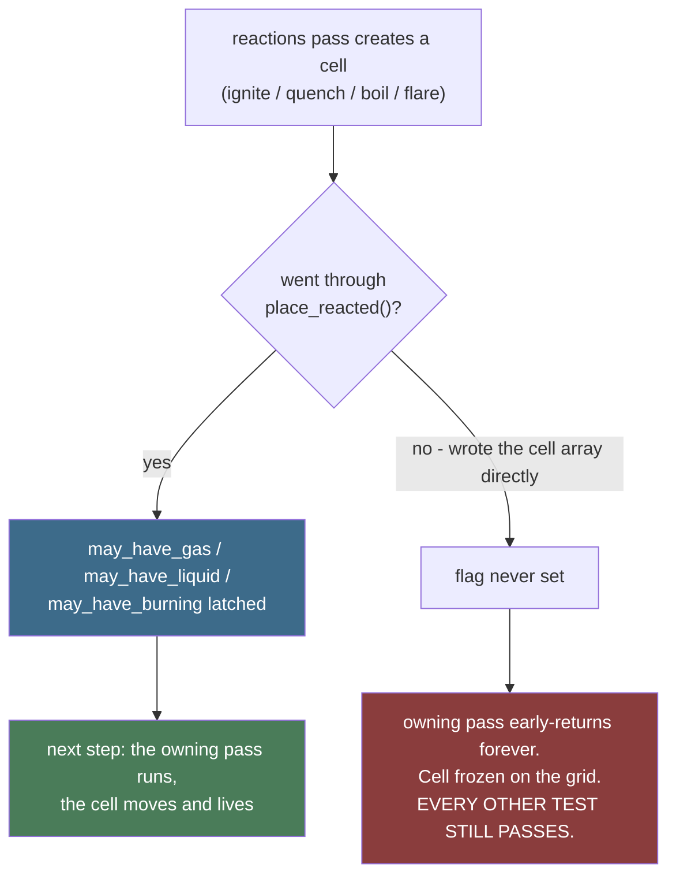

# Adding a Material

A practical checklist, worked out by actually building materials four
through nine end to end - `MAT_GAS`, then fire's redesign, then the whole
wood/ember/steam/smoke chain and the boiler that came with it. Read
[`Sand-Simulation.md`](Sand-Simulation.md) first if you have not - this
assumes you already know what `material_t`, `material_kind_t`, and the
main sweep's no-double-move guarantee are.

Everything here was paid for once already. The sections marked **lesson**
are mistakes that shipped or nearly shipped, kept in the shape that makes
them recognisable next time rather than tidied into rules.

---

## The map: two independent axes

A material is two orthogonal decisions, and confusing them is the most
common way to over-build. **How it moves** is `materials[]`. **How it
burns** is `reactions[]`. Neither constrains the other.

```mermaid
flowchart LR
    subgraph MOVE["materials[] - how it MOVES (hot table)"]
        direction TB
        M1["KIND_STATIC\nstone, wood"]
        M2["KIND_POWDER\nsand"]
        M3["KIND_LIQUID\nwater, lava"]
        M4["KIND_GAS\ngas, fire, steam, smoke"]
    end

    subgraph REACT["reactions[] - how it BURNS (cold table)"]
        direction TB
        R1["inert\nsand, water, steam, smoke"]
        R2["fuel\ngas, wood"]
        R3["heat source\nfire, lava"]
        R4["conductor\nstone"]
    end

    MOVE -.->|"any row on the left\ncan pair with any\nrow on the right"| REACT

    style M1 fill:#5a5a5a,color:#fff
    style M2 fill:#a87a3d,color:#fff
    style M3 fill:#3d6b8a,color:#fff
    style M4 fill:#4a7c59,color:#fff
    style R1 fill:#5a5a5a,color:#fff
    style R2 fill:#a87a3d,color:#fff
    style R3 fill:#8a3d3d,color:#fff
    style R4 fill:#3d6b8a,color:#fff
```



**Lava is the clearest proof the axes are independent** - its own comment
in `material.c` says exactly that: `KIND_LIQUID`, the same kind as
ordinary water, and simultaneously a heat source that ignites its
neighbours and flares, with not one line of movement code anywhere
knowing about the combination. (Ember made the same point once, as a
`KIND_STATIC` material that was also a heat source - see "Lesson: the
obvious material is sometimes the wrong one" below for why it folded into
wood instead.) A `KIND_POWDER` material that is also flammable needs a
`reactions[]` row and *nothing else* - no new pass, no movement code, no
branch anywhere.

Colour convention, used consistently in every diagram in this folder:

| | |
|---|---|
| ⬛ grey `#5a5a5a` | static / inert |
| 🟫 amber `#a87a3d` | powder, fuel |
| 🟦 blue `#3d6b8a` | liquid, conductor, cold paths |
| 🟩 green `#4a7c59` | gas |
| 🟥 red `#8a3d3d` | hot / active / the expensive path |

---

## The two-part question

Every material decomposes into the same two questions, and they are
independent of each other:

1. **Does it move like something that already exists?** `KIND_POWDER`
   (falls, piles at an angle of repose) and `KIND_LIQUID` (falls, spreads
   flat as an amount) are the two shapes on offer, plus `KIND_GAS`
   (rises, disperses) and `KIND_STATIC` (never moves). If your material's
   movement is genuinely one of these, reusing the existing kind and
   just giving it its own row in `materials[]` - different density,
   slip, repose, scatter - is the *entire* implementation. This is the
   common case, and the reason the material table is designed the way
   it is: "adding a material is a row here rather than a branch in the
   movement code" (`material.h`'s own header comment).

2. **Does it need a new KIND?** Only if the movement shape itself is new
   - as it was for gas (`KIND_GAS`, rises instead of falls). This is the
   harder path, covered below, and it was genuinely harder than adding a
   row: it needed a new file, a second sweep pass, and three attempts to
   get the performance right.

If your answer to (1) is yes, stop reading here and go do that - a new
row in `materials[]` plus a palette entry (see "The mechanical part"
below) is the whole job. **Five of the nine real materials - fire,
wood, steam, smoke and ember - were exactly this**, and none of them
needed a line of movement code.

---

## Where your change actually lands

Before writing anything, know which of these boxes you are touching. The
red box is the only one that costs you performance thinking; everything
downstream of the main sweep is gated behind a flag and runs on nobody's
frame budget when your material is not on the grid.



Every extra pass runs **after** the main sweep and **before**
`finalize_settling()`, so `BLOCK_ACTIVE` reflects the whole step rather
than the main sweep's share of it. That ordering is not cosmetic - see
the comment at the call site in `sand.c`.

---

## Design questions worth working through before writing code

These came up designing gas and then again designing fire chemistry, in
roughly the order they became unavoidable. Not all of them apply to every
new material - but check each one, because skipping one silently is how a
material ships broken in a way host tests might not catch.

**Does the main sweep's no-double-move guarantee hold for this
material's own primary direction?** The main sweep sweeps *against*
gravity, so any move gravity-ward lands in already-visited territory.
If your material moves gravity-ward too (even partially, like a liquid's
fall-then-slide), it can join the main sweep. If it moves in some other
fixed direction - anti-gravity, like gas, or something else entirely -
it needs its **own pass**, swept in whichever order makes *that*
direction's moves land in already-visited territory. Get this wrong and
the symptom is dramatic: a grain that should move one cell a step
teleports across the whole grid in one frame, because the sweep re-visits
a cell it just moved into.

**Can it reuse the existing movement primitives, direction-inverted, or
does it need genuinely new movement logic?** `try_fall_or_scatter()`/
`try_slide()` (declared in `sand_priv.h`, `_impl` bodies there, real
wrappers in `sand.c`) take a plain `(dx, dy)` direction and are not
hardcoded to "down" - passing a negated direction produces correct
"rise and slide" behaviour for free. Whether this is enough depends on
what the material is meant to look like: reusing them gets you rising/
falling plus diagonal sliding under friction, but **not** flat spreading
- that is what `equalise_liquids()`/`equalise_gas()`'s own *second* sub-pass
does, and skipping it (assuming the reused primitives are the whole
story) is exactly the mistake gas's own design almost made. If the
existing primitives genuinely do not fit the movement shape at all, a
new material needs its own logic - at which point think hard about
whether it is really a new `KIND`, or a variant of an existing one.

**Whole-grain or mass-based?** `KIND_POWDER` moves whole grains
(`move_to()`, a swap); `KIND_LIQUID` moves an *amount* per cell
(`give_mass()`/`pour_into()`, 1-15 via `CELL_VARIANT`). Whole-grain is
the smaller diff if an existing kind's primitives are being reused (as
above) - but it means the visual result is discrete grains, not a
smoothly thinning cloud. This is a real product/visual decision, not one
the code makes for you.

**What is its density, relative to every other material?** `can_enter()`/
`move_to()`'s displacement rule is one-directional: denser only ever
displaces lighter, never the other way round. Pick a density that makes
every displacement relationship you actually want come out true - gas's
`10` (between empty's `0` and water's `30`) lets sand and water sink
*through* it for free, with zero gas-specific code, simply because the
existing displacement rule already runs in the main sweep whenever
something denser tries to move into a gas-occupied cell.

The current ladder, which any new material has to slot into somewhere:

```mermaid
flowchart LR
    E["empty\n0"] --> S["steam\n5"] --> K["smoke\n7"] --> G["gas\n10"] --> F["fire\n15"] --> SN["snow\n15"] --> X["oil\n22"] --> W["water\n30"] --> AC["acid\n38"] --> LV["lava\n45"] --> A["sand\n60"] --> D["wood/ember\n150"] --> T["stone / glass\n200"]

    style E fill:#2a2a2a,color:#fff
    style S fill:#3d6b8a,color:#fff
    style K fill:#5a5a5a,color:#fff
    style G fill:#4a7c59,color:#fff
    style F fill:#8a3d3d,color:#fff
    style W fill:#3d6b8a,color:#fff
    style A fill:#a87a3d,color:#fff
    style D fill:#a87a3d,color:#fff
    style T fill:#5a5a5a,color:#fff
    style X fill:#a87a3d,color:#fff
    style LV fill:#8a3d3d,color:#fff
    style AC fill:#4a7c59,color:#fff
```



Oil at 22 and lava at 45 straddle water deliberately: oil floats, lava
sinks, and both fall out of one rule rather than any material-specific
code.

Note which mechanism each kind goes through, because it decides whether
a density relationship needs code at all. A **powder** moves via
`can_enter()`, which admits a mover only if it is denser than the target
- so for a powder, "lighter than water" already means "floats", for free.
A **liquid** never consults `can_enter()`, which is why oil floating on
water needed a rule of its own (`sink_through_lighter_liquid()`). **Check
the mechanism before assuming a density relationship needs enforcing.**

Two consequences worth internalising, both real limitations rather than
bugs to chase:

- **Equal density means mutual blocking, not mixing.** `can_enter()`
  needs *strictly* greater density to displace. Two materials at the
  same density simply stop each other dead. Steam sits at 5 and smoke
  at 7 for exactly this reason - nothing else depends on the gap.
- **Mobility is not expressible in `can_enter()`, and needed its own
  code.** Steam (5) cannot *enter* water (30) - the rule wants a denser
  mover - and water will not fall into steam either, because `room_in()`
  refuses a cell holding a different material outright. Between them a
  gas under standing liquid had no legal move in either direction and
  froze there permanently. The fix is `try_bubble()` in `sand_gas.c`: a
  straight two-cell swap, gated on `KIND_GAS` and an inverted density
  test, living in the warm tier so the hot predicate never learns about
  it. Worth knowing as a precedent - **when a rule cannot express what
  you need, adding the exception to the cold or warm pass is usually
  right, and teaching the hot predicate is usually wrong.**
- **Two liquids of different densities also needed their own rule, and it
  was nearly free.** `room_in()` refuses a cell holding another material,
  so oil and water simply blocked each other. The fix
  (`sink_through_lighter_liquid()`, `sand_liquid.c`) is phrased as *the
  denser liquid moves DOWN* rather than *the lighter one rises* - and
  that phrasing is the whole trick, because down is gravity-ward and so
  inherits the main sweep's existing no-double-move guarantee. The
  mirror-image rule would have needed its own reversed pass, exactly like
  gas's. **When a new movement has to be added, check whether it can be
  stated gravity-ward before writing a pass for it.**

**Does it need `slip`/`repose` to mean "no resistance", like a liquid,
even if it is whole-grain?** Gas's `slip = 255`/`repose = 0` copy water's
values exactly, even though gas moves through the powder primitives, not
the liquid ones - `slide_chance()` and `driven_by_gravity()` both already
treat those values as "never held back", so a whole-grain material can
still get liquid-like freedom of movement just by setting the same
numbers.

**Does the movement direction interact with `driven_by_gravity()`
correctly?** This one is subtle and easy to get backwards.
`driven_by_gravity()`'s friction check is a dot product against the
*real* gravity vector - if a material's own primary direction is not
gravity itself (gas's is the negation of it), its slide vectors must be
checked against a matching negated gravity vector too, or the dot
product comes out negative for every slide and the material never slides
at all. `sand_gas.c` builds its own `driven_gas[][]` table against
`(-gx, -gy)` for exactly this reason.

**Can a player actually build the scene this material needs?** The
newest question, and the one that cost the most rework. It has its own
section below - **read it before picking any constant that describes a
distance in cells.**

---

## The mechanical part



1. **`material.h`**: add the new `material_id_t` enum value, before
   `MAT_COUNT`.
2. **`material.c`**: add a `materials[]` row and a `palette[]` block. The
   block needs its own designator - `[MAT_YOURS * MATERIAL_VARIANTS] =`
   followed by `SHADES(lo, hi)` - which is what stops it depending on
   where in the list it sits. `MATERIAL_MAX` stays 16 either way.

   The designators are not decoration. The palette used to be positional,
   and twice a block added or removed in the middle shifted every block
   after it by sixteen entries, handing materials each other's colours and
   leaving the last one reading the array's zero-filled tail - which
   renders as plain black and looks like a styling choice rather than a
   bug. `test_every_material_has_a_palette_block` now checks the result.

   **If the material reacts to fire at all** - it can catch, it is
   itself a heat source, it conducts heat, it smokes, it does something
   other than vanish when quenched, or it flares a flame - it also needs
   a row in the *second* table, `reaction_t reactions[]` (same header,
   same file).

   **An absent row is not neutral.** It is all-zero, and zero means
   something different for each field: never catches, never a heat
   source - but also **immune to acid** and **heat stops here**. The
   first two are the harmless reading that makes most materials able to
   skip this table entirely. The last two are real behaviours, and glass
   shipped with both by accident - correctly immune to acid, wrongly
   inert to heat, from the same missing row. See "An omission is a
   decision" below.

   See `material.h`'s own comment on `reaction_t` for why this is a
   second table rather than more fields on `materials[]` - the short
   version is the next section.
3. **If reusing an existing `KIND`**: that is the whole implementation.
   Write host tests (see below) and you are done.
4. **If it needs a new `KIND`**: a new file (`sand_<name>.c`), mirroring
   `sand_liquid.c`'s or `sand_gas.c`'s shape - a `sand_step_<name>()`
   entry point declared in `sand_priv.h`, called from `sand_step()`
   after the main sweep and before `finalize_settling()`. Add a
   `may_have_<name>` flag to `sand_t` (mirrors `may_have_liquid`/
   `may_have_gas`) set wherever the material gets placed
   (`sand_set()`/`try_spawn_one()`), checked both inside the new pass
   (cheap early-out) and, once the pass exists and is measured, at its
   call site in `sand_step()` too (avoids marshalling arguments for a
   call that will immediately return - see `sand_step_gas()`'s own call
   site for the pattern).
5. **`step_one_grain()`** (`sand.c`): the new `KIND` needs a branch, even
   if it is just "skip - handled by its own pass", exactly like `KIND_GAS`
   is skipped there with a comment explaining why.
6. **`app_sand.c`**: add the new material to the paintable-materials
   brush list if it should be usable in the real app. Separate,
   app-level concern from the core simulation - **easy to forget, and
   nothing will tell you**: `run_tests.sh` skips every `app_*.c` by
   design, so the brush list is covered by no test at all.

---

## The reaction chain, as it stands

Useful as a worked example of how much behaviour comes out of pure table
data. Every arrow below is a `reaction_t` field, not a branch in code.



Note the two byproducts are **different materials on purpose**: steam is
water that got hot, smoke is fuel that burned out. That split has its own
lesson below.

Ember is not a node here any more. It folded into wood's own variant -
`burn_decay` counts down how much of a lit log is left to burn, so
"catching fire" is wood becoming a lit version of itself (the self-loop
above) rather than becoming a different material - see "Lesson: the
obvious material is sometimes the wrong one" below for the full story.

The old `Ember -->|"conducts"| Steam` edge is gone too, and not because
conducting was ever removed from anything: ember's own rows
(`materials[MAT_EMBER]` and `reactions[MAT_EMBER]`, checked directly
against the commit before the fold) never had a `conducts` field at
all. The edge was wrong the day it was drawn - a diagram claiming a
field the table never had - not a behaviour this fold took away.
Wood's current row still has no `conducts`, which is simply consistent
with what ember's row always was. Dirt and metal are the newest
arrivals - see
[`Metal-Smelting-Plan.md`](Metal-Smelting-Plan.md).

---

## Performance: what is hot, what is cold, and what that buys you

The single most useful thing to know before optimising anything here is
which tier your code is in. They differ by orders of magnitude.

| Tier | What runs there | Cost per step | What you may spend |
|---|---|---|---|
| 🟥 **Hot** | `step_one_grain()`, `can_enter()`, `move_to()`, `material_t` field reads | every awake cell, several reads each | Almost nothing. A branch here is a real regression. |
| 🟩 **Warm** | `sand_step_liquids()`, `sand_step_gas()` | every cell of every block that could hold that kind | Modest. Gate aggressively; both already skip block-columns. |
| ⬛ **Cold** | `sand_step_reactions()`, `reaction_t` field reads | only when `may_have_burning`, only on burning cells | Freely. Neighbour scans, bounded walks, extra tables. |

**This is why `reaction_t` is a second table.** `material_t` is read
several times per cell per step from the hot tier, and its own comment
explains why keeping the row inside a 32-byte cache line matters. The
seven reaction fields are read by exactly one cold function. Fattening
the hot table's stride to carry them would have cost every step that
never touches fire at all. The price of the split is that a material
that both moves and burns needs two rows instead of one - cheap, at that
exchange rate.

### Lesson: inlining into more call sites is not free

If step 4 applies - a new pass reusing an existing kind's movement
primitives - the exact way those primitives get shared between the main
sweep and the new pass matters more than it looks like it should. Three
attempts, each measured on real hardware, each wrong in a different way:

1. Just remove `static` from the primitives so the new file can call
   them. **Loses inlining at the ORIGINAL call site** (the main sweep's),
   which had been relying on the compiler inlining a `static` function
   used once per grain - regressed two frame-budget tests by ~26%,
   exactly reproducible, with neither test ever touching the new material
   at all.
2. Move the whole primitive chain to a header as `static inline`, so both
   files get their own independently inlinable copy. Fixes (1), but now
   the NEW call site also gets a full inlined copy of a large call graph
   - measured to nearly double a worst-case test's time, again exactly
   reproducible, again without that test touching the new material.
3. **What actually works**: keep the primitives `static inline` in the
   header (so the hot, original call site stays fully inlined, exactly
   as before), but give the new pass an ordinary, non-inline wrapper
   function - defined once, real linkage, calling the inline version
   internally - to call instead. One genuine function-call's worth of
   overhead from the new pass, zero code duplicated into it, and the
   original hot path untouched.

**Flash is a cache-constrained resource on this chip** (32 KB instruction
cache, see "Performance discipline" in `Sand-Simulation.md`), and a
function's compiled size at each call site is part of that budget, not
just its execution time. If a shared hot-path function needs calling from
a second place, measure whether that second place is hot enough to *need*
its own inlined copy before giving it one - a plain function call across
translation units is often the right default, not the fallback.

Full numbers in [`Simulation-Lessons.md`](Simulation-Lessons.md)'s gas
section and `sand_priv.h`'s comments above `try_fall_or_scatter_impl()`.

### Lesson: a cost bound must never decide whether a feature works

Heat conduction walks a run of conductor cells, capped by
`CONDUCT_REACH`. That cap exists purely so a cold pass cannot become an
unbounded scan - it is a statement about cost, not about physics.

It was set to 16, on the reasoning that one drag of the pour brush lays
down about eleven cells and 16 is comfortably past that. But a player
scribbling back and forth builds a floor well past sixteen cells, and at
that thickness the walk gave up entirely: the boiler was not slow, it was
**silently, completely dead**. The bound had quietly become a feature
gate.

The rule that leaves behind: when you cap a loop for cost reasons, set
the cap far enough out that the *physics* (here, probabilistic
attenuation) is what limits the result in every reachable scene, and the
cap only ever catches pathological ones. If you cannot tell which is
biting, that is a sign the cap is too tight, not that the feature is
fine.

---

## Lesson: can a player actually draw this?

The most expensive mistake of the whole fire-chemistry feature, made
twice in a row, in the same shape.

Heat conduction was first specified as reaching **exactly one** conductor
cell: fire on one side of a stone wall, water on the other, boil it. A
clean rule, easy to reason about, easy to test, and completely
unbuildable - because `app_sand.c`'s pour brush is a fixed radius-5 disc
(`POUR_RADIUS 5`) with no size control anywhere in the UI.



The fix was an attenuating walk - crossing `d` cells succeeds with
probability `(conducts/256)^d`, so thickness costs time instead of
being a hard wall, and thermal resistance falls out for free with no
second constant. Then the *same class* of mistake bit again: the first
attenuation figure (176, ≈0.69/cell) was tuned against the eleven-cell
case and collapsed past it - a thirteen-cell floor got through on 0.8%
of steps, a sixteen-cell one on 0.3%. In practice: a minute of staring
at nothing.

**The general lesson.** A rule that is clean in the abstract can be
unreachable through the very UI that has to produce the scene it depends
on, and neither the simulation nor its host tests will ever tell you.
Only asking *"can a player actually draw this?"* does. Concretely, before
finalising any constant that describes a distance in cells:

- Look up `POUR_RADIUS` and `ERASE_RADIUS` in `app_sand.c`. Those, not
  your intuition, define the granularity of every scene a player can
  make.
- Assume the sloppiest plausible construction, not the neatest one.
- Build the test fixture at that thickness. A test that passes on a
  one-cell idealisation while the real case fails is worse than no test,
  because it reports success.

---

## Lesson: a predicate about "air" has to know what air is

Oil burns off its surface rather than detonating through its volume
because of one flag, `needs_air`, and one predicate behind it:
`touches_air()`. The first version of that predicate tested whether any
cardinal neighbour was **empty**, which is the obvious reading and is
wrong in exactly the situation the feature exists for.

A flame resting on a pool is not empty space. The moment the surface
caught, its neighbour became a fire cell, the surface stopped counting as
exposed, and the pool could never light. Measured, not reasoned about: a
fire blob sat on an oil slick for thirty steps doing nothing. The fix is
one clause - air is empty space **or any `KIND_GAS` cell** - and the
slick then burns top-down exactly as intended.

Worth generalising, because this shape recurs: **a predicate named after
a physical concept will be written against the simplest encoding of it,
and the simplest encoding is usually the one that breaks under the
condition the feature was built to handle.** "Empty" and "open to the
air" feel like the same thing right up until something occupies the
opening. Test the predicate in the state the feature actually runs in,
not the state you set it up in.

## Lesson: an omission is a decision

`reactions[]` rows are optional, and a material without one gets all
zeroes. The guide above used to say that reads correctly for a material
with no reactions, and for most materials it does. It is not true field
by field.

Glass is the counterexample. It shipped with no reaction row at all,
which gave it two properties at once:

- `dissolvable = 0` - **immune to acid**. Correct, and the entire reason
  glass exists.
- `conducts = 0` - **heat stops dead at it**. Wrong. A stone vessel over
  a flame boiled its contents and a glass one did not, which is backwards
  for the vessel you have to make and the only one acid cannot eat.

Both came from the same absence, and nothing in the source distinguishes
them: the feature and the bug look identical, because neither is written
anywhere. It took someone noticing the beaker did not boil.

The general shape: **a defaulted field is a decision you did not make,
and the safety of the default depends entirely on which field it is.**
Before leaving a material without a reaction row, read the field list and
ask what zero means for each one, rather than what it means on average.
The fields where zero is genuinely inert (`flammability`, `burns`,
`dissolves`, `residue`) are safe to skip; the ones where zero is a real
behaviour (`conducts`, `dissolvable`) want a deliberate answer even when
the answer is zero - and a comment saying so, as stone's row does for
`dissolvable`.

## Lesson: sometimes the palette *is* the feature

`MAT_STEAM` and `MAT_SMOKE` have nearly identical `materials[]` rows.
Both are light gases that rise, spread and fade; their densities differ
by 2, their decay and mobility by a little. By every argument this
document otherwise makes, they should be **one** material - and they
were, at first.

That was wrong, and the way it was wrong is the point. The overlap was
real in the *physics* and false in the *picture*: a lone fire burning out
in mid-air, nowhere near water, puffing bright white kettle-steam reads
as a bug to whoever is watching, because they can see for themselves
there was nothing there to boil.

So the two rows exist to be **told apart on sight**, which makes their
palettes load-bearing rather than decorative - unusual here, and worth
recognising when it happens again. Two properties, both measured, both
pinned by `test_steam_and_smoke_are_told_apart_by_brightness`:

| | |
|---|---|
| at equal life | steam is ≥ 89 luminance brighter than smoke, all 16 variants |
| across whole ranges | freshest smoke (122) is still dimmer than dying steam (132) - **no overlap at all** |

The second is the subtle one, and the first draft of the palette did not
have it (`0x9A8F84` put fresh smoke at 144 against dying steam's 132). A
puff is caught at whatever point in its life you happen to look at it, so
only non-overlapping *ranges* make every cell unambiguous.

**When two materials differ mainly in appearance, write a test that
asserts the appearance.** Everything else in `suite_sand.c` tests
behaviour, and a future palette tweak would break this feature while
passing every one of them.

---

## Lesson: a reaction that changes a cell's KIND must latch that kind's flag

Invisible to almost every test that could catch it, which is what makes
it worth its own section.



`sand_t` carries a `may_have_<kind>` flag per movement kind
(`may_have_liquid`, `may_have_gas`) plus `may_have_burning` for
reactions, and every pass those flags gate **early-returns** when its
flag is clear - that is the entire point of the flag.
`sand_set()`/`try_spawn_one()` set the right flag(s) when a material is
placed *from outside the simulation*. That covers a player painting, and
does not cover a material a *reaction* creates mid-step: fuel igniting,
a liquid boiling into steam, an ember flaring fire. Those cells appear
from inside `sand_reactions.c`, never through `sand_set()`.

The danger is that the flag is usually **already** set some other way -
another gas cell already on the grid - so the bug hides. The one test
that catches it is a scene with *nothing else* of that kind present,
which is not the scene anyone writes by default. See
`test_creating_steam_arms_the_gas_pass`.

The fix that shipped: every cell-creating path in `sand_reactions.c`
goes through one function, `place_reacted()`, which sets the cell *and*
latches every flag the new material needs, in the same independent-`if`
shape `sand_set()` uses (an `else if` chain would shadow one - a material
can need more than one flag at once).

### And the variant it is born holding is a decision, not a default

`place_reacted()` takes a material, not a cell, so it has to pick the new
variant itself. It picks `MATERIAL_VARIANTS - 1`, which is right for a
**fill level** (a new pool of water is full) and for a **life** (a new
wisp of smoke has its whole life ahead of it) and wrong for every variant
that *accumulates towards* an end state instead of draining from one.
Heat has always been special-cased for this reason: a pane of glass born
at the top of its melt ramp would run to lava on the next step.

Burn progress is the same shape and was not. Wood's variant is how far
along it has burned, so `place_reacted(..., MAT_WOOD)` places a log
**already well alight** - which is exactly right when the reaction is fire
making an ember of a log, and catastrophic when it is a plant hardening
into a trunk. Every tree that grew tall enough to become wood burned to
nothing over the next couple of hundred steps, on a board with no flame
anywhere on it.

The general fix would be to make wood born-cold, and it is wrong: it
breaks ignition, which is the one caller that *means* the maximum. The
variant is not a property of the material, it is a property of the
**reaction**. So the shared bookkeeping was split out into `place_cell()`,
which takes a whole `cell_t`, and a caller that has an opinion about the
variant states it:

```c
place_cell(s, cx, cy, at, CELL_MAKE(r->hardens_to, 0));   /* grew, not caught */
```

Both go through the same latch/mark/wake, so nothing is lost. If you add a
reaction whose product has an accumulating variant - heat, burn progress,
moisture - say what it starts at.

---

## Lesson: the obvious material is sometimes the wrong one

Worth recording because the instinct it corrects is reasonable. The
obvious way to make wood burn is: wood touches fire, wood becomes fire.
Same shape gas already uses, less code, and wrong for wood specifically
in a way that only shows up when you ask what happens on the *next* step.

Fire is `KIND_GAS`. A wood cell that became fire would rise and disperse
on the next `sand_step_gas()` pass, exactly like any other fire cell -
so a log would dissolve into a rising flame that drifts away, often
before it gets a turn to ignite the log next to it. The burn stalls or
races depending on nothing the player did. The symptom is not even
obviously wrong at a glance, because fire *is* supposed to rise.

The fix is to split the burn into two jobs rather than ask one thing to do
both: a `KIND_STATIC` heat source that stays exactly where the wood was -
igniting, counting down, conducting, burning out, all without moving - plus
an ordinary `MAT_FIRE` flame it periodically flares upward
(`reaction_t.flare`) purely for looks.

That static heat source used to be its own material, `MAT_EMBER`. It is now
a STATE of wood: `reaction_t.burn_decay` makes wood burn while its variant
is non-zero, and the variant is how much is left to burn. The behaviour is
identical - the same 24-in-256 countdown, the same flare, the same smoke -
and it stopped costing a material slot.

Which is the more useful lesson, because ember spent a long time looking
like it had to be a material. It differed from wood in seven fields, and
only ONE of them (`decay`) was in the movement table; the other six were
reactions. What forces a slot is not "behaves differently" - it is needing
a different row in the table the SWEEP reads, since that is indexed by the
material nibble alone. A state the variant can carry does not need one.

**The question this leaves for the next material:** when something reacts
into another material, ask whether the reacted-into material's own
*movement* rules still make sense for what just happened. "Wood catches
fire" sounds right until "fire floats away" turns out to be exactly wrong
for a log.

---

## Measure it: the throwaway probe

Do not guess a constant, and do not ship it and hope you notice. The
simulation sources compile on the host with no ESP-IDF anywhere, so you
can build a one-off harness that sweeps a parameter and prints real
numbers in about five minutes. This is how the conduction figures above
were fixed, and it is the highest-leverage habit in this document.

```bash
gcc -std=c11 -O1 -I launcher/main -o probe.exe probe.c launcher/main/apps/sand/sand.c launcher/main/apps/sand/sand_liquid.c launcher/main/apps/sand/sand_gas.c launcher/main/apps/sand/sand_reactions.c launcher/main/apps/sand/material.c launcher/main/apps/sand/row_runs.c
```

Your `probe.c` needs only `#include "apps/sand/sand.h"`, a grid, and a
loop. Build the scene the way the *app* would build it (pour-brush-sized
blobs, hand-drawn thicknesses - see the UI lesson above), sweep the
constant you are unsure about, and print a table. The conduction sweep
was slab thickness 1..20 against one blob of fire, reporting first-boil
step and water consumed; the answer - that the old numbers died past 13
cells and vanished entirely past 16 - was obvious in one glance at the
table and invisible in every other way.

Keep the probe in your scratch directory, not the repo. It is a
measuring instrument, not a test: once it has told you the number, the
number goes in a comment next to the constant and the probe is disposable.

---

## Small traps that cost real time

- **The two tables key on the same material ids.** `materials[]` and
  `reactions[]` both contain `[MAT_STONE] = {`, so any search-and-replace
  or patch anchored on a bare `[MAT_X] = {` hits the movement table
  first. That has put a reaction row into `materials[]` twice now; the
  build catches it (`'material_t' has no member named 'conducts'`) but
  only after the fact. Anchor on a field that only the intended table
  has.
- **Do not draw a random number when the chance is 255.** `try_ignite()`
  checks `flammability == 255` *before* rolling, so materials at "always"
  consume no RNG. This is not micro-optimisation - it keeps the whole
  random stream bit-identical for every scene that does not involve the
  new material, which is what keeps existing tests and the exactly
  reproducible device frame-budget captures valid. Adding an unconditional
  roll to a shared path silently invalidates every timing number in the
  repo.
- **Never widen a shared test grid to fit one test.** `suite_sand.c`'s
  `wide` grid is 32 cells across; a test needing more cells changes how
  many cells every *other* test drawing on that grid rolls random numbers
  over, cascading into unrelated failures. Give the outlier its own grid -
  see `test_conduction_stops_at_the_reach_cap`.
- **Palette blocks carry their own `[MAT_X * MATERIAL_VARIANTS] =`
  designator.** They used to be positional and it bit twice: a block added
  or removed mid-list shifts every one after it, and the symptom is a
  material rendering black rather than any kind of error. Do not add a
  block without one.
- **`smothered()` needs all four neighbours *strictly* denser.** A dense
  material (wood at 150) is therefore essentially unsmotherable - only
  stone qualifies. Check this whenever you pick a density above sand's.
- **A material's variant may already mean something.** Liquids read it as
  fill, transients as life, glass and stone as temperature, wood as how
  much is left to burn. The suite's `GLASS`, `STONE` and `WOOD` macros have
  each been caught placing cells at a variant that used to be a shade and
  had quietly become a state - hot stone, half-melted glass, a log already
  on fire. If you give a material's variant a meaning, grep the tests for
  `CELL_MAKE(MAT_YOURS`.
- **Test overrides are wiped by `sand_init()`.** `sand_set_decay()` and
  friends must be called *after* any fixture helper that re-inits the
  grid internally.
- **`sand_set_mobility(&s, 0)` does not fully pin a gas cell.** It gates
  only sub-pass 1 of `sand_step_gas()`; `equalise_gas()`'s sideways
  spread is gated on `has_room_above()` instead. A cell with blocked "up"
  and an open side still drifts. See `test_the_boiler_end_to_end`'s
  comment.
- **Every tuned constant is a starting point.** The convention in
  `material.c` is to say so explicitly in the comment and record what the
  figure was measured against. Follow it.

---

## Testing

Follow `suite_sand.c`'s existing conventions - host-portable, direct
assertions, not visual inspection (see `docs/Testing-Guide.md` for why).
The gas tests are a reasonable template for a new `KIND`:

- Basic movement under ordinary gravity, and under at least one other
  gravity direction (inverted, and/or tilted/diagonal) - this project's
  simulation supports full 8-direction tilt-steered gravity, and a
  material's movement code needs to be genuinely direction-generic, not
  just correct for straight down.
- Blocked by a solid material with no gap (mirrors
  `test_nothing_displaces_stone`).
- Density-based displacement, both directions if both are meant to work
  (mirrors `test_sand_sinks_through_water`/`test_water_does_not_sink_through_sand`).
- Grain/mass conservation across every one of the 8 gravity directions
  in one test (mirrors `test_grains_are_never_created_or_destroyed`).
- If the material needs its own pass: a wake-propagation test confirming
  the pass explicitly wakes the blocks it moves through, with sleeping
  enabled - the class of bug that a missing `wake_block_and_neighbors()`
  call produces is invisible to every OTHER test, because the block-
  sleeping system is opt-in and most tests do not enable it.
- If the material spreads/disperses: a test confirming it actually
  spreads across more than its starting position after many steps, not
  just that it moves at all - a material that only reuses gravity-ward
  primitives without a proper spread pass will pass every "it moves"
  test while still piling into a heap instead of dispersing.
- **If a reaction creates it**: a test in a scene containing nothing else
  of its kind, asserting it still moves on the following step - the
  `place_reacted()` failure mode above.
- **If it is distinguished from another material mainly by appearance**:
  assert the appearance, not just the behaviour.
- **If its scene has to be hand-drawn**: build the fixture at the
  thickness the pour brush really produces, not a convenient
  idealisation.

Device frame-budget tests are a separate matter: **every budget in that
file is a measured figure with the measurement written beside it.** Never
add one with an invented number. If you cannot flash hardware, say so and
leave the budget to whoever can - and note that touching the reactions
pass makes the two existing fire budgets worth re-measuring.

---

## Related

- [`Sand-Simulation.md`](Sand-Simulation.md) — how the simulation works
  today, including the gas, fire-chemistry and boiler sections.
- [`Simulation-Lessons.md`](Simulation-Lessons.md) — the full discovery
  narrative, including the exact numbers behind the inlining lesson.
- [`Architecture.md`](Architecture.md) — both material tables as
  reference tables, the `kind` decision diagram, the step pipeline, and
  the exact device build/flash/verify commands.
- [`Shading-and-Colour.md`](Shading-and-Colour.md) — the deeper dive on
  painting an *existing* material once it has a palette block: the
  pipeline, the recurring shading mistakes, and the one item still open.
- [`Performance-Tuning-Attempts.md`](Performance-Tuning-Attempts.md) /
  [`Tuning-At-a-Glance.md`](Tuning-At-a-Glance.md) — what has already
  been tried, measured and rejected. Read before optimising anything.
- `docs/Testing-Guide.md` — the host/device test split this guide's
  testing section assumes.
