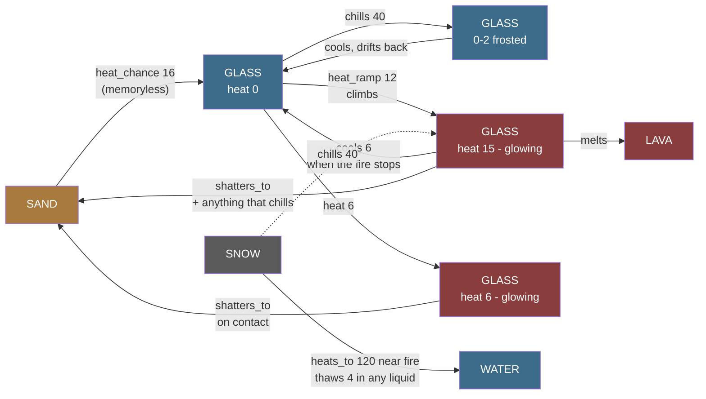
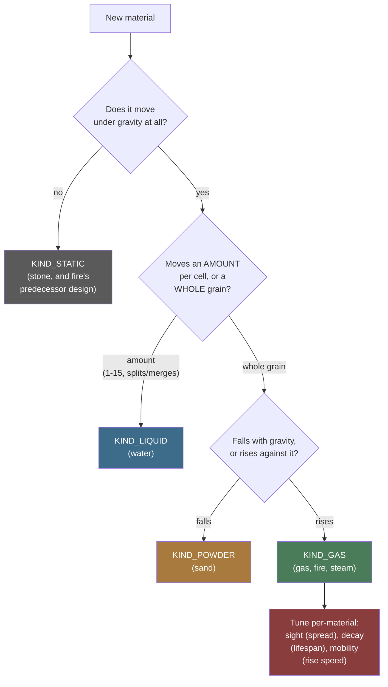
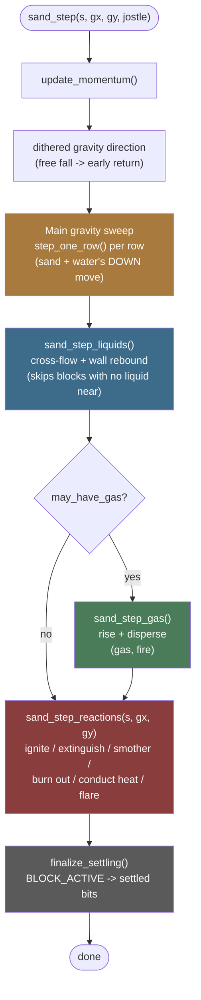
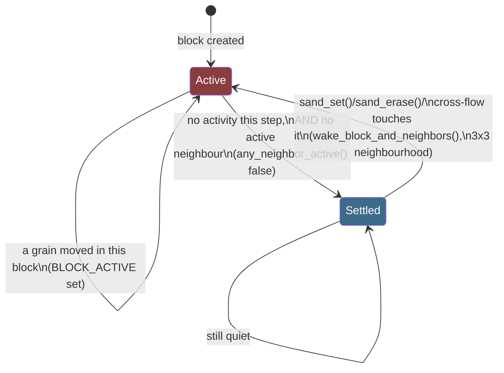
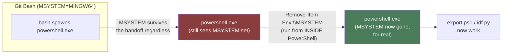

# Sand App Architecture

A single-page map of `main/apps/sand/`: the shapes, not the reasoning.
[`Sand-Simulation.md`](Sand-Simulation.md) is the "why" behind every rule
here; [`Simulation-Lessons.md`](Simulation-Lessons.md) and
[`Performance-Tuning-Attempts.md`](Performance-Tuning-Attempts.md) are the
discovery narratives behind the numbers; [`Adding-a-Material.md`](Adding-a-Material.md)
is the checklist for extending any of this. This page exists for a
narrower job those don't do well as prose: showing the *shape* of the
system at a glance, and writing down - in one place, precisely - every
hop between "I changed a `.c` file" and "I have a real number from the
device," so a future session (yours, or another agent's) doesn't have to
rediscover the Git Bash/`idf.py` trap this repo already paid for once.

---

## The grid, in one byte

```
┌───────────────┬───────────────┐
│  material id  │    variant    │   one cell = one uint8_t
│   (4 bits)    │   (4 bits)    │   184 x 224 grid = 41 KB total
│   0-15        │   0-15        │
└───────────────┴───────────────┘
   high nibble       low nibble
```

The material id indexes a 16-row table (`materials[MATERIAL_MAX]`,
`material.c`) that is `const` - memory-mapped from flash, zero bytes of
RAM. What the variant *means* depends entirely on the material sitting in
that row:

| Material's `decay` | Variant means | Example |
|---|---|---|
| `0` (immortal) and `kind == KIND_POWDER` | a shade (cosmetic texture) | sand |
| `0` (immortal) and `kind == KIND_LIQUID` | fill level, 1-15 | water |
| non-zero (transient) | life remaining, counts down to 0 = gone | gas, fire |
| `heat_ramp != 0` | **temperature, 0-15, resting at 3** - and the palette index, so the cell's colour *is* its temperature. Below 3 is frost, above it is heat | glass, stone |

Reusing one nibble for three different jobs is deliberate, not a
shortcut: the alternative is a second byte per cell, which at this grid
size is 41 KB more RAM than the ~90 KB actually free after the
framebuffer. See [`Sand-Simulation.md`](Sand-Simulation.md#the-grid-is-one-byte-per-cell-and-always-will-be)
for the exact budget.

## The material table, today

9 of 16 slots used; the other 7 are zeroed to an inert inline material
(`kind = KIND_STATIC`, `density = 255`) so a corrupt cell byte can never
crash anything, only sit there as an immovable block.

| Slot | Material | `kind` | Rises/falls | Notable fields |
|---|---|---|---|---|
| 0 | empty | `KIND_NONE` | - | - |
| 1 | sand | `KIND_POWDER` | falls | `repose=7` (~35°), `slip=96` |
| 2 | water | `KIND_LIQUID` | falls | `slip=255` (no resistance) |
| 3 | stone | `KIND_STATIC` | never | `density=200`, undisplaceable. Carries a **temperature** like glass, but never melts and never shatters - acid is the only thing that destroys it |
| 4 | gas | `KIND_GAS` | rises | `sight=16`, `decay=32`, `mobility=96` |
| 5 | fire | `KIND_GAS` | rises | `sight=5` (tighter), `decay=96` (shorter life), reacts via a second pass (below) |
| 6 | wood | `KIND_STATIC` | never | `density=150`; fuel, does not burn on its own |
| 7 | steam | `KIND_GAS` | rises | `sight=20`, `mobility=160` (fastest); water that got hot |
| 8 | smoke | `KIND_GAS` | rises | `sight=24` (widest), `decay=16` (longest-lived); fuel that burned out |
| 9 | ember | `KIND_STATIC` | never | `density=150`, `decay=24`; what wood chars into, reacts alongside fire |
| 10 | oil | `KIND_LIQUID` | falls | `density=22` (floats on water); fuel, burns only where it meets air |
| 11 | lava | `KIND_LIQUID` | falls | `density=45`, `decay=0` (**must** stay 0); a liquid that is also a heat source |
| 12 | acid | `KIND_LIQUID` | falls | `density=38` (sinks in water, floats on lava), `mobility=220`; dissolves what opts in |
| 13 | glass | `KIND_STATIC` | never | `density=200`; made from sand by heat, the **only** thing acid cannot eat, and the only material whose variant is a temperature |
| 14 | snow | `KIND_POWDER` | falls | `density=15` (floats on water **and** oil), `scatter=90` (drifts), `repose=9` (~42°); the only **cold** material. Melts in any liquid, keeps indefinitely on dry ground

Every field on `material_t` is read from the innermost loop, several
times per cell per step, which is why the struct is kept small with the
movement fields first - the C6's cache line is 32 bytes, and a fatter
row would straddle two lines. Full field-by-field reasoning:
[`material.h`](../../launcher/main/apps/sand/material.h)'s own top
comment and struct comment.

## The reaction table, a second table for a cold pass

Fire chemistry - flammability, what a material ignites into, whether it
is itself a heat source, how well it conducts heat, whether it smokes
on burn-out, what it becomes when quenched, whether it flares a flame -
lives in a **second** table, `reaction_t reactions[MATERIAL_MAX]`, not
as more fields on `materials[]` above. None of those fields are read by
any movement code, only by `sand_reactions.c`'s cold pass, gated behind
`may_have_burning`; fattening the hot table's stride to carry them would
cost every step that never touches fire at all, for a table almost
nothing reads on such a step. The cost of the split is that adding a
material capable of burning, catching, conducting, or reacting to
either is now potentially two rows instead of one - `materials[]` for
how it moves, `reactions[]` for how it burns - which is a small price
for keeping the hot table exactly as small as its own comment insists
it stay.

| Material | `flammability` | `needs_air` | `ignites_to` | `burns` | `conducts` | `residue` | `quench_to` | `flare` | `dissolves` | `dissolvable` | `heats_to` |
|---|---|---|---|---|---|---|---|---|---|---|---|
| sand | 0 | - | - | 0 | 0 | 0 | - | 0 | 0 | **200** | **glass** (16) |
| stone | 0 | - | - | 0 | 220 | 0 | - | 0 | 0 | **60** | - |
| gas | 255 | - | fire | 0 | 0 | 0 | - | 0 | 0 | 0 | - |
| fire | 0 | - | - | 1 | 0 | 40 | steam | 0 | 0 | 0 | - |
| wood | 6 | - | ember | 0 | 0 | 0 | - | 0 | 0 | **160** | - |
| ember | 0 | - | - | 1 | 0 | 90 | steam | 48 | 0 | **160** | - |
| oil | 50 | **1** | fire | 0 | 0 | 0 | - | 0 | 0 | 0 | - |
| lava | 0 | - | - | **1** | 0 | 0 | **stone** | 16 | 0 | 0 | - |
| acid | 0 | - | - | 0 | 0 | 0 | - | 0 | **60** | 0 | - |
| glass | 0 | - | - | 0 | **220** | 0 | - | 0 | 0 | **0** (immune) | **lava**, by ramp |
| snow | 0 | - | - | 0 | 0 | 0 | - | 0 | 0 | 0 | **water** (120) |

### Heat that accumulates

Four fields that only glass and snow use today, kept out of the table above
because they describe a different thing: not a reaction that fires once, but
a quantity a cell carries.

| Field | On | Meaning |
| --- | --- | --- |
| `heat_ramp` | glass, 64 | chance/256 per step per adjacent heat source to climb one level. **Non-zero is what makes the variant a temperature** rather than a shade |
| `cools` | glass, 5 | chance/256 to move one level **towards `SAND_AMBIENT_HEAT`**, down if hot and up if frosted - **scaled** by how far above ambient the cell already is, so the drain grows the hotter it gets |
| `chills` | snow, 40 | chance/256 to pull a level out of a *neighbour* that has a temperature, down to 0; non-zero also marks the material **cold** |
| `shatters_to` | glass, sand | what a cell becomes when shocked - **on contact, no roll**, in **either** direction: at or above `SAND_SHOCK_HEAT` when something cold touches it, or at or below `SAND_SHOCK_COLD` when heat reaches it |
| `thaws` | snow, 4 | chance/256 per step per adjacent **liquid** cell that it gives up and becomes `heats_to` |
| `SAND_AMBIENT_HEAT` | 3 | not a field - where room temperature sits on the 0-15 scale, so that **cold has somewhere to go** |
| `conducts >> SPREAD_SHIFT` | glass, 220>>3 = 27 | chance/256 that a cell off ambient drags a neighbour of the same kind one level towards itself, when they differ by 2 or more |

`thaws` is a second trigger for the transformation `heat_chance` already
drives, and needs its own number because one cannot serve both. Snow beside
a flame should be gone in two steps (`heat_chance` 120); snow landing on a
pond should not, or a snowfall over water would never be seen to land -
it lasts about 60 steps there instead. Any liquid counts, because nothing
in this simulation is at a temperature except glass, so "liquid" is the
nearest available statement of *warm and touching you on every side*.

What it melts *into* is always water, whatever melted it. Snow becoming
more of the liquid that touched it would be an exploit rather than a
flourish: acid is spent as it dissolves, so snow melting into acid is a
bucket that refills itself.

`heat_ramp` and `heat_chance` are alternatives, not partners. `heat_chance`
is a memoryless roll - sand fuses to glass the first time it wins one, and
nothing is remembered between attempts. `heat_ramp` banks progress in the
cell, which is the only way to express *sustained* exposure: under a
memoryless roll a candle lit for one step a day melts a pane exactly as
surely as a furnace, just later.

`cools` is the other half of that and is not optional. Without it the ramp
measures lifetime total rather than duration, and the distinction the ramp
exists for disappears.

`chills` and `cools` do the same thing in the same units and are still two
fields, because they sit on different materials: `cools` belongs to the hot
one and drains it to nothing, `chills` belongs to the cold one and drains a
neighbour. They also cannot share a number - snow's 40 against glass's 6 is
what lets a snowbank win a race that ambient cooling always loses.

### A crack runs through the pane

Shattering converts the whole connected run of the material, not one cell,
up to `CRACK_MAX` (256) cells per shock.

One cell at a time meant breaking a pane took as many separate successful
shocks as it had cells - and each one needs something cold touching glass
that is still hot, at the moment it touches. Getting that to happen once is
the interesting part; needing it sixty times in the same place is
attrition, and on the board it read as thermal shock barely working.
Measured on the vessel scene, the mean panes broken went from **2.8 to
29.8** with nothing else changed.

It is also what glass does. A pane does not crumble cell by cell as each
part independently decides to; a crack starts somewhere and travels, and
the pane goes at once.

The crack deliberately does **not** re-check temperature as it spreads -
the stress it releases is the whole pane's, and a crack does not stop
because the far end of the sheet was cooler. The temperature test belongs
where the crack *starts*. It does follow the material, so two panes that
are not touching are two panes.

### Shock runs in both directions

Thermal shock is a large temperature **change**, not a high temperature. For
a while only half of it existed - cold arriving at hot glass broke it, heat
arriving at frosted glass did not - which is an asymmetry nobody could have
explained to a player, and which made the obvious experiment (chill a
vessel, then pour something hot in) quietly do nothing.

The two directions live in different code and can break independently:
cold-onto-hot in `step_one_cold_cell()`, driven by the cold cell;
hot-onto-cold in `try_heat_transform()`, driven by the heat source.

### Why the drain scales with temperature

`cools` is the drain **one level above ambient**, and it is multiplied by
how far above ambient the cell already is. One constant then serves two
jobs that pull opposite ways: getting a pane WARM is easy, and getting it
MOLTEN stays hard.

With a flat drain there was no setting that did both. At 12 up against 6
flat, a pane took 152 steps just to become shatterable. Raising the ramp
enough to fix that dropped time-to-melt from ~450 steps to ~30 and threw
away the long exposure the ramp exists for. Scaled, the same ramp gives:

| held source | shatterable | molten |
| --- | --- | --- |
| lava | 12-26 steps | 102-678 steps |
| fire | ~65 steps | **never** (peaks at 13) |

Fire making glass fragile but never melting it is a consequence, not a
special case.

One **brush** of fire still does almost nothing, and no ramp fixes it: fire
is a rising gas, so a single dab has drifted off the pane within a couple of
steps. Measured, it peaks around 6 whether the ramp is 64 or 160. Heat has
to be held against glass.

### What the vessel scene taught

The scene people actually build is a drawn glass ring filled about half way
with lava, with snow poured over the top. It did not work, and the reason
was not the transfer rate:

- A half filled vessel puts the glass a player can **reach** - the rim,
  above the lava line - several cells from the heat. The gradient decays
  about two levels per cell, so the rim sits in the warming band while the
  submerged glass glows. Snow can only touch the part that was never hot.
- Snow and lava **annihilate each other** before either reaches the glass.
  Snow melts to water, and water quenches lava to stone. Measured on a
  filled ring, the lava had turned to stone and the whole vessel had
  frosted over with two panes broken out of dozens.

Lowering `SAND_SHOCK_HEAT` is what fixed it, and the numbers are worth
keeping because they are the only measurement of the scene as played:

| threshold | panes broken |
| --- | --- |
| ambient + 6 | **0** |
| ambient + 4 | 12 |
| ambient + 3 | 17 |
| ambient + 2 | 25 |

### The material budget, and what is left

A cell is one byte: four bits of material, four of variant. Zero is empty,
so there are **15 material slots** and **14 are in use** - sand, water,
stone, gas, fire, wood, steam, smoke, ember, oil, lava, acid, glass, snow.
One free.

Four ways to make more room, cheapest first - two of which mostly do not,
and one that looks like a way and is not. The short version: the extended
range is the real answer, and the single remaining full-physics slot should
be saved for something that has to move or carry a variant.

**Reinterpret a nibble.** Free, and already the pattern: liquids read the
variant as fill, transients as life remaining, glass and stone as
temperature. A material needing two small quantities can split its own
nibble.

This adds no slots - it removes the *need* for one. Glass carrying a
temperature is why there is no separate "hot glass" material, and stone
getting its speckle from a position hash is why it could give its variant
up for the same thing. Always ask this first, because the answer costs
nothing.

**Make a material a state of another - rarely possible, and worth knowing
why.** The tables are indexed by the MATERIAL NIBBLE alone. `material_of()`
and `reaction_of()` both take the id and nothing else, so two states of one
material get the same `density`, `decay`, `burns`, `flammability` and every
other field. A state that behaves differently cannot be a state.

Ember is the example, and it is an example of the limit rather than of the
technique - **ember does occupy a slot**. It differs from wood in seven
fields:

| | wood | ember |
| --- | --- | --- |
| `decay` | 0 | 24 |
| `burns` | 0 | 1 |
| `flammability` | 6 | 0 |
| `ignites_to` | ember | - |
| `residue` | 0 | 90 |
| `quench_to` | - | steam |
| `flare` | 0 | 48 |

Wood does not decay, does not burn and does not flare; ember does all
three. There is nowhere for those to live except a second row, so ember
is its own material that merely happens not to be paintable - which saves
the player a press in the brush list and saves no space at all.

Smoke and steam are not the free merge they look like either. Their
reaction rows are identical, but their movement rows differ in five fields
- density 7 against 5, scatter 150/140, decay 16/24, mobility 120/160,
sight 24/20 - because steam is meant to be the lighter, faster,
shorter-lived one. Merging them would make one of them move like the other.

So this saves a slot only when two states share *every* field and differ in
something the variant already carries. That is a narrow case, and nothing
in the table currently meets it.

**Add an extended range behind the last slot.** Not built, but the layout
already allows it and it is the cheapest way to a large number of new
materials. Let material id 15 mean "extended", and read the low nibble as
naming one of sixteen further materials.

Three facts make it free in the sweep, and all three are properties of how
the tables are already indexed:

| | what happens |
| --- | --- |
| `material_of()` | indexes `materials[]` by the nibble - id 15 is **one shared row**, so the hot path does not change at all |
| `palette[256]` | is indexed by the **raw cell byte**, so sixteen distinct colours come for free with no change whatsoever |
| `reaction_of()` | is used only in `sand_reactions.c` - the **cold** table, where decoding the extended id costs nothing that matters |

So the sixteen can each have their own colour and their own reaction row -
their own flammability, acid resistance, heat behaviour, whatever - while
`sand_step()` continues to treat them as one material.

What they cannot have is their own **physics** or a **variant**. They share
one `density`, `kind`, `slip`, `repose` and `scatter`, because that is the
row the hot path reads; and the low nibble is spent naming which one they
are, so there is nothing left for a shade, a fill level, a life or a
temperature. That confines them to inert static solids - coloured brick,
decorative block, an ore that acid or fire treats differently, anything
whose job is to be built with and reacted to rather than to move.

Which makes the realistic budget:

- **one slot** with full physics, worth saving for something that has to
  move or carry a variant - another liquid, powder or transient;
- **sixteen more** inert solids behind the extended range, addable the day
  a seventeenth material is actually wanted, disturbing nothing that
  already exists;
- packing the whole byte only after both are spent.

**Pack the byte.** Drop the fixed 4+4 split for a flat 0-255 index with a
per-material base offset, giving each material only as many variant codes
as it uses. Measured against the current table that needs **189 of 256
codes, leaving 67** - about four more liquids or sixteen more inert solids.
The cost lands in the worst place: `CELL_MATERIAL` and `CELL_VARIANT`
become dependent table lookups instead of a shift and a mask, in the
hottest loop in the program. Worth doing only when slot pressure is real.

**What does not work: moving transients out of the grid.** The idea is
appealing - fire, smoke, steam, gas and ember are five of the fourteen
slots, and they are short-lived, so a side list of active ones would free
a third of the table. Measured peak transient population:

| scene | transient cells at once |
| --- | --- |
| a burning wood floor | 2,631 |
| a lava pool, flaring | 412 |
| a screen of gas, ignited | **33,879** |

The grid is 41,216 cells. In the scenes that actually stress the
simulation transients are most of the board, so a side table holding
position, kind and life would want ~132 KB against the ~50 KB of RAM that
exists - more than three times the whole grid at one byte per cell. They
are not the rare case; they are the case that fills the screen, which is
exactly why they belong in the grid rather than beside it.

### What carries a temperature, and what it does with one

`heat_ramp` makes a material's variant a temperature. What it does with
that temperature is a separate question, answered by which other fields it
has - and for the two materials that carry one, the answers are opposites:

| | shows heat | melts (`heats_to`) | shatters (`shatters_to`) | acid |
| --- | --- | --- | --- | --- |
| stone | yes | **no** | **no** | eaten |
| glass | yes | to lava | to sand | immune |

Both absences on stone are decisions rather than omissions. If stone melted
there would be no vessel that holds lava indefinitely and the choice
between the two would collapse into "glass, but it dies". And rock does not
thermally shock into anything this simulation has a material for - a
quenched slab spalls and cracks, it does not become sand - so there is no
honest byproduct to name, and thermal shock stays glass's alone. That is
most of what makes glass worth making.

### How these materials are drawn

Purely visual, all of it: nothing in `material_colours()` is read by the
simulation, which is exactly why it needs its own tests - a wrong colour
breaks no behaviour and nothing else would notice.

- **Flat** is the default and stays free. One colour, whole block, the same
  tight loop it always used.
- **Speckled** (stone) picks its shade from the cell's POSITION rather than
  its variant. Stone used to carry a random shade and a wall looked like
  rock because of it; spending the variant on temperature took that away.
  The shade never needed to be *stored*, only to be stable, and a position
  gives that for free. Still one colour per cell, so it costs nothing extra
  in the pixel loop.

  Eight levels, spread **both ways** around the temperature colour. The
  first version only darkened, which put every wall below the grey it used
  to average at and read as a different, murkier material. A fifth toward
  black and a fifth toward white from resting grey lands back on very
  nearly the old ramp's own endpoints, 0x4A4F5A and 0x767D8C.
- **Hatched** (glass) draws two families of single-pixel diagonals, one
  every eight pixels each way, over three colours: the pane, a quiet
  **grain** that does not move, and a brighter **reflection** that does.
  Which diagonal reflects is chosen by gravity, and its phase shifts with
  orientation, so the glints slide across a pane as the board is tilted.
  That movement is most of what sells it as a surface catching light
  rather than a texture printed on one.

  Both were tried the other way round first and neither worked. Wide bands
  buried the pane - half the pixels were line and a quarter were highlight.
  And the lines mixed *toward the background*, which is the obvious thing
  to do for something see-through and came out as no pattern at all: a
  dark line on a dark pane is invisible. Light caught on glass is lighter
  than the glass, so they lift toward white instead.

  Lines are measured in screen pixels so they run unbroken from one cell
  into the next. That is the one pattern that cannot be constant-folded,
  and the only one that does per-pixel work.

All of it happens *inside* a cell's block. The dirty-run tracking works on
grid cells, so a pattern made of whole cells would break every run into
one-cell pieces and multiply what gets pushed to the panel; a pattern made
of pixels inside a cell is invisible to it.

**Edges are softened.** A cell with empty space cardinally beside it is
drawn two thirds of the way back toward its own resting colour. A wall
going from grey to glowing otherwise changes its whole silhouette, so the
shape stops reading at exactly the moment it matters. The outline still
shifts with heat, a third as far; the body is what shows the temperature.

### Room temperature is in the middle

`SAND_AMBIENT_HEAT` is 3, not 0, and the reason is entirely about what can
be seen. With ambient at the bottom of the range there is no such thing as
colder than resting: chilling a pane at 0 changes no number, so it changes
no colour, and snow sitting on glass looks exactly like snow sitting on
nothing.

Putting ambient at 3 gives cold somewhere to go. 0-2 is **frost** - pale,
near white, the way cold glass actually goes - and it fades, because
`cools` moves a cell *towards* ambient from either side rather than only
downwards. Frost is a state, not a scar.

The same change fixed a second half of the same bug. Chilling used to be
driven from the warm cell, and a warm cell only gets a turn when it is
already off ambient - so a pane at rest never looked at the snow on top of
it and could not be chilled at all. Chilling is driven from the **cold**
cell now, the way fire reaches out to its neighbours. Melting (`thaws`)
stays there too, but for a different reason: a neighbour scan per liquid
cell would land on the commonest material on the board, where a scan per
snow cell lands on something that arrives in drifts.

### Temperature spreads along the material

A chilled cell drags its neighbours down and a heated one pulls them up,
which is what `conducts` has always meant - applied *within* the material
rather than only to whatever is on the far side of it.

Without it the effect was real and nearly invisible. Only the single cell a
flake touched ever changed, and barely: snow melts after a chill or two and
`cools` pulls the cell straight back towards ambient, so it hovered one
level off and nobody could see it on a 184x224 board. Spreading turns that
into a patch of frost creeping outward from where the snow landed.

Two things keep it from destroying the mechanic, and both were found by
breaking them:

- **Scaled down hard.** At the full `conducts` value a pane goes isothermal
  within a step or two, and a wall that is all one temperature cannot be
  hot inside and cold outside. Measured: a pane under lava never reached
  melting at all, because heat was shared out faster than any cell could
  bank it. `SPREAD_SHIFT` is 3, so 27 in 256 rather than 220.
- **Only across a gap of 2 or more.** A difference of one is left alone, so
  a smooth gradient across a wall survives instead of collapsing flat.

It is derived from `conducts` rather than being its own field because it is
the same physical property - a material that carries a fire's heat well
carries its own temperature well - and two independent numbers could
disagree about a material for no reason anyone could explain.

### What chilling costs the cold material

Taking heat out of something **above** room temperature costs the cold
material its own `heats_to`: snow that cooled a glowing pane for free would
be an unlimited heat sink arriving in a light drift.

Pushing cold *into* something at or below room temperature costs nothing,
because nothing was absorbed. That distinction is load-bearing rather than
pedantic - without it, snow melted on contact with ordinary cold glass at
the rate tuned for standing beside a fire, which makes a snowbank
impossible to keep anywhere near the one building material it exists to be
used against.

### The threshold is a visible state

Cooling is gradual and takes a roll; **shattering is not**. A cold neighbour
touching a cell at or above `SAND_SHOCK_HEAT` breaks it the same step, with
no roll at all.

Shock used to wait for the `chills` roll, and that roll is also what *cools*
the pane - so the usual outcome of pouring snow on a hot basin was that the
pane quietly cooled below the threshold instead of breaking, and nothing
appeared to happen. Cracking is the fast path now and cooling is the slow
one, which is the right way round physically as well.

That leaves a rule where one heat level decides everything - a pane at 5 is
untouchable and a pane at 6 breaks instantly - so **the player has to be
able to see which side of the line a pane is on**. Glass's palette is
therefore not a smooth ramp: it runs cold blue to a flat neutral over levels
0-5, then jumps into a glow and climbs to lava's brightest at 15. The
largest colour change along the ramp is exactly at the threshold, so
*orange means snow will break this*.

Three things have to agree on that number - the rule, the palette and the
tests - which is why it is `SAND_SHOCK_HEAT` in `material.h` rather than a
private `#define` beside the code. A `_Static_assert` fails the build if it
moves without the palette, and a test asserts the widest colour step in the
ramp still lands on it.

**Measured** (host, 2026-08-25): lava held under a cold pane makes it
shatterable in 42-84 steps and molten in 633-818 - fragile quickly, melted
slowly, which is the useful split. Snow on a pane at or above the threshold
breaks every cell in 1 step; below it, never. A pane at full heat drains
back to cold in ~610 steps once the fire is gone.


| glass | 0 | - | - | 0 | **220** | 0 | - | 0 | 0 | **0 (immune)** | - |

Six things in that table are worth reading twice:

- **The byproducts are different materials.** `quench_to` gives **steam**
  (water that got hot); `residue` gives **smoke** (fuel that burned out). See the
  simulation document for why steam and smoke are not one row.
- **`needs_air` is what makes a pool of fuel burn rather than detonate.**
  Only oil sets it. Without it a spark lights a whole connected pool
  inside one pass.
- **`dissolves` and `dissolvable` are a pair, on two different
  materials.** One is how hard the acid tries, the other is how easily the
  target gives way, and both must be nonzero for anything to happen. That
  split lets a single acid figure produce different rates against sand
  (200), stone (60) and glass (immune) without acid knowing any of their
  names. `dissolvable` defaulting to **0 = immune** means a material is
  eaten only by opting in, so anything added without a thought for acid is
  safe by omission.
- **Glass is the only thing acid cannot eat, and it has to be made.**
  Stone held that role by being immune; it dissolves now, slowly, and
  glass took over. A container is therefore something you build - sand
  plus sustained heat - rather than something the level already gave you.
- **`heats_to` is a phase change, not combustion.** Sand becomes glass
  beside a burning cell, or through a conductor exactly as water boils
  through one. Kept apart from `flammability`/`ignites_to`, which would
  work mechanically and would be a lie: sand does not catch fire, and the
  field name would send the next reader hunting for a flame.
- **Lava is `KIND_LIQUID` *and* `burns`.** That combination is the
  clearest evidence the movement and reaction axes are genuinely
  independent - nothing anywhere special-cases it. It is also why lava's
  `decay` **must** be 0: `decay != 0` reinterprets the variant nibble as
  life remaining, and for a liquid that nibble is its fill level, so any
  decay at all would eat the cell's own mass.

Everything else - sand, water, steam, smoke, and every unused slot -
is all-zero, which reads correctly for every field on its own: never
catches, never a heat source, never conducts, leaves nothing, vanishes on
quench, never flares. See
[Fire chemistry: wood, embers, steam, and a working
boiler](Sand-Simulation.md#fire-chemistry-wood-embers-steam-and-a-working-boiler)
for what each field actually drives.

## Choosing a `kind` for a new material



This only answers *movement*. A material's *reactions* (ignite, extinguish,
smother, conduct, quench, flare - `sand_reactions.c`) are a separate,
orthogonal axis, driven by the second table above: fire is `KIND_GAS`
for how it moves, but `reaction_t.burns` and the reactions pass's own
neighbour-scanning are what make it a fire specifically. Ember is the
clearest proof the two axes are independent: it is `KIND_STATIC` - the
same kind as motionless stone - and yet it is very much a heat source,
`reaction_t.burns` and all, decaying and flaring exactly like a fire
that happens not to move. A future material can mix and match too - a
`KIND_POWDER` material that is also flammable needs a `reactions[]` row
and nothing else, no new pass. See
[`Adding-a-Material.md`](Adding-a-Material.md) for the full worked
checklist, including the three-attempt inlining lesson that applies
whenever a new material needs to call into an existing hot-path function
from a second place, and the `place_reacted()` lesson this feature's own
design surfaced.

## One step, in order



The one rule that governs the whole pipeline: **every pass that isn't the
main sweep has to finish before `finalize_settling()` runs**, because
`BLOCK_ACTIVE` has to reflect the *whole* step, not just whichever pass
ran first. This exact phrase appears at every call site in `sand.c` and
every pass's own declaration in `sand_priv.h` - if you add a seventh pass,
it goes here too, before `finalize_settling()`, not after.

Two passes are gated differently on purpose:
`sand_step_gas()` is checked at the call site (`if (s->may_have_gas)`)
because it takes nine arguments and this call site runs on every step of
every test - skipping the call avoids marshalling all nine for nothing.
`sand_step_liquids()` and `sand_step_reactions()` rely on their own
internal early-return instead, because they take few enough arguments
that the marshalling cost was never worth a second check -
`sand_step_reactions()` grew from one argument to three (`s, gx, gy`)
when heat conduction's boiler needed a gravity direction, and two ints
is still nowhere near sand_step_gas()'s nine, so the reasoning held
without needing to move the check. Getting this
gating wrong in the wrong direction is a real, shipped bug class - see
"the else-if ordering bug" in
[`Performance-Tuning-Attempts.md`](Performance-Tuning-Attempts.md).

## Block and row sleeping



A settled block costs one comparison per step (`BLOCK_ACTIVE` check in
`finalize_settling()`) instead of a full grain-by-grain sweep - this is
the entire reason `test_a_screen_of_settled_sand_costs_almost_nothing`
exists and has a 300 µs budget instead of one shared with the other
tests. Two settled bits, not one
(`BLOCK_SETTLED_NEAREST`/`BLOCK_SETTLED_OTHER`), because gravity's
direction is dithered between two ring directions each step, and a block
settled under one might not be under the other.

`block_state` carries two more bits, for a different question the same
grid answers cheaply. `BLOCK_HAS_LIQUID` is set by the main sweep - which
reads every cell of every awake block anyway - when it sees a liquid cell,
and `BLOCK_LIQUID_NEAR` is that bit expanded to a block's 8 neighbours by
one pass over the blocks. `sand_step_liquids()`'s cross-flow pass skips
the block-columns whose NEAR bit is clear, which took it from reading all
41,216 cells of the grid every step to reading only the ~59% that could
possibly matter. The expansion is what makes it sound: liquid moves one
cell in the sweep and at most `SAND_LIQUID_SIGHT` (8) in the cross-flow
pass, so anywhere it can arrive after its own block was walked belongs to
a neighbour of the block that was seen holding it. See `sand_priv.h` for
the invariant in full, and
`test_water_falling_into_the_next_block_down_still_spreads` for the
fixture that fails without the expansion.

Block size (`SAND_BLOCK_W=32`, `SAND_BLOCK_H=64`, `sand.h`) was swept
across six candidate pairs on real hardware, not guessed - see the
"sixth attempt" in [`Performance-Tuning-Attempts.md`](Performance-Tuning-Attempts.md)
for the full table and the two real device-only bugs that sweep found
along the way (a stack overflow, two test fixtures that assumed the old
size).

## Dirty-row tracking

Separate from block sleeping, and for a different purpose: block sleeping
decides what the *simulation* can skip; `dirty_rows` (`sand.h`) decides
what the *renderer* can skip. Any move marks its source and destination
row (`mark_rows()`, `sand_priv.h`). `app_sand.c`'s `draw_dirty_rows()`
walks every row, skips the clean ones outright, and for the dirty ones
calls into `row_runs.h`'s span-reconciliation so only the pixel spans
that actually changed get sent to the panel via `gfx_mark_dirty()` - "a
screen band containing no changed rows need not be sent to the panel at
all, which is most of a frame's cost."

## Verifying performance on real hardware

### Use the scripts in `launcher/tools/`

| Want to... | Run | Produces |
|---|---|---|
| flash the current code | `tools/build_flash.sh [PORT]` | release firmware on the board |
| performance numbers | `tools/report_performance.sh [PORT]` | `tools/results/performance_<ts>.md` |
| pass/fail for every suite | `tools/report_test_results.sh [PORT]` | `tools/results/test_results_<ts>.md` |
| raw console capture | `python tools/sweeps/capture_selftest.py OUT.txt --port PORT` | unparsed self-test output |

**They are `.sh` files that shell out to PowerShell, and that is all they
are for**: `idf.py` cannot run under Git Bash, so anything that builds or
flashes has to cross into PowerShell first. The next section is that
problem in detail, and the rest of this one is what the scripts are doing
on your behalf.

The two `report_*` scripts also restore `build.release` afterwards, so
they are safe to run against a board you then want to use. Their output
is generated from a real capture and the current source, which makes it
the authority over the hand-maintained table further down this page - and
a new budget test appears in it automatically, with no tooling change.

### The trap: `idf.py` cannot run from Git Bash, at all

ESP-IDF's own `export.sh`/`idf_tools.py` refuses outright if
`MSYSTEM` is set in the environment - it prints "MSys/Mingw is not
supported" and exits non-zero. Git Bash on Windows always sets
`MSYSTEM=MINGW64`. Worse: this isn't only a bash-vs-PowerShell problem -
`MSYSTEM` rides along even into a `powershell.exe` **child process**
launched from bash (confirmed directly: `env -u MSYSTEM powershell.exe`
still sees it set inside). The only place clearing it actually sticks is
*inside* the PowerShell process itself, before it sources `export.ps1`:



`launcher/tools/build_flash.sh` already does this correctly - read it as
the reference implementation, or just call it.

### Building/flashing the release firmware (interactive use)

One command, works from Git Bash directly:

```bash
./tools/build_flash.sh COM3
```

Delegates to PowerShell internally (the `Remove-Item Env:\MSYSTEM` dance
above), builds `build.release`, flashes it. This is what to run before
handing the device back for interactive/manual testing.

### Building/flashing the diagnostics firmware (self-tests)

No wrapper script exists for this one yet - run it as a single
PowerShell block (copy-paste verbatim, it's the exact sequence used
throughout this session):

```powershell
powershell.exe -NoProfile -ExecutionPolicy Bypass -Command "
    Remove-Item Env:\MSYSTEM -ErrorAction SilentlyContinue
    & 'C:\Espressif\esp-idf-v5.5\export.ps1' | Out-Null
    Set-Location 'C:\Users\ville\Projects\esp32-c6\launcher'
    idf.py -B build.diag build
    if (`$LASTEXITCODE -ne 0) { exit `$LASTEXITCODE }
    idf.py -B build.diag -p COM3 flash
"
```

`build.diag` and `build.release` are separate build directories on
purpose - each keeps its own `sdkconfig`, and neither overwrites the
other's cache.

### Collecting the self-test results

`tools/sweeps/capture_selftest.py` does **not** need `idf.py` at all -
it's pure `pyserial`, resets the device via an RTS pulse, and reads
serial until `SELFTEST_COMPLETE` appears. This one *does* work directly
from Git Bash:

```bash
python tools/sweeps/capture_selftest.py /path/to/output.txt --port COM3
```

(`pip install pyserial` first if the environment doesn't have it -
`ModuleNotFoundError: No module named 'serial'` means exactly that, not
a real error.)

`test/run_device_tests.sh --no-flash` works here too, and collects the
same way: its collection step is this same plain-Python path, not
`idf.py`. Only its build/flash half needs ESP-IDF.

(That was not always true in practice. The script used to check for
`idf.py` on PATH *before* looking at `--no-flash`, so collecting failed
for want of a tool it never runs - which read as "this script needs
ESP-IDF for everything" and is why this page once said so. The check is
scoped to the flash path now.)

### Reading the result

Grep the capture for the headline line and any failures:

```bash
grep -E "FAIL|SELFTEST_COMPLETE" /path/to/output.txt
```

`SELFTEST_COMPLETE failures=N` is the number that matters. The accepted
baseline is **`failures=5`** as of the 2026-08-25 capture, and only one
of those five is deliberate:

- `test_a_gravity_flip_on_every_material_at_once_stays_sane` - a
  reduction target, 10% under its measured 60091 µs, failing by design.
- Four others are **unexplained and probably regressions**: the full
  screen of fire (286720 against a 250000 budget, up 34% on its last
  recorded figure), the fire cascade (390158, up 23%), the screen of
  water (16052, up 21%) and the mixed-scene flip (12876, up 15%).
  Everything sand-only is unchanged to within a percent, which points at
  the reactions and liquid passes rather than at the sweep.

That is not a baseline anyone should be comfortable with. It is written
down as five so the number is honest, not because four unexplained
regressions are acceptable - they want attributing against the commit
they appeared in.

It was `failures=3` for a long time, and all three came off without a
single budget moving, which is the part worth knowing. The settled-pile
flip and the screen of water came in during the ninth tuning attempt,
which found that per-move row bookkeeping was 40% of the flip and then
that the cache it protected (`ROW_NO_LIQUID`) cost more than it saved and
deleted it outright. The mixed scene came in during the tenth, which gave
the cross-flow pass a block-shaped skip for the cells that hold no liquid.
See [`Performance-Tuning-Attempts.md`](Performance-Tuning-Attempts.md).

## The eight device frame-budget tests

All `#ifdef DEVICE_BUILD`-only, in `suite_sand.c`, run against the real
184x224 grid rather than the 8x8 host-test fixture. Each one's number
came from an actual device capture, not a guess - see each test's own
comment for the reasoning behind its specific budget.

Two of them are **reduction targets** rather than headroom - set below
what the code could do when they were written, on purpose, so they fail
until the work is done. The mixed scene was the first and came good; the
mixed-material flip is the second and has not yet.

| Test | Scenario | Budget | Last measured |
|---|---|---|---|
| `test_a_full_size_step_fits_in_the_frame_budget` | Checkerboard of falling sand, worst-case movement | 6000 µs | ~5876 µs (thin - watch it) |
| `test_a_screen_of_settled_sand_costs_almost_nothing` | Entire grid full of sand, nothing moving | 300 µs | ~260 µs |
| `test_flipping_gravity_on_a_settled_pile_fits_in_the_frame_budget` | Big pile settled asleep, then gravity flipped | 6500 µs | ~5969 µs (was 8996 and failing until the ninth attempt) |
| `test_flipping_gravity_on_a_mixed_scene_fits_in_the_frame_budget` | Sand ~30% left, water ~30% right, a stone X in between, all settled then flipped | 12000 µs | ~11167 µs (was 15144 and failing until the tenth attempt) |
| `test_a_screen_of_water_fits_in_the_frame_budget` | Half a screen of water dropped as a slab | 14000 µs (tightened from 16000 after the tenth attempt) | ~13288 µs (was 16141 and failing until the ninth attempt) |
| `test_fire_cascading_through_a_full_screen_of_gas_fits_in_the_frame_budget` | Whole grid of gas, one fire spark, single step (ignition, not steady state) | 350000 µs | ~316000 µs |
| `test_a_full_screen_of_fire_fits_in_the_frame_budget` | Whole grid already all fire (steady state - both `sand_step_gas()` and `sand_step_reactions()` pay per cell, every step) | 250000 µs | ~214000-231000 µs (varies with flash-cache layout - see below) |
| `test_a_gravity_flip_on_every_material_at_once_stays_sane` | A wrapped tile of **every** material, laid out so all 66 material pairs touch, settled then flipped - every pass doing real work at once | 54000 µs (**reduction target**, 10% under measured) | 60091 µs (2026-08-25) - **currently 11% over** |

Every measured row passes, and no budget was ever raised to make that
true - the mixed scene in particular was set 21% *below* what the code
could do when it was written, deliberately, as a reduction target rather
than a safety margin, and it went from 26.2% over to 7.0% under without
the number moving. That is the standard to hold the next one to, and the
reason the unmeasured row above is labelled rather than quietly given a
plausible-looking figure: a budget nobody measured is worse than no
budget, because it looks like one.

One row to watch rather than celebrate: `full_size_step` sits at ~2.1%
under its budget, thin enough that an unrelated code change can flip it
purely by moving where things land in flash - it has crossed twice in this
project's history for exactly that reason. If a capture ever shows a
failure, check whether the number that moved actually moved *much* (not the
ordinary ~2-5%, occasionally more, flash-layout noise this project has
already characterised - see
[`Performance-Tuning-Attempts.md`](Performance-Tuning-Attempts.md)) before
assuming a real regression. The tenth attempt measured a 14% swing on the
water benchmark from a restructuring that changed no semantics at all, so
"much" has a wide floor here.

The last two rows are new territory this session opened, not a template
that existed before: there was no gas- or fire-specific frame-budget
test until fire needed one, because gas shipped without a dedicated
worst-case perf test at all. If a future material needs its own, these
two are the closest things to a pattern to copy - one for a worst-case
*transition* (like the cascade), one for worst-case *steady state* (like
the full-screen-of-fire test), since those two numbers are not
interchangeable (the redesign that made fire move like gas changed the
steady-state cost without touching the transition cost at all - see
"Corrections" in the plan history if you want the full trace of why).

## Related

- [`Sand-Simulation.md`](Sand-Simulation.md) - the "why" behind every
  rule sketched here: movement, the water model, gas, the performance
  discipline.
- [`Simulation-Lessons.md`](Simulation-Lessons.md) - the original
  build-out discovery narrative.
- [`Performance-Tuning-Attempts.md`](Performance-Tuning-Attempts.md) -
  the chronological tuning campaign, including the block-size sweep and
  the three-attempt inlining saga referenced above.
- [`Adding-a-Material.md`](Adding-a-Material.md) - the practical
  checklist for extending any of this with a new material.
- `launcher/tools/sweeps/README.md` - the sweep tooling this page's
  device-verification section builds on.
