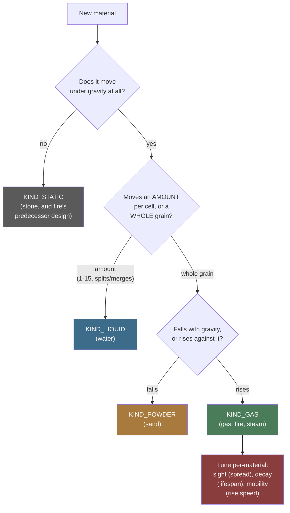
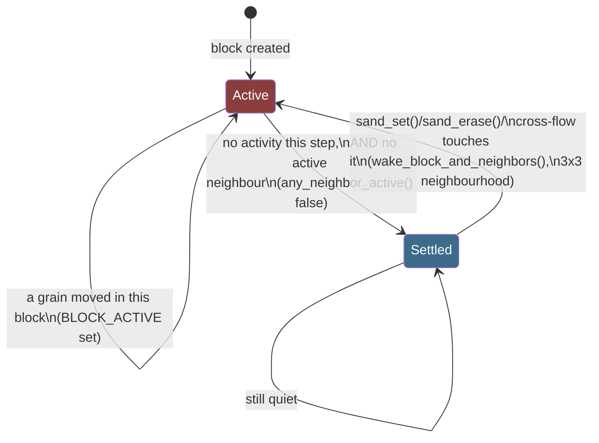
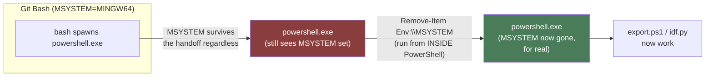

# Sand App Architecture

A single-page map of `main/apps/sand/`: the shapes, not the reasoning.
[`Sand-Simulation.md`](Sand-Simulation.md) is the "why" behind every rule
here; [`Simulation-Lessons.md`](Simulation-Lessons.md) and
[`Performance-Tuning-Attempts.md`](Performance-Tuning-Attempts.md) are the
discovery narratives behind the numbers; [`Adding-a-Material.md`](Adding-a-Material.md)
is the checklist for extending any of this. This page exists for a
narrower job those don't do well as prose: showing the *shape* of the
system at a glance, and writing down - in one place, precisely - every
hop between "I changed a `.c` file" and "I have a real number from the
device," so a future session (yours, or another agent's) doesn't have to
rediscover the Git Bash/`idf.py` trap this repo already paid for once.

---

## The grid, in one byte

```
┌───────────────┬───────────────┐
│  material id  │    variant    │   one cell = one uint8_t
│   (4 bits)    │   (4 bits)    │   184 x 224 grid = 41 KB total
│   0-15        │   0-15        │
└───────────────┴───────────────┘
   high nibble       low nibble
```

The material id indexes a 16-row table (`materials[MATERIAL_MAX]`,
`material.c`) that is `const` - memory-mapped from flash, zero bytes of
RAM. What the variant *means* depends entirely on the material sitting in
that row:

| Material's `decay` | Variant means | Example |
|---|---|---|
| `0` (immortal) and `kind == KIND_POWDER` | a shade (cosmetic texture) | sand |
| `0` (immortal) and `kind == KIND_LIQUID` | fill level, 1-15 | water |
| non-zero (transient) | life remaining, counts down to 0 = gone | gas, fire |

Reusing one nibble for three different jobs is deliberate, not a
shortcut: the alternative is a second byte per cell, which at this grid
size is 41 KB more RAM than the ~90 KB actually free after the
framebuffer. See [`Sand-Simulation.md`](Sand-Simulation.md#the-grid-is-one-byte-per-cell-and-always-will-be)
for the exact budget.

## The material table, today

9 of 16 slots used; the other 7 are zeroed to an inert inline material
(`kind = KIND_STATIC`, `density = 255`) so a corrupt cell byte can never
crash anything, only sit there as an immovable block.

| Slot | Material | `kind` | Rises/falls | Notable fields |
|---|---|---|---|---|
| 0 | empty | `KIND_NONE` | - | - |
| 1 | sand | `KIND_POWDER` | falls | `repose=7` (~35°), `slip=96` |
| 2 | water | `KIND_LIQUID` | falls | `slip=255` (no resistance) |
| 3 | stone | `KIND_STATIC` | never | `density=200`, undisplaceable |
| 4 | gas | `KIND_GAS` | rises | `sight=16`, `decay=32`, `mobility=96` |
| 5 | fire | `KIND_GAS` | rises | `sight=5` (tighter), `decay=96` (shorter life), reacts via a second pass (below) |
| 6 | wood | `KIND_STATIC` | never | `density=150`; fuel, does not burn on its own |
| 7 | steam | `KIND_GAS` | rises | `sight=20`, `mobility=160` (fastest); water that got hot |
| 8 | smoke | `KIND_GAS` | rises | `sight=24` (widest), `decay=16` (longest-lived); fuel that burned out |
| 9 | ember | `KIND_STATIC` | never | `density=150`, `decay=24`; what wood chars into, reacts alongside fire |
| 10 | oil | `KIND_LIQUID` | falls | `density=22` (floats on water); fuel, burns only where it meets air |
| 11 | lava | `KIND_LIQUID` | falls | `density=45`, `decay=0` (**must** stay 0); a liquid that is also a heat source |
| 12 | acid | `KIND_LIQUID` | falls | `density=38` (sinks in water, floats on lava), `mobility=220`; dissolves what opts in |

Every field on `material_t` is read from the innermost loop, several
times per cell per step, which is why the struct is kept small with the
movement fields first - the C6's cache line is 32 bytes, and a fatter
row would straddle two lines. Full field-by-field reasoning:
[`material.h`](../../launcher/main/apps/sand/material.h)'s own top
comment and struct comment.

## The reaction table, a second table for a cold pass

Fire chemistry - flammability, what a material ignites into, whether it
is itself a heat source, how well it conducts heat, whether it smokes
on burn-out, what it becomes when quenched, whether it flares a flame -
lives in a **second** table, `reaction_t reactions[MATERIAL_MAX]`, not
as more fields on `materials[]` above. None of those fields are read by
any movement code, only by `sand_reactions.c`'s cold pass, gated behind
`may_have_burning`; fattening the hot table's stride to carry them would
cost every step that never touches fire at all, for a table almost
nothing reads on such a step. The cost of the split is that adding a
material capable of burning, catching, conducting, or reacting to
either is now potentially two rows instead of one - `materials[]` for
how it moves, `reactions[]` for how it burns - which is a small price
for keeping the hot table exactly as small as its own comment insists
it stay.

| Material | `flammability` | `needs_air` | `ignites_to` | `burns` | `conducts` | `residue` | `quench_to` | `flare` | `dissolves` | `dissolvable` |
|---|---|---|---|---|---|---|---|---|---|---|
| sand | 0 | - | - | 0 | 0 | 0 | - | 0 | 0 | **200** |
| stone | 0 | - | - | 0 | 220 | 0 | - | 0 | 0 | 0 |
| gas | 255 | - | fire | 0 | 0 | 0 | - | 0 | 0 | 0 |
| fire | 0 | - | - | 1 | 0 | 40 | steam | 0 | 0 | 0 |
| wood | 6 | - | ember | 0 | 0 | 0 | - | 0 | 0 | **160** |
| ember | 0 | - | - | 1 | 0 | 90 | steam | 48 | 0 | **160** |
| oil | 50 | **1** | fire | 0 | 0 | 0 | - | 0 | 0 | 0 |
| lava | 0 | - | - | **1** | 0 | 0 | **stone** | 16 | 0 | 0 |
| acid | 0 | - | - | 0 | 0 | 0 | - | 0 | **60** | 0 |

Three things in that table are worth reading twice:

- **The byproducts are different materials.** `quench_to` gives **steam**
  (water that got hot); `residue` gives **smoke** (fuel that burned out). See the
  simulation document for why steam and smoke are not one row.
- **`needs_air` is what makes a pool of fuel burn rather than detonate.**
  Only oil sets it. Without it a spark lights a whole connected pool
  inside one pass.
- **`dissolves` and `dissolvable` are a pair, on two different
  materials.** One is how hard the acid tries, the other is how easily the
  target gives way, and both must be nonzero for anything to happen. That
  split lets a single acid figure produce different rates against sand,
  wood and stone without acid knowing any of their names. `dissolvable`
  defaulting to **0 = immune** is the important half: a material is eaten
  only by opting in, so stone holds acid, the floor survives, and every
  material added without a thought for acid is safe by omission.
- **Lava is `KIND_LIQUID` *and* `burns`.** That combination is the
  clearest evidence the movement and reaction axes are genuinely
  independent - nothing anywhere special-cases it. It is also why lava's
  `decay` **must** be 0: `decay != 0` reinterprets the variant nibble as
  life remaining, and for a liquid that nibble is its fill level, so any
  decay at all would eat the cell's own mass.

Everything else - sand, water, steam, smoke, and every unused slot -
is all-zero, which reads correctly for every field on its own: never
catches, never a heat source, never conducts, leaves nothing, vanishes on
quench, never flares. See
[Fire chemistry: wood, embers, steam, and a working
boiler](Sand-Simulation.md#fire-chemistry-wood-embers-steam-and-a-working-boiler)
for what each field actually drives.

## Choosing a `kind` for a new material



This only answers *movement*. A material's *reactions* (ignite, extinguish,
smother, conduct, quench, flare - `sand_reactions.c`) are a separate,
orthogonal axis, driven by the second table above: fire is `KIND_GAS`
for how it moves, but `reaction_t.burns` and the reactions pass's own
neighbour-scanning are what make it a fire specifically. Ember is the
clearest proof the two axes are independent: it is `KIND_STATIC` - the
same kind as motionless stone - and yet it is very much a heat source,
`reaction_t.burns` and all, decaying and flaring exactly like a fire
that happens not to move. A future material can mix and match too - a
`KIND_POWDER` material that is also flammable needs a `reactions[]` row
and nothing else, no new pass. See
[`Adding-a-Material.md`](Adding-a-Material.md) for the full worked
checklist, including the three-attempt inlining lesson that applies
whenever a new material needs to call into an existing hot-path function
from a second place, and the `place_reacted()` lesson this feature's own
design surfaced.

## One step, in order


The one rule that governs the whole pipeline: **every pass that isn't the
main sweep has to finish before `finalize_settling()` runs**, because
`BLOCK_ACTIVE` has to reflect the *whole* step, not just whichever pass
ran first. This exact phrase appears at every call site in `sand.c` and
every pass's own declaration in `sand_priv.h` - if you add a seventh pass,
it goes here too, before `finalize_settling()`, not after.

Two passes are gated differently on purpose:
`sand_step_gas()` is checked at the call site (`if (s->may_have_gas)`)
because it takes nine arguments and this call site runs on every step of
every test - skipping the call avoids marshalling all nine for nothing.
`sand_step_liquids()` and `sand_step_reactions()` rely on their own
internal early-return instead, because they take few enough arguments
that the marshalling cost was never worth a second check -
`sand_step_reactions()` grew from one argument to three (`s, gx, gy`)
when heat conduction's boiler needed a gravity direction, and two ints
is still nowhere near sand_step_gas()'s nine, so the reasoning held
without needing to move the check. Getting this
gating wrong in the wrong direction is a real, shipped bug class - see
"the else-if ordering bug" in
[`Performance-Tuning-Attempts.md`](Performance-Tuning-Attempts.md).

## Block and row sleeping



A settled block costs one comparison per step (`BLOCK_ACTIVE` check in
`finalize_settling()`) instead of a full grain-by-grain sweep - this is
the entire reason `test_a_screen_of_settled_sand_costs_almost_nothing`
exists and has a 300 µs budget instead of one shared with the other
tests. Two settled bits, not one
(`BLOCK_SETTLED_NEAREST`/`BLOCK_SETTLED_OTHER`), because gravity's
direction is dithered between two ring directions each step, and a block
settled under one might not be under the other.

`block_state` carries two more bits, for a different question the same
grid answers cheaply. `BLOCK_HAS_LIQUID` is set by the main sweep - which
reads every cell of every awake block anyway - when it sees a liquid cell,
and `BLOCK_LIQUID_NEAR` is that bit expanded to a block's 8 neighbours by
one pass over the blocks. `sand_step_liquids()`'s cross-flow pass skips
the block-columns whose NEAR bit is clear, which took it from reading all
41,216 cells of the grid every step to reading only the ~59% that could
possibly matter. The expansion is what makes it sound: liquid moves one
cell in the sweep and at most `SAND_LIQUID_SIGHT` (8) in the cross-flow
pass, so anywhere it can arrive after its own block was walked belongs to
a neighbour of the block that was seen holding it. See `sand_priv.h` for
the invariant in full, and
`test_water_falling_into_the_next_block_down_still_spreads` for the
fixture that fails without the expansion.

Block size (`SAND_BLOCK_W=32`, `SAND_BLOCK_H=64`, `sand.h`) was swept
across six candidate pairs on real hardware, not guessed - see the
"sixth attempt" in [`Performance-Tuning-Attempts.md`](Performance-Tuning-Attempts.md)
for the full table and the two real device-only bugs that sweep found
along the way (a stack overflow, two test fixtures that assumed the old
size).

## Dirty-row tracking

Separate from block sleeping, and for a different purpose: block sleeping
decides what the *simulation* can skip; `dirty_rows` (`sand.h`) decides
what the *renderer* can skip. Any move marks its source and destination
row (`mark_rows()`, `sand_priv.h`). `app_sand.c`'s `draw_dirty_rows()`
walks every row, skips the clean ones outright, and for the dirty ones
calls into `row_runs.h`'s span-reconciliation so only the pixel spans
that actually changed get sent to the panel via `gfx_mark_dirty()` - "a
screen band containing no changed rows need not be sent to the panel at
all, which is most of a frame's cost."

## Verifying performance on real hardware

### Start here: the one-click scripts

**There is a script for each of these. Reach for it before reading any
further.** All four are Bash entry points, safe to run from Git Bash, and
each one handles the ESP-IDF/PowerShell dance described below on your
behalf.

| Want to... | Run | Produces |
|---|---|---|
| put the current code on the board | `launcher/tools/build_flash.sh [PORT]` | release firmware, flashed |
| get **performance** numbers | `launcher/tools/report_performance.sh [PORT]` | `tools/results/performance_<ts>.md` - every frame-budget test with scenario, budget, measured, headroom, pass/fail |
| get **pass/fail** for every suite | `launcher/tools/report_test_results.sh [PORT]` | `tools/results/test_results_<ts>.md` |
| capture the raw console only | `python launcher/tools/sweeps/capture_selftest.py OUT.txt --port PORT` | the unparsed self-test output |

The two `report_*` scripts build and flash `build.diag`, capture the run,
write a markdown table, and **restore `build.release` afterwards
regardless of outcome** - so they are safe to run against a board you
then want to use.

The performance report is **generated from a real capture and the current
source**, which makes it the authority over the hand-maintained table
further down this page. That table is a convenience; when the two
disagree, the generated one is right. Its parser finds any
`static void test_*(void)` inside the `#ifdef DEVICE_BUILD` block that
calls `TEST_ASSERT_LESS_THAN_MESSAGE`, and pairs it with an `ESP_LOGI`
line tagged `device_tests` containing a microsecond figure - so a new
budget test appears in the report automatically, with no change to the
tooling.

### The one constraint behind all of it

**`idf.py` cannot run under Git Bash.** That is the whole problem, and
everything above is a consequence of it:

- Anything that BUILDS or FLASHES must go through PowerShell. The
  wrappers do that for you; `test/run_device_tests.sh` does not, so it
  refuses outright rather than silently flashing nothing (`idf.py` exits
  *successfully* without building under MSys, which would report a
  confident pass for code that was never compiled).
- Anything that only READS THE SERIAL PORT is plain Python and works fine
  from Git Bash - including `test/run_device_tests.sh --no-flash`.

So from Git Bash there are two honest routes: use a `tools/` wrapper and
get the whole thing in one command, or build and flash from PowerShell
and then collect with `--no-flash`.

### The mechanics, for when a script is not enough

The rest of this section is what the wrappers are doing, kept because
something eventually breaks and the wrapper stops being enough.

### The trap: `idf.py` cannot run from Git Bash, at all

ESP-IDF's own `export.sh`/`idf_tools.py` refuses outright if
`MSYSTEM` is set in the environment - it prints "MSys/Mingw is not
supported" and exits non-zero. Git Bash on Windows always sets
`MSYSTEM=MINGW64`. Worse: this isn't only a bash-vs-PowerShell problem -
`MSYSTEM` rides along even into a `powershell.exe` **child process**
launched from bash (confirmed directly: `env -u MSYSTEM powershell.exe`
still sees it set inside). The only place clearing it actually sticks is
*inside* the PowerShell process itself, before it sources `export.ps1`:



`launcher/tools/build_flash.sh` already does this correctly - read it as
the reference implementation, or just call it.

### Building/flashing the release firmware (interactive use)

One command, works from Git Bash directly:

```bash
./tools/build_flash.sh COM3
```

Delegates to PowerShell internally (the `Remove-Item Env:\MSYSTEM` dance
above), builds `build.release`, flashes it. This is what to run before
handing the device back for interactive/manual testing.

### Building/flashing the diagnostics firmware (self-tests)

No wrapper script exists for this one yet - run it as a single
PowerShell block (copy-paste verbatim, it's the exact sequence used
throughout this session):

```powershell
powershell.exe -NoProfile -ExecutionPolicy Bypass -Command "
    Remove-Item Env:\MSYSTEM -ErrorAction SilentlyContinue
    & 'C:\Espressif\esp-idf-v5.5\export.ps1' | Out-Null
    Set-Location 'C:\Users\ville\Projects\esp32-c6\launcher'
    idf.py -B build.diag build
    if (`$LASTEXITCODE -ne 0) { exit `$LASTEXITCODE }
    idf.py -B build.diag -p COM3 flash
"
```

`build.diag` and `build.release` are separate build directories on
purpose - each keeps its own `sdkconfig`, and neither overwrites the
other's cache.

### Collecting the self-test results

`tools/sweeps/capture_selftest.py` does **not** need `idf.py` at all -
it's pure `pyserial`, resets the device via an RTS pulse, and reads
serial until `SELFTEST_COMPLETE` appears. This one *does* work directly
from Git Bash:

```bash
python tools/sweeps/capture_selftest.py /path/to/output.txt --port COM3
```

(`pip install pyserial` first if the environment doesn't have it -
`ModuleNotFoundError: No module named 'serial'` means exactly that, not
a real error.)

`test/run_device_tests.sh --no-flash` works here too, and collects the
same way: its collection step is this same plain-Python path, not
`idf.py`. Only its build/flash half needs ESP-IDF.

(That was not always true in practice. The script used to check for
`idf.py` on PATH *before* looking at `--no-flash`, so collecting failed
for want of a tool it never runs - which read as "this script needs
ESP-IDF for everything" and is why this page once said so. The check is
scoped to the flash path now.)

### Reading the result

Grep the capture for the headline line and any failures:

```bash
grep -E "FAIL|SELFTEST_COMPLETE" /path/to/output.txt
```

`SELFTEST_COMPLETE failures=N` is the number that matters. As of this
writing the accepted baseline is **`failures=0`**: every frame budget is
met. Anything above zero is now a real regression - there is no longer a
known-failing row to explain away.

It was `failures=3` for a long time, and all three came off without a
single budget moving, which is the part worth knowing. The settled-pile
flip and the screen of water came in during the ninth tuning attempt,
which found that per-move row bookkeeping was 40% of the flip and then
that the cache it protected (`ROW_NO_LIQUID`) cost more than it saved and
deleted it outright. The mixed scene came in during the tenth, which gave
the cross-flow pass a block-shaped skip for the cells that hold no liquid.
See [`Performance-Tuning-Attempts.md`](Performance-Tuning-Attempts.md).

## The eight device frame-budget tests

All `#ifdef DEVICE_BUILD`-only, in `suite_sand.c`, run against the real
184x224 grid rather than the 8x8 host-test fixture. Each one's number
came from an actual device capture, not a guess - see each test's own
comment for the reasoning behind its specific budget.

**One exception, clearly marked.** The mixed-material flip at the bottom
was written without access to hardware, so its figure is a loose sanity
ceiling rather than a budget: wide enough that it cannot be mistaken for
a tuned number, tight enough to catch an accidental quadratic. It needs
replacing with a real capture the first time anyone runs
`run_device_tests.sh` after it landed.

| Test | Scenario | Budget | Last measured |
|---|---|---|---|
| `test_a_full_size_step_fits_in_the_frame_budget` | Checkerboard of falling sand, worst-case movement | 6000 µs | ~5876 µs (thin - watch it) |
| `test_a_screen_of_settled_sand_costs_almost_nothing` | Entire grid full of sand, nothing moving | 300 µs | ~260 µs |
| `test_flipping_gravity_on_a_settled_pile_fits_in_the_frame_budget` | Big pile settled asleep, then gravity flipped | 6500 µs | ~5969 µs (was 8996 and failing until the ninth attempt) |
| `test_flipping_gravity_on_a_mixed_scene_fits_in_the_frame_budget` | Sand ~30% left, water ~30% right, a stone X in between, all settled then flipped | 12000 µs | ~11167 µs (was 15144 and failing until the tenth attempt) |
| `test_a_screen_of_water_fits_in_the_frame_budget` | Half a screen of water dropped as a slab | 14000 µs (tightened from 16000 after the tenth attempt) | ~13288 µs (was 16141 and failing until the ninth attempt) |
| `test_fire_cascading_through_a_full_screen_of_gas_fits_in_the_frame_budget` | Whole grid of gas, one fire spark, single step (ignition, not steady state) | 350000 µs | ~316000 µs |
| `test_a_full_screen_of_fire_fits_in_the_frame_budget` | Whole grid already all fire (steady state - both `sand_step_gas()` and `sand_step_reactions()` pay per cell, every step) | 250000 µs | ~214000-231000 µs (varies with flash-cache layout - see below) |
| `test_a_gravity_flip_on_every_material_at_once_stays_sane` | Bands of **all eleven** movable materials, reactive pairs touching, settled then flipped - every pass doing real work in one step | 100000 µs **(sanity ceiling, not a budget)** | **never measured - needs a device run** |

Every measured row passes, and no budget was ever raised to make that
true - the mixed scene in particular was set 21% *below* what the code
could do when it was written, deliberately, as a reduction target rather
than a safety margin, and it went from 26.2% over to 7.0% under without
the number moving. That is the standard to hold the next one to, and the
reason the unmeasured row above is labelled rather than quietly given a
plausible-looking figure: a budget nobody measured is worse than no
budget, because it looks like one.

One row to watch rather than celebrate: `full_size_step` sits at ~2.1%
under its budget, thin enough that an unrelated code change can flip it
purely by moving where things land in flash - it has crossed twice in this
project's history for exactly that reason. If a capture ever shows a
failure, check whether the number that moved actually moved *much* (not the
ordinary ~2-5%, occasionally more, flash-layout noise this project has
already characterised - see
[`Performance-Tuning-Attempts.md`](Performance-Tuning-Attempts.md)) before
assuming a real regression. The tenth attempt measured a 14% swing on the
water benchmark from a restructuring that changed no semantics at all, so
"much" has a wide floor here.

The last two rows are new territory this session opened, not a template
that existed before: there was no gas- or fire-specific frame-budget
test until fire needed one, because gas shipped without a dedicated
worst-case perf test at all. If a future material needs its own, these
two are the closest things to a pattern to copy - one for a worst-case
*transition* (like the cascade), one for worst-case *steady state* (like
the full-screen-of-fire test), since those two numbers are not
interchangeable (the redesign that made fire move like gas changed the
steady-state cost without touching the transition cost at all - see
"Corrections" in the plan history if you want the full trace of why).

## Related

- [`Sand-Simulation.md`](Sand-Simulation.md) - the "why" behind every
  rule sketched here: movement, the water model, gas, the performance
  discipline.
- [`Simulation-Lessons.md`](Simulation-Lessons.md) - the original
  build-out discovery narrative.
- [`Performance-Tuning-Attempts.md`](Performance-Tuning-Attempts.md) -
  the chronological tuning campaign, including the block-size sweep and
  the three-attempt inlining saga referenced above.
- [`Adding-a-Material.md`](Adding-a-Material.md) - the practical
  checklist for extending any of this with a new material.
- `launcher/tools/sweeps/README.md` - the sweep tooling this page's
  device-verification section builds on.
