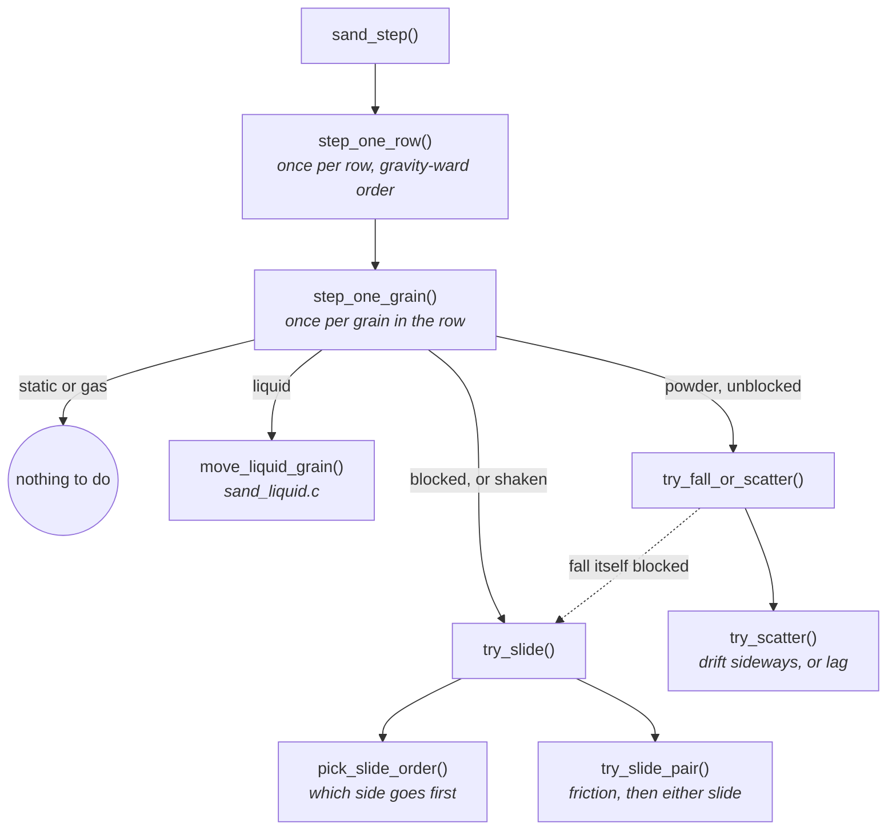
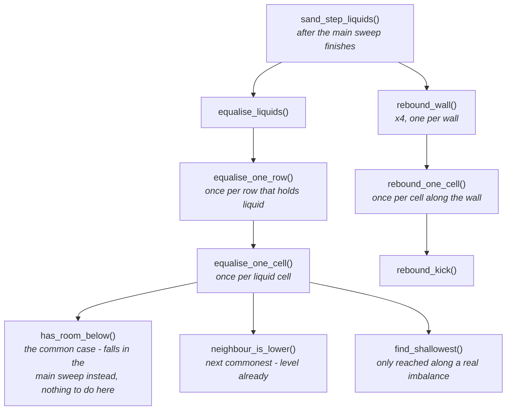

# The Falling-Sand Simulation

What `main/apps/sand/` actually is: a cellular automaton with a handful of
materials, tilt-steered by the accelerometer, that has to run inside a
memory and time budget tight enough that most of its design decisions were
forced by measurement rather than chosen for elegance.

This document is the "why" behind it - the material encoding, the movement
rules, the water model, and the performance discipline that shaped all of
them. For the app-registration mechanics (how `main/apps/*` plugs into the
shell), see `docs/Launcher-Architecture.md`. For the hardware constraints
underneath everything here, see `docs/Notes/README.md`. The discovery
narrative behind the fixes below - the bugs found and the reasoning at the
time - lives in `docs/Sand/Simulation-Lessons.md`.

---

## The grid is one byte per cell, and always will be

The cell size is a quality setting chosen on the app's boot menu - ULTRA
(2 px, 184 x 224), HIGH (3 px, 122 x 149), NORMAL (4 px, 92 x 112, the
default), LOW (6 px, 61 x 74) or VERY LOW (8 px, 46 x 56) - so the grid's
own byte budget varies with it, from 41 KB down to about 2.5 KB; two bytes
per cell at the finest setting would be 82 KB, against roughly 90 KB
actually free once the framebuffer (322 KB of the chip's ~424 KB internal
SRAM, no PSRAM) is accounted for. That budget is why the encoding is this
tight:

```
high nibble   material id, 0 meaning empty  -> 15 materials, MATERIAL_MAX = 16
low nibble    a variant, meaning depends on the material's kind
```

What the low nibble means is not fixed - it is reused per material, on
purpose:

- **Powder** (`KIND_POWDER`, e.g. sand): a *shade*, so a pile has texture
  rather than reading as one flat block of colour. Travels with the grain
  rather than being derived from its position, because position-derived
  colour makes a falling pile shimmer as it moves.
- **Liquid** (`KIND_LIQUID`, e.g. water): a *fill level*, 1-15
  (`MASS_MAX`). This is what lets water level itself using only its
  immediate neighbours - see [The water model](#the-water-model) below.
- **Transient** (`decay != 0`, e.g. gas, fire, steam, ember): *life
  remaining*, counting down to nothing. Reusing the nibble is what makes
  that free instead of needing its own byte - see [Gas: the same
  primitives, upside down](#gas-the-same-primitives-upside-down),
  [Fire chemistry: wood, embers, steam, and a working
  boiler](#fire-chemistry-wood-embers-steam-and-a-working-boiler), and
  [`Adding-a-Material.md`](Adding-a-Material.md) for how each of these
  uses this.

## Materials are a flash-resident table, not code

`materials[MATERIAL_MAX]` (`material.c`) is `const`, so it is memory-mapped
from flash and costs **zero bytes of RAM** - confirmed via `idf.py size`,
not assumed. Adding a material is a row in that table, not a branch in the
movement code:

```c
typedef struct {
    uint8_t kind;      /* how it moves - see material_kind_t */
    uint8_t density;    /* heavier displaces lighter */
    uint8_t slip;       /* resistance to being buried, 255 = none (a liquid) */
    uint8_t repose;     /* angle of repose x10, 0 = none (a liquid) */
    uint8_t scatter;    /* chance a falling grain drifts, for visual dispersion */
    const char *name;   /* cold - last, so it cannot push the hot fields apart */
} material_t;
```

The table is padded to the full 16 the nibble can address
(`MATERIAL_MAX = 16`), with the unused slots filled inert (`KIND_STATIC`,
`density = 255`). That turns every lookup into a plain array index with no
bounds check - worth doing because it happens several times per cell, per
step, and a corrupt cell byte becomes an immovable block instead of
undefined behaviour.

The 256-entry colour palette (`material_palette()`) is built the same way -
16 shades per material, interpolated at compile time into another `const`
table, so drawing a cell is one array index and zero colour maths at
runtime.

## Movement: one rule, and one invariant that has to be right

Every grain gets the same rule: try to move the way gravity points; failing
that, try the two directions either side of it. Angle of repose, heaps that
collapse when undermined, sand pouring through a gap - none of that is
modelled explicitly. It all falls out of those three attempts. (Gas is the
one exception - the same rule, run against a negated direction, from its
own pass - see "Gas: the same primitives, upside down" below.)

**The sweep order is the one thing that cannot be wrong.** A grain only ever
moves into a cell in the gravity-ward half of its neighbourhood, so sweeping
the grid *against* the direction of travel guarantees a cell's destination
has already been visited this step - a grain that moves cannot be picked up
and moved again in the same frame. Sweep the other way and a falling grain
teleports to the floor in one frame instead of falling one cell at a time.
Every pass in this codebase (the main sweep, and the liquid cross-flow pass
below) is built around this same guarantee, each with its own sweep order
derived from whichever direction *it* moves things in.

**Friction is two separate things**, because burial alone does not explain
the reported symptom (a floor of sand skating sideways on the faintest
tilt):

- **Angle of repose** - a grain on a slope stays put until the slope exceeds
  the friction angle: `descent > mu * lateral`, the same test as a block on
  an incline. `mu` is `repose / 10`; sand's `repose = 7` is ~35 degrees. A
  liquid's `repose = 0` means no angle of repose exists at all - it slides
  sideways however level the surface is, which is what makes it a liquid.
- **Burial** - a grain counts how many grains are stacked directly against
  gravity above it, and each one halves its chance of sliding
  (`SAND_SLIP_CHANCE = 96` in 256, halving per grain, capped hard past
  `SAND_LOAD_CAP = 5`). A liquid's `slip = 255` means load never holds it at
  all - water at the bottom of a pool flows exactly as freely as water at
  the top.

**Gravity's direction is dithered, not snapped to nearest-of-eight.**
Snapping makes a slow tilt arrive in 45-degree jerks. Instead, each step
randomly picks one of the two octants bracketing the true angle, weighted so
the long-run average matches it - the same trick as dithering a colour ramp,
applied to a direction. At 60 fps the eye integrates the two directions into
one smooth angle.

## The water model

Water went through three designs this project, in order, each one replaced
because it was measurably wrong rather than because it looked wrong:

1. **Cell-count, no amount.** A cell is either water or not. Two adjacent
   cells at "full" and "empty" have no legal move that leaves a valid state
   in between - a wide pool freezes into a staircase. This is a genuine
   fixed point of any rule shaped like this, not a bug in one attempt at it.
2. **Local mass diffusion only** (an amount per cell, shared only with
   immediate neighbours). Correct per the literature, and measurably too
   slow: levelling a pool 184 cells wide by neighbour-to-neighbour diffusion
   alone takes tens of thousands of steps, because information only moves
   one cell per step. Measured: a real-width pool was still 6 cells proud
   after 5,000 steps. Not a tuning problem - an `O(n^2)` bound on any rule of
   that shape.
3. **Mass, plus a bounded surface scan** - what shipped. A liquid cell
   carries an amount, 1-15 (`MASS_MAX`). Two rules, in the main sweep, in
   order:
   - **Down, then down-the-slope** (`move_liquid_grain()`, `sand_liquid.c`):
     fill the cell below if it has room, then share what is left with the
     two diagonal downhill neighbours. Still only immediate neighbours,
     still gravity-ward, so it carries the same no-double-move guarantee
     every other move in the main sweep does.
   - **Cross-flow** (`equalise_liquids()`, `sand_liquid.c`): a *second*,
     separate sweep that walks one of two rays bracketing the true
     perpendicular to gravity - which one a given column (or row) takes is
     chosen on a fixed pattern in space, see `xflow_t` in `sand_priv.h` -
     up to `SAND_LIQUID_SIGHT` (8) cells along the surface for somewhere
     shallower, and moves half the difference in LEVEL there: mass adjusted
     for how much deeper one cell sits than another along gravity, not raw
     mass. This is deliberately not local - it is the cheap stand-in for
     pressure, which in real water travels far faster than the water itself
     does, and it is why every falling-sand game has some version of it.

**Why cross-flow cannot live in the main sweep.** The main sweep's
no-double-move guarantee depends on sweeping against gravity - but once
gravity is tilted, that pins the sweep on *both* axes, and of the two
directions across the flow, only the one the sweep has already passed is
ever safe to use. Water could cross a slope one way and never back: a
tilted pool did not level at all, it walked into the low corner and set
there in steps. A separate pass has its own sweep order, chosen to fit
whichever cross-flow direction it is using that step (the two alternate
every step, so both directions become available over time).

**`SAND_LIQUID_SIGHT` is 8, not larger, and that number is measured, not
guessed.** A longer sight distance hands mass directly to a cell far away,
skipping everything between - so water visibly vanishes from one spot and
reappears in another, and because the sweep direction alternates every
step, it sloshes straight back the next. Measured residual unevenness after
settling: 4 -> 1.6 cells, 8 -> 0.8, 16 -> 0.5, 32 -> 0.2 (but visibly wrong
while it gets there - "huge waves"). 8 was picked as the point where a 4x
reduction in cost costs only ~0.6 cells of extra unevenness, which is
smaller than a pixel at this grid's resolution.

**A subtle correctness bug, worth knowing if this code is ever touched
again:** cross-flow's own axis was, for a while, taken from the *dithered*
gravity direction - which by design alternates between two octants almost
every step once off-axis. That made the axis a "is this level" search runs
along change out from under it constantly, and a settled pool could read as
wildly unbalanced along the direction it *wasn't* just checked against,
swinging large amounts of mass back and forth every step or two - visible as
water that looked settled flashing between shades and resettling. Fixed by
taking the axis from the *nearest* (non-dithered) direction instead, the
same fix friction's burial check already used for the identical reason. See
`test_a_settled_pool_does_not_flicker` in `suite_sand.c`.

**That fix had a sequel, and it is worth knowing too.** Pinning cross-flow
to the nearest of the eight gravity directions was the correct fix for the
flicker, and it had a cost nobody had priced: a pool could then only ever
settle perpendicular to one of those eight directions, so its surface
quantised to 0/45/90 degrees regardless of the true tilt. The near-vertical
octant lost more than resolution - its axis ray is horizontal, and a
horizontal ray can only move mass within a row, so that octant could not
tilt its surface at all, not merely coarsely. What replaced the single-ray
rule is a spatial dither between two rays - the axis ray and the diagonal
beside it, chosen per column on a fixed pattern rather than pinned to one -
plus comparing gravitational potential instead of raw mass, since two cells
reached by different rays are not the same distance along "down" even when
they hold equal mass. Two guard tests exist for this pair of concerns on
purpose: `test_a_settled_pool_does_not_flicker` holds the original fix, and
`test_a_pool_settles_at_the_angle_it_is_tilted_to` holds its cost. Neither
alone is enough - see the fourteenth attempt in
[`Performance-Tuning-Attempts.md`](Performance-Tuning-Attempts.md) for the
full derivation and what it cost to buy back.

## Gas: the same primitives, upside down

The fourth material (`MAT_GAS`/`KIND_GAS`, `sand_gas.c`) rises and
disperses - literally the water model's shape, reflected: instead of
"falls, then spreads across the surface it lands on", gas is "rises,
then spreads across the ceiling it hits". It reuses the exact same
`try_fall_or_scatter()`/`try_slide()` primitives sand's own gravity-ward
move already used, called with the direction negated, rather than a
parallel set of gas-specific movement functions.

**Why it needs a second pass, the same reason cross-flow does.** The main
sweep's no-double-move guarantee depends on sweeping *against* the
direction something moves - correct for gravity-ward materials, exactly
backwards for something moving *against* gravity. `sand_step_gas()` is
its own pass, called after the main sweep, swept in the reverse row/
column order, so a rising move lands in already-visited territory
instead of teleporting to the ceiling in one step.

**Getting the shared code onto both paths cheaply took three attempts,**
the same "measure on device, don't assume" discipline as
`SAND_LIQUID_SIGHT` above - full story, exact numbers, and why it matters
generally (a `static` function turning `extern` silently loses inlining;
inlining a large call graph into *two* hot call sites can cost more in
flash-cache pressure than it saves) in
[`Simulation-Lessons.md`](Simulation-Lessons.md).

See [`Adding-a-Material.md`](Adding-a-Material.md) for the practical
walkthrough of building this material end to end - the design questions
that came up, and the mechanical checklist for adding the next one.

## Fire chemistry: wood, embers, steam, and a working boiler

Fire's own reactions - ignition, extinguishing, smothering, burn-out -
live in `sand_reactions.c` and are driven by a second table,
`reaction_t reactions[]` (`material.h`), kept deliberately separate from
`materials[]`. The reasoning is the same one that keeps `material_t`
itself small: every field of `materials[]` is read several times per
cell per step from the main sweep, and fire chemistry is read only by
the cold reactions pass, gated behind `may_have_burning`. Paying for
`flammability`, `ignites_to`, `burns`, `conducts`, `smoke`, `quench_to`
and `flare` in the hot table's stride would be paying for nothing on
every step that never touches fire at all.

**Wood catches slowly, and chars into an ember rather than a flame.**
The obvious design - wood ignites straight to `MAT_FIRE`, the same way
gas does - does not work, and the reason is worth understanding before
touching either material. Fire is `KIND_GAS`, so a wood cell that became
fire would float away on the very next `sand_step_gas()` pass, leaving a
hole where the log was; a log would dissolve into rising flames that
drift off, often before they get a turn to ignite the next log along.
Burning wood fixes this by splitting the two jobs fire was doing at once.
A lit log is `KIND_STATIC` and stays exactly where it was - it keeps
igniting neighbours, keeps counting down, and eventually burns out, all
without moving - while the flame licking up off it (`reaction_t.flare`) is
ordinary, separate `MAT_FIRE`, purely for looks and for reaching fuel
stacked above. "Wood burning below, flame above" falls out of two simple
things, not one material trying to be a heat source and a moving flame at
the same time.

Being alight is a STATE of the wood (`reaction_t.burn_decay`), held in its
variant, rather than a second material. It was `MAT_EMBER` for a long time
and behaved identically; folding it back in freed a slot and made "water
puts a log out" expressible - the log is still there, just no longer
alight, which an ember could never be because the ember *was* the fire. Wood's own
`flammability` (6 in 256) makes catching a slow negotiation rather than
an instant flash - roughly 43 steps of contact with a single flame
before it takes, so a log has to actually burn rather than vanish on
first touch.

Ember is essentially never `smothered()` the way fire can be: that
predicate needs all four cardinal neighbours *strictly* denser, and at
density 150 only stone (200) qualifies - burying a log in sand will not
put it out. That is an accepted limitation, not a bug to chase: only
decay, or water, ends an ember.

**Fire has two exhausts, and they are deliberately different
materials.** A burning cell touched by water still goes out in one
touch, but now becomes `MAT_STEAM` instead of simply vanishing, and the
water that quenched it pays a unit of its own mass for the privilege -
steam is a byproduct, not a free lunch, and a pot boiled dry should
eventually run dry rather than boiling forever for nothing. A burning
cell that just runs out of life leaves `MAT_SMOKE` instead
(`reaction_t.smoke`), no water involved:

| | what it is | where it comes from |
|---|---|---|
| `MAT_STEAM` | water that got hot | boiled through a conductor, or flashed off a quenched fire |
| `MAT_SMOKE` | fuel that burned out | a fire or an ember reaching the end of its life |

These were **one** material at first, and the reasoning for sharing a
row was good: both are a light gas that rises, spreads and fades, their
`materials[]` rows are nearly identical even now, and this document's
own top section is a sustained argument for making one thing do two
jobs when the two jobs have the same shape. It was still wrong, and the
way it was wrong is the useful part. The overlap was real in the
*physics* and false in the *picture*: a lone fire burning out in
mid-air, nowhere near water, puffing bright white kettle-steam reads as
a bug to anyone watching, because the player can see for themselves
there was nothing there to boil. Nothing in the simulation or its tests
could surface that - only looking at it could.

So the split is not really two materials, it is two *palettes* that
happen to need a material each: steam is cool and bright, smoke is warm
and dim, and a fresh puff of smoke tops out dimmer than a dying wisp of
steam so the two stay separable even where they overlap. The small
differences in `decay`, `mobility` and `sight` are flavour on top - if
you find yourself re-merging these rows on the entirely correct
observation that they are nearly identical,
`test_quenching_makes_steam_but_burning_out_makes_smoke` is there to
stop you.

**Gas under standing liquid, and the bubble that gets it out.**
`can_enter()`'s displacement rule is one-directional - denser only ever
displaces lighter - and steam (density 5) sits below water (30), so
steam cannot *enter* the water above it. The reverse does not save it
either: a liquid never consults `can_enter()` at all, and `room_in()`
(`sand_liquid.c`) refuses any cell holding a different material, so
water will not fall into a steam cell. Between the two rules a gas cell
underneath standing liquid had **no legal move in either direction** and
sat frozen there forever. On the device that read exactly as what it
was: a boiler that produced steam and then held onto it.

`try_bubble()` (`sand_gas.c`) is the fix - a plain two-cell swap between
a gas cell and the liquid directly above it, gated on `KIND_GAS` and an
*inverted* density test (only something lighter than the liquid rises
through it). Measured at one cell per step, with water mass conserved
exactly, since a swap moves the liquid's variant nibble across untouched
rather than splitting it.

Two things about where it lives are the interesting part:

- **It is deliberately not in `can_enter()`.** That predicate is the
  hottest thing in the project, read several times per cell per step
  from the main sweep; a mobility special case there would be paid for
  by every falling grain of sand on the board forever. In the gas pass
  it costs one comparison, only for gas cells, only in a pass already
  gated behind `may_have_gas`, and only on cells whose ordinary rise was
  already blocked.
- **It is safe with respect to sweep order for free.** The gas pass
  sweeps so the rise destination is already-visited territory, so the
  displaced liquid cannot be picked up again by it; and both liquid
  passes ran earlier in the same `sand_step()`. The liquid gets exactly
  one move, the same guarantee every other move has.

**Boiling happens at the heat source**, converting the very cell
`conduct_heat()` reaches - the one touching the hot conductor - and the
steam climbs out by itself from there. A pot on a hot stone reads as a
column of bubbles rising off its base.

It did not always. The first version walked *against gravity* through
the liquid run and boiled the cell at the **surface** instead, purely
because of the trapping described above: before bubbling existed, steam
made at the bottom of a pool stayed there forever, so boiling anywhere
else produced nothing anyone could see. That walk needed a gravity
vector, which is the only reason this pass ever took one. Bubbling
dissolved the constraint, and the walk, its `BOIL_REACH` cap and the
whole `(gx, gy)` plumbing came back out with it.

Worth keeping as a general habit: **a workaround built on a limitation
should be re-examined the moment that limitation is lifted.** Left
alone, it quietly outlives its reason and starts reading as a deliberate
design choice - and the code carries a parameter nobody can justify.

**Building one in the app:** a wood floor, a stone basin over it as
thick as a single drag of the pour brush produces, water poured into the
basin, and a spark to light the wood. The wood catches, chars into an
ember, and the ember's own heat conducts up through the basin floor,
boiling the water inside it and sending steam up out of the basin - all
without the fire or the ember ever leaving the space below the stone.

The general lesson, worth keeping past this one feature: a rule that is
clean in the abstract can be unreachable through the very UI that has to
produce the scene it depends on, and the material and reaction tables
are not where anyone finds that out.

See [`Adding-a-Material.md`](Adding-a-Material.md) for the `place_reacted()`
lesson this feature's own design surfaced - a material whose reaction
changes its *kind* (fuel igniting into a gas, a liquid boiling into one)
has to latch that kind's `may_have_*` flag, and getting it wrong is
invisible to almost every other test.

### Water cools, and lava can lose ground it cannot get back without a pour

Stone and glass bank heat in the low nibble their `KIND_STATIC` never
otherwise needed (material.h's own comment on the low nibble's per-material
reuse - see "The grid is one byte per cell" above), 0-15 with
`SAND_AMBIENT_HEAT` sitting in the middle rather than at the floor, so a
pane has somewhere to go both when it warms and when it chills
(`step_one_tempered_cell()`, `sand_reactions.c`). Left alone, that variant
relaxes back toward ambient on its own, at a rate (`reaction_t.cools`) that
gets harder to outrun the further off ambient the cell already sits - a
single brush of fire makes a pane fragile quickly, while cooking it all the
way to molten stays a long exposure.

A quenching liquid (`PAIR_QUENCHES` - water and acid, never lava or oil,
this file's own top comment in `sand_reactions.c`) sitting against a
heat-ramping cell multiplies that same drain by `SAND_WET_COOLING_FACTOR`
(sand.h), but ONLY in the above-ambient half of the ramp. Pouring water on
a glowing wall is what makes its banked heat actually come back down in a
reasonable number of steps rather than the many dozens plain ambient
cooling alone would take - and the asymmetry is deliberate: nothing about
being wet can ever push a cell below `SAND_AMBIENT_HEAT`. That is chilling's
job (snow, ice, `reaction_t.chills`) alone, and letting water do it too
would let an ordinary splash thermally shock glass the same way a
deliberately-placed snowbank does.

**Lava quenched into stone can take a neighbour down with it, which is what
lets a sustained pour eat into a pool rather than only ever sealing its
surface.** The one-touch quench any water-on-lava contact has always done
(`neighbor_quenches()`, `quench_to`) now rolls a small, deliberately rare
chance (`SAND_LAVA_COOLOFF_CHANCE`, sand.h) to freeze ONE further adjacent
lava cell too, which rolls again in turn - an iterative walk
(`cool_off_chain()`, `sand_reactions.c`), bounded at `SAND_LAVA_COOLOFF_MAX_CHAIN`
links so one lucky roll can never run the whole pool to stone in a single
event. Stop pouring, and the crust that formed simply sits there - nothing
about it keeps spreading on its own.

Lava pays the same small chance for a second reason: doing the WORK of
actually melting a neighbour into something else (a genuine material
change - sand fusing all the way to lava, a thermal-shock crack - not
merely banking one more level of heat, which stone and glass do on nearly
every step they touch lava and which never costs anything) rolls the same
chain. Getting this distinction right mattered enough to be its own guarded
test (`test_a_lava_pool_in_a_dry_stone_bowl_does_not_freeze_itself`,
`suite_sand.c`): gating on whether the heat-transform probe merely
*returned true* rather than on whether `CELL_MATERIAL` actually changed
would have made a lava pool sitting in an ordinary stone bowl slowly
self-extinguish with no water and no fuel anywhere on the board - an
always-on drain nobody asked for.

### A sufficiently covered lava cell can burst

Independent of water: a lava cell with a complete gravity-relative lid
over it (`covered_at()`, `sand_priv.h` - see "The shared 'am I covered'
primitive" below) gets a tiny, deliberately rare per-step chance (`SAND_LAVA_BURST_CHANCE`, sand.h - 1 in
256, the rarest a single byte-wide roll can express) to convert to
`MAT_STONE` and immediately `sand_explode()` at that spot, fire included.
This is the replacement for the earlier vent mechanism
(`reaction_t.vent_chance`, which threw whatever was covering the lava
rather than touching the lava itself) and the mechanism that reopens a
sealed pool's own crust so a sustained pour can keep reaching lava rather
than the pour's own cool-off chain armouring the surface shut - see the
cool-off section above.

A lid, not `smothered()`'s own all-4 (a different, gravity-agnostic
question - see below): a pocket with an open side still qualifies, which is
what lets an ordinary hand-drawn vessel (which the `smothered()`-exemption
story above already found has dozens of one-cell dimples) actually reopen
over time rather than needing a fully sealed cell to ever do anything.

#### The shared "am I covered" primitive

The first version of this feature (`cover_count()`, retired) counted the
four SCREEN-fixed cardinal neighbours, and was wrong twice over: what is
BELOW a cell supports it rather than covering it, so the eligible set has
to rotate with gravity; and because it was built on `neighbor_smothers()`
(which never counts a liquid neighbour, on purpose - `smothered()` needs
that exemption too, for the identical reason a big pocket of fire must
not smother itself from the inside out), an interior cell of a pool wider
than one cell had at most ONE neighbour that could ever count - the cell
directly above it - so a wide pool sealed by a crust could never reach
the threshold no matter how complete the seal was. Only an isolated lava
cell sitting in its own solid pocket could ever burst.

`cover_mask()`/`covered_at()` (`sand_priv.h`, beside
`ring_dir()`/`ring_of()`) fix both problems and are meant as a general
"is there a lid over this cell" primitive, not a burst-private helper - the
confined-gas ignition check is a candidate to migrate onto it later (the
vent machinery's own `covered_from_above()`, the other candidate this
paragraph used to name, no longer exists - removed once the burst above
replaced it). The lid is the **three cells centred on anti-gravity**: the
cell directly opposite gravity and the two diagonals either side of it,
and a cell is covered when **all three** are covering (non-liquid,
strictly denser, in bounds - the board edge is never a container). What is
below a cell supports it and what is beside it walls it in; neither covers
it. Gravity is read from `s->last_load_dx/dy` (the SETTLED direction - the
nearest of the eight ring directions, stable while the board is held
still) rather than `s->last_step_dx/dy` (the per-step DITHERED direction)
or the raw tilt vector: dithering would swing the lid between two adjacent
orientations every step a tilt fell between two eighths, so a cell sealed
in one would read open in the other and the rule would turn into
orientation noise.

This is the second gravity-relative version (2026-09-03). The first
(2026-09-02) was a five-cell **semi-disc** - the same three plus the two
perpendiculars - needing three covered in a contiguous run, with a
cardinal-triple exception. The perpendiculars were the defect. A
finger-drawn stone wall bulges one cell past itself every brush step, so
its inner face has a notch every brush step, and lava settling into each
notch saw wall to its side, wall on the diagonal above that side and wall
directly above: three, contiguous, "sealed" - while the pool's surface sat
wide open one cell over. Every hand-drawn basin blew its own sides out as
the lava settled. Reproduced on the host: a clean one-cell wall never
produced a single eligible cell in 5000 steps (which is why no test saw
it - every basin in the suite is drawn clean); a brush-drawn one did
within 16 steps and breached by step 62 at natural odds. Dropping the
perpendiculars removed every eligible cell in that scene at brush radii 2
to 4 and left the wide-pool-under-a-crust case, the one the rule exists
for, exactly as it was. It is also cheaper: three probes, no count, no
contiguity walk, no exception. The one shape it still fires on at a wall
that the player might not expect is a two-cell-wide overhang, where the
innermost cell does have a complete lid. See
`test_lava_in_a_wall_notch_never_bursts` and
`test_cover_primitive_matches_the_exhaustive_shape_table`, `suite_sand.c`.

**`sand_explode()` fills a core of radius `radius / SAND_EXPLODE_CORE_
DIVISOR` with fire before it queues a single flight entry** (see
`SAND_EXPLODE_CORE_DIVISOR`'s own comment, sand.h). At `SAND_LAVA_BURST_
RADIUS` (8, `SAND_GAS_IGNITE_BLAST_RADIUS`'s own figure - the only other
reaction-driven burst that exists) and divisor 5, that core radius is 1 -
so the `MAT_STONE` this feature just wrote at the centre is immediately
overwritten by fresh fire. That is pinned, expected behaviour (see
`test_buried_lava_bursts_into_stone_and_fire`, `suite_sand.c`), not a bug.

Not gated on `sand_enable_impulses()` having been called: `sand_explode()`
is a documented no-op without it, so with impulses off the cell simply
becomes stone and nothing is thrown - correct, since no impulses means no
explosions anywhere else in the simulation either.

**The rate is per covered cell, per step, not per pool or per event** -
the same multiplier trap the earlier vent mechanism's own rate fell into
twice, back when it was tuned (see git history): a large sealed pool has
many covered cells, each independently rolling this every step it stays
covered, so a figure that reads as vanishingly rare in isolation is
common in aggregate.
A stress-tested "pool under a hand-drawn floor" scene (many one-cell
dimples across a wide ceiling, deliberately packed tighter than the blast
radius) confirmed the mechanism is self-limiting rather than a runaway
chain: a burst's own explosion destroys the cover around it as it clears
the pocket, so a freshly-uncovered neighbour is usually blown open rather
than left standing and re-eligible. At the real production chance the
scene lost roughly a sixth of its lava over 3000 steps in a slow trickle,
never more than a handful of dimples in a single step; pinned to the
maximum chance the same scene lost about half its lava in the first 20
steps and then plateaued as the remaining pockets thinned out and
scattered. Not a suppression mechanism - the tapering is an emergent
consequence of the blast itself clearing cover, not a cap anyone added.

## Roots: a tree welds itself to the soil it drinks from, then spreads through it

The plant/wood/leaf family (`MATX_PLANT`, `MAT_WOOD`, `MATX_LEAF`) is not
otherwise covered in this document - its growth, hardening and budding
rules live in the extensive comments on `extended_reactions[MATX_PLANT]`
and `reactions[MAT_WOOD]` in `material.c`, which is the source of truth for
how a tree grows tall, thickens, and buds new limbs. This section covers
one narrower piece: how a tree stays connected to the ground it drinks
from once the ground itself starts moving, and how the root SYSTEM that
grows from that connection gets its shape.

**The problem.** Dirt is a powder and shifts. A tree finds water by
walking down its own stem to the ground and on down into the soil
(`find_water()`, `sand_reactions.c`) - and when the soil directly under
the tree's collar (where the trunk actually touches ground) slides away,
that walk finds neither more stem nor ground below it and simply returns
failure. The tree is stranded, sometimes with plenty of water two rows
down, because the one cell it needed to reach it is gone.

**PART 1: the seed.** As a plant or a trunk spends the soil moisture it
grows, buds or sprouts on, there is a small chance (`reaction_t.roots` on
the PLANT/WOOD rows, 40 in 256) that the CONTACT cell - the collar itself,
not wherever the moisture actually came from - welds into a `ROOT` cell
instead of staying an ordinary grain of dirt. A root is `KIND_STATIC`: it
does not fall, slide, or get displaced the way loose dirt does, so once a
collar has rooted, nothing about the bed shifting can carry it away from
under the tree.

This roll fires ONLY ONCE per tree - gated in `spend_soil_moisture()` to
`root_depth == 0`, meaning `find_water()`'s stem walk crossed no root at
all on the way down. The moment the first root exists, PART 1 gets out of
the way for good and PART 2 takes over growing the system; without that
gate, every later grow/bud/sprout event would keep re-rolling here too,
seeding fresh disconnected root cells at whatever the current deepest
contact happens to be, fighting PART 2 over the same collar.

**PART 2: the system.** A root cell is not otherwise inert - it eats.
Every step, a root cell scans its own eight neighbours (`step_one_rooting_cell()`)
for one that is dirt and still holds moisture, rolls a small chance
(`reaction_t.roots` on `MATX_ROOT`'s OWN row - the same field, a second
reading of it, the way `hardens_to` and `clings_to` already do double duty
elsewhere in `reaction_t`), and converts it into more root. The conversion
IS the water cost: `place_reacted()` overwrites the whole cell with a
fresh root byte, so the dirt's moisture nibble is simply gone along with
everything else the cell used to be, rather than separately debited.

Almost no direction weights. Moisture itself already has a shape - it
percolates down through a bed and diffuses out from anything drinking or
pouring nearby - so a root that simply reaches for whichever neighbour
still has water in it spreads wide near a wet surface and fingers downward
through a bed drying from the top. The first cut had no weights at all on
exactly that reasoning, and on the device the sideways spread near a wet
surface won so completely that depth only happened at the angles the
geometry favoured. So there is one SMALL skew, read off the grid with no
state: a candidate that continues AWAY from the cell's own root neighbours
weighs +2, one that reaches gravity-ward +1, over a base of 1. A tip has
one parent and keeps going the way it was going - what `holds_line` does
for a stem, without remembering anything; a junction's neighbours partly
cancel and it is free to turn; the trunk a root grew from counts as a
parent too (`clings_to`), so the very first root under a tree heads down
and out from under the wood rather than tossing a coin along the wet
surface. Measured over THIRTY seeds (six was per-seed scatter of +/-10
rows): mean deepest root 3.5 rows with the weights zeroed, 7.2-7.4 with
them; systems about twice the size (22 roots against 42), because a
directed tip keeps finding fresh moist cells instead of re-hitting the
crowd; and the runaway scene still pins at a fixed point.

**Depth is bounded by water, not by the weights.** Raising the gravity
term and adding the trunk term narrowed systems (mean half-width 8.5 ->
7.9) and did not deepen them (7.2 -> 7.4), and the harness says why:
after 20,000 steps every saturated bed was 98-99% dry and not one live tip
had moist dirt beside it. A root can only eat moist soil, a bed watered
from the top dries from the top, and the moist front the fingers chase is
gone before they reach the floor. The weights decide which moist cell a
tip takes next; how deep the water goes decides how deep the roots can.

**So the roots carry the water down.** A root cell is a CONDUIT
(`step_one_conducting_cell()`, `ROOT_CONDUCT_CHANCE` 64): each step it
may move one level of moisture from the wettest soil beside or above it
into the driest soil beneath it. Moves only, never makes - the same
conservation percolation keeps - and one way only, gravity-ward, so it
cannot ping-pong against diffusion. The sink is the next cell a tip wants
to eat, and a fresh tip is itself a conduit, so the moisture front and
the root front move down together: depth is earned a level of water at a
time. Sides count as sources, not only "above" - a column has more root
above each cell, not soil, so only its top cell would ever conduct
otherwise; drawing from the wet soil flanking each cell is what lets a
whole column drain the surface layer downward.

Measured on the dry bed watered at the collar only (the device case), ten
seeds, mean deepest root of 19 rows, for three percolation rates:

```
SOIL_PERCOLATE_CHANCE    conduit off    conduit on
        15 (current)         4.6           15.0
        30                   7.0           18.0
        60 (the old value)   5.3           15.1

   and on a SATURATED bed, percolation 15:   9.6           15.4
```

Two readings. Conduction is worth roughly three times what the
percolation rate is - even the old, fast percolation only reached 5-7
rows without it - so the earlier slowdown of `SOIL_PERCOLATE_CHANCE` was
not what made roots shallow, and undoing it would not have made them
deep. And the runaway scene still pins: collar re-saturated every step,
93 roots at step 2000 and 93 at 20,000, because `ROOT_SURFACE_MAX` bounds
the SHAPE regardless of how much water is carried into it. An earlier
draft of this feature reused
`step_one_growing_cell()`'s own stem-walk machinery - a site roll (tip,
lean, branch, widen) walking a run outward from the collar - the same way
a limb grows; it was replaced by the local eating rule because a root does
not need a stem's machinery to look like a root, and because eating rests
on the same scarce-resource philosophy (spend the moisture, and that is
the whole bound) the rest of this feature already uses, rather than adding
depth and spread caps as a second, separate kind of bound beside it.

**What actually bounds it.** Three things, in the order that matters:

1. **The moisture itself.** A cell with nothing to spend has nothing to
   grow into, and the total on a board is finite unless something keeps
   pouring more in.
2. **`ROOT_SURFACE_MAX`, 2.** A root already touching more than 2 other
   roots does not roll to grow at all. This is what actually gives the
   system its shape - without it, a well-watered bed converts every moist
   cell it can reach into a solid slab of root rather than a filigree of
   it. Measured against a runaway scene - a root pre-planted so the rare
   PART 1 lottery cannot confound the reading, its collar rewatered to
   SOIL_MOISTURE_MAX every single step for 20,000 steps, root count
   sampled every 2000: at `ROOT_SURFACE_MAX = 1` the system starved
   itself shut at 4 cells (a bare stub); at 3 it never stopped growing -
   99 roots by step 2000, still climbing at 220 by step 20000, no sign of
   levelling off; at 2 it climbed to the low forties by step 2000 and then
   sat there BYTE-IDENTICAL through the remaining 18,000 steps, seed after
   seed - a genuine fixed point.
3. **`reaction_t.roots` itself, 8 in 256 on the root row** - a small
   chance, the same discipline every roll in `sand_reactions.c` follows.

No depth or spread cap was needed in the end - the walk-shaped first
draft's `ROOT_DEPTH_MAX` is retired entirely (see its own RETIRED comment
in `sand_reactions.c`, where the constant used to live). A local rule with
no notion of "the collar" has nothing to measure a depth cap FROM in the
first place, and `ROOT_SURFACE_MAX` alone already produces a genuine fixed
point at the scale this feature actually runs at.

**Eight neighbours, not four.** `step_one_rooting_cell()`'s scan walks all
eight ring directions rather than the four cardinals `reaction_dirs[]`
uses elsewhere in this file. Compared directly, both ways, over the same
six seeds: four gave a near-straight taproot, one or two cells wide, that
only fanned out where moisture happened to pool against the stone floor;
eight let a root step diagonally as it reaches for water, which is what
actually produces the wandering, forking shape a root system is supposed
to have. The difference was qualitative, not a rounding error.

**Shade follows structure, not age.** A root darkens from the fresh tan
toward a wood-like brown (`ROOT_OLD`, `material.c`) as more root grows
around it: the painter hands `material_colours()` the count of root
neighbours in the `depth` slot only a liquid's interior otherwise reads
(`material_root_neighbours()`, `material.h`), and that count picks one of
`ROOT_SHADES` steps. A tip touching one other root wears the fresh colour;
a cell that has put out children steps darker; the collar, touched on most
sides, wears the darkest. Not a lifetime, on purpose and not only because
a root has nowhere to store one: an age would darken the tips too, and the
tips are the part meant to stay fresh. Lose a child to rot or lava and the
parent lightens again. The eating rule above is what makes this visible at
all - a straight column is almost entirely two-neighbour cells, while a
branching system is full of the junctions the darker steps are keyed to.

**Measured, before and after** (60 wide, 70 tall; stone floor; 20 rows of
saturated dirt; one seed on the surface; the 13 cells around the collar
rewatered every 20 steps; 20,000 steps; `sand_step(&s, 0, 1000, 0)`):

```
                     BEFORE (PART 1 only)         AFTER (PART 1 + PART 2)
seed    roots depth  half-width  wood      roots depth  half-width  wood
11        7     3        7       141         0     0        0       83
909       4     2        3       82         35    19        9       88
4242      3     2        1       78         48    19       12       69
77        1     1        1       71         76    19       13       58
5150      7     2        9       148        55    19       12      298
31337     2     2        2       116        29     8        7       104
```

Before, a root system was a short column near the collar, one to seven
cells, capped by `ROOT_DEPTH_MAX` and starved by how rarely a single
un-replanted tree spends soil moisture at all. After, the same scene
grows a genuine branching system reaching most of the bed's own depth,
spreading well past the collar. Seed 11 growing zero roots either side is
not a regression - PART 1's lottery (~16% per eligible spend, and a single
tree spends only a few dozen times in its life) simply missed for that
seed within 20,000 steps; the suite's own tests replant every 40 steps
specifically to give that roll many independent tries, the way this raw
harness does not.

One seed's soil, picture (`seed 4242`, `R` root, `W` wood, `.` dirt,
collar near the top centre):

```
.............................RR.RR..........................
.............................RR.RR..........................
.............................R..............................
.............................R..............................
.............................RR.............................
.............................R..............................
.............................R..............................
.............................RR.............................
.............................RR.............................
..............................R.............................
..............................R.............................
..............................RR............................
..............................R.............................
..............................R.............................
..............................RR............................
..............................R.............................
..............................R.............................
..............................RR..R..R.R.RR..................
..............................RRRRRRRRRRRRR..................
```

Wide near the collar, a wandering single-cell thread through the middle of
the bed, and a wider fan again at the bottom where moisture pools against
the stone floor - the shape moisture's own distribution gives it, for
free, with only the small away-from-parent and gravity-ward skew above
laid over it.

**Why a new material, not more wood.** The obvious shortcut - give wood a
"rooted" variant, the way glass spends its variant on temperature - does
not work, because wood's variant is already spoken for: it is burn
progress (`reaction_t.burn_decay`), and `CELL_VARIANT(n) != 0` is what
"on fire" means throughout the reactions pass. A root wearing a wood
variant would read as a nearly-burnt-out log. Being its own material also
buys two things a wood-based encoding could not: a root does not count
against `TREE_LIFT` (`find_water()` tracks a separate `root_depth` purely
so it can NOT add to `lift` - a cell below the water line lifts nothing,
and charging it anyway would let a handful of root cells eat a real share
of every tree's height budget for free), and the stem walk can tell a
root apart from ordinary ground well enough to treat one buried under
freshly-shifted dirt as transparent rather than as a second dead end,
reintroducing the very bug this feature exists to fix from the other
side.

Flammability is zero on a root's own row, deliberately - not an omission.
A root is buried, and a fire that could reach down and burn out a tree's
own anchor from under it would undo the whole point of the feature: the
tree would be exactly as vulnerable to a shifting bed as it was before
roots existed, just one fire away.

**A root competing with its own tree.** PART 2 gave the feature one new
and genuinely surprising failure mode: a root sitting directly on its
tree's ONLY reachable water can, given enough steps, eat that exact cell
itself and convert it to more root - and if nothing lies beyond it but
stone, the tree's own water access is gone, spent on growing the root
system instead of ever reaching the trunk above. This is not a bug in
`find_water()`'s transparency (untouched by PART 2, and still correct);
it is root and tree genuinely competing for the same scarce moisture,
first roll wins. `test_a_buried_root_does_not_cut_off_the_water_below_it`
(`suite_sand.c`) used to rest on a single row of water directly under the
root, and PART 2 made that scene racy against this exact competition
(measured: FAILED, deterministically, for this suite's fixed seed) - the
fix was a deeper wet reserve below the root, not a change to the
mechanism, since a real root system does not get to consume literally
every cell of water below it before the tree it belongs to can use any.

## Momentum and the wall-rebound splash

Everything above reacts to where gravity *points*. Nothing reacted to how
fast it was *changing* - so a wave that had just piled against a wall had no
reason to do anything but sit there, indistinguishable from a slow tilt to
the same angle. `sand_step()` tracks a single shared momentum vector
(`mom_x_q8`, `mom_y_q8`, Q8 fixed point - not a per-cell velocity field,
which would cost another byte per cell) from how much gravity's direction
has turned, step over step, and decays it (`SAND_MOMENTUM_DECAY = 220/256`
per step). When that momentum is large and pointed into a wall, cells
touching that wall kick a little mass back into the grid
(`SAND_REBOUND_GAIN = 8`, `SAND_REBOUND_MAX = 10` per cell per step, above
`SAND_REBOUND_THRESHOLD = 160`).

**The direction and the speed deliberately come from different signals.**
`(gx, gy)` is already smoothed before `sand_step()` ever sees it - it has to
be, or every grain would jitter with sensor noise - and that smoothing caps
how far its own frame-to-frame delta can move, which makes it the *wrong*
thing to measure speed from: a real flick and a slow tilt to the same angle
become nearly indistinguishable once the filter has settled. So direction
still comes from `(gx, gy)`; how far to push comes from
`sand_set_flick()`, fed once a frame from the gyroscope's raw rotation rate
(`imu_rotation_level()`) - never run through the position filter, and
already read every frame to steer *its* responsiveness anyway. Calibrated
against a real capture rather than guessed: ordinary handling measured
21-159 (Q8 units), and a genuine flick 162-737 - comfortably past
`SAND_REBOUND_THRESHOLD = 160`, with a real gap between the two clusters
rather than a fuzzy boundary. Most of a flick's range sits at the low end of
that (162-350), which is why the gain is 8, not smaller - at the old value
of 3, a typical flick's kick was only 1-2 mass out of 15, barely visible.

## Performance discipline

Every number below came from `esp_timer_get_time()` on real hardware, via
the device-only tests in `suite_sand.c` (`#ifdef DEVICE_BUILD`), not
estimated:

| Scenario | Cost | Budget |
|---|---|---|
| Settled screen of sand | ~19-24 us | (dwarfed by anything else) |
| Full-screen sand step, worst case | ~5.5-6 ms | 8 ms |
| Water cross-flow + rebound, worst case | up to ~15 ms | 16 ms |
| Full-screen panel blit | **~17 ms** | (fixed hardware cost) |

The blit figure was carried as ~9.6 ms here for a long time; it is wrong,
and `gfx.h`'s own comment has had the right numbers for a while (16.5 ms
theoretical at the 40 MHz the panel actually runs, 17.6 ms measured). A
2026-08-28 device test settled it directly by timing one raw
`esp_lcd_panel_draw_bitmap()` of the whole framebuffer against a full
`gfx_present()`: **16,998 us of bus time against 18,147 us total, so the
dirty-tracking path's own overhead is 1,149 us - 6% - and the frame is
94% bus-bound.** 80 MHz would halve it and has been tried twice; it
produces real visual artifacts on this panel, so 17 ms is the floor.

Water, not sand, is the actual bottleneck whenever a body of it is moving -
see the correction in `docs/Sand/Simulation-Lessons.md`'s "A note on
measurement noise", which used to say the opposite before water existed as
a material.

Three techniques account for most of the gap between "walk every cell every
step" and the numbers above:

- **Block sleeping.** A block that produced no movement under the current
  gravity direction, and none of whose neighbours moved either, is skipped
  entirely next step (`block_state`, in `sand.c`). Motionless sand costs
  roughly 1,000x less than the same sand while it is actually falling. This
  was row-shaped originally (`row_state`); see
  [Performance-Tuning-Attempts.md](Performance-Tuning-Attempts.md)'s fourth
  and sixth attempts for why it became block-shaped and how the block
  dimensions were chosen.
- **Not every skip structure earns its keep.** The liquid pass had one of
  its own for a long time - `ROW_NO_LIQUID`, a per-row "scanned and found
  dry" flag - and it was deleted in the ninth attempt after the device
  measured the bookkeeping that kept it honest (a three-byte row_state wipe
  on every move of every material, anywhere on the grid) as costing far more
  than the row scans it avoided: a screen of water went from 17,860 us a
  step to 13,130 just from removing it. Worth reading before adding another
  one.
- **Bitmasks over flash-table reads, inside a hot loop.** Asking
  `materials[id].kind` per cell is a flash read and a likely cache miss (the
  32 KB code/constant cache on this chip, not a data cache - see
  `docs/Sand/Simulation-Lessons.md`). Precomputing a 16-bit "is this id a
  liquid" bitmask once per pass, instead of once per cell, measurably
  mattered: it alone was the difference between a settled screen of sand
  costing 17 us and costing 5.5 ms.

## Why the liquid logic is its own file

`sand.c` and `sand_liquid.c` used to be one file. Measured with a cognitive
complexity analyzer (`launcher/tools/cognitive_complexity.py`, cross-checked
against `idf.py clang-check`'s real clang-tidy run until the two agreed
exactly): `sand_step()` alone scored 191 against Sonar's own "worth a look"
line of 25. Two things were true about that number - `equalise_liquids()`
(85) and the wall-rebound pass (27) were already separate *functions*, just
not a separate *domain*, since both are liquid-only and already shared
helpers with each other.

The split moved everything about a liquid that is **not** gravity-ward
(cross-flow, the rebound splash, the momentum accessors) into
`sand_liquid.c`, and extracted the one piece that had to stay in `sand.c`'s
sweep (`move_liquid_grain()`, since it obeys the same gravity-ward guarantee
every other move there does) into its own function. That extraction alone
dropped `sand_step()` from 191 to 134 - a real complexity cut, not just
relocated lines, because it collapsed nesting that had been compounding the
score.

`dest_row()` and `mark_rows()`, needed on both sides of the split, stay
`static inline` in a shared `sand_priv.h` rather than becoming ordinary
`extern` functions - both sit on the hottest path in the simulation, and a
call across translation units is not guaranteed to inline the way a call
within one file is. Confirmed on device rather than assumed: the
frame-budget tests above are what would have caught it if splitting the
file had cost anything.

## The sweep and the cross-flow pass, broken down further

134 and 85 are still well over Sonar's *default* line, which is 15, not the
25 used above - that line only ever applied to the standalone check, not to
what the project actually holds itself to. Both functions were later broken
down the same way again, one level deeper: nested per-cell and per-row logic
pulled into small named functions, until every function in `main/` scored 15
or under (`sand_step()` itself: 6; `equalise_liquids()`: 13).

The main sweep, per grain:



The cross-flow pass, per liquid cell:



**The extraction was not free.** `has_room_below()`,
`neighbour_is_lower()`, `find_shallowest()`, `equalise_one_cell()` and
`give_mass()` are all on the per-cell path above, and none of them were
marked `inline` when they were pulled out - unlike `pour_into()`/`room_in()`,
the pair already living in that file. A full screen of water went from the
~15 ms in the table above to 18 ms against its 16 ms budget, caught directly
by `test_a_screen_of_water_fits_in_the_frame_budget` on device, not
noticed by eye. Marking those five `inline` restored it. The lesson from
the file split above held a second time: a call this hot has to be
confirmed on device, not assumed free because the source now reads as
several small functions instead of one large one.

---

## Related

- `docs/Launcher-Architecture.md` - how an app (this one included) plugs
  into the shell; the folder layout every app follows.
- `docs/Notes/` - the hardware constraints underneath all of this: the
  memory budget, the flash/RAM cache distinction, panel and touch gotchas.
  Start at `docs/Notes/README.md`.
- `docs/Sand/Simulation-Lessons.md` - this app's own discovery narrative,
  in the same folder as this file.
- `docs/Sand/Adding-a-Material.md` - the practical how-to for adding a
  new material, worked through end to end against a real one (gas).
- `docs/Sand/Shading-and-Colour.md` - how an existing material's variant
  actually becomes a pixel: the palette pipeline, the recurring shading
  mistakes and their fixes, and the one item still open (liquid depth is
  not yet gravity-continuous).
- [`Architecture.md`](Architecture.md) - a single-page, diagram-first map
  of the whole app: the pipeline, the sleeping system, the material
  table, and the exact hops to get a real number off the device.
- `docs/Testing-Guide.md` - how the host and device test suites work, and
  why release builds carry none of the test code.
- `launcher/tools/cognitive_complexity.py` - the complexity analyzer
  mentioned above, with its own reasoning documented in its module comment.
