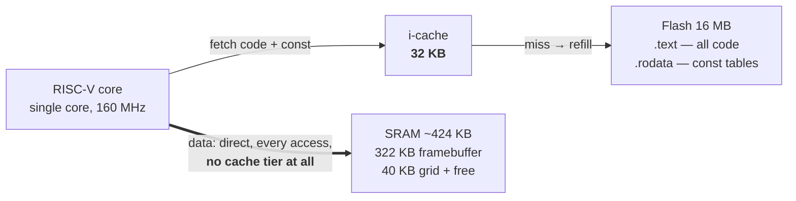
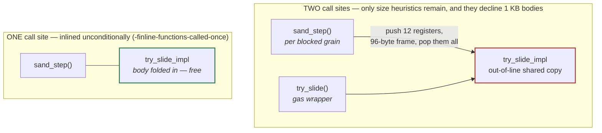
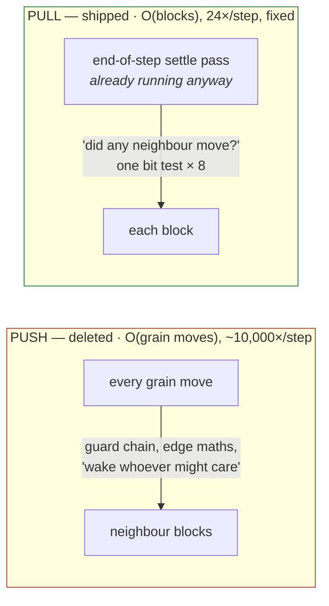
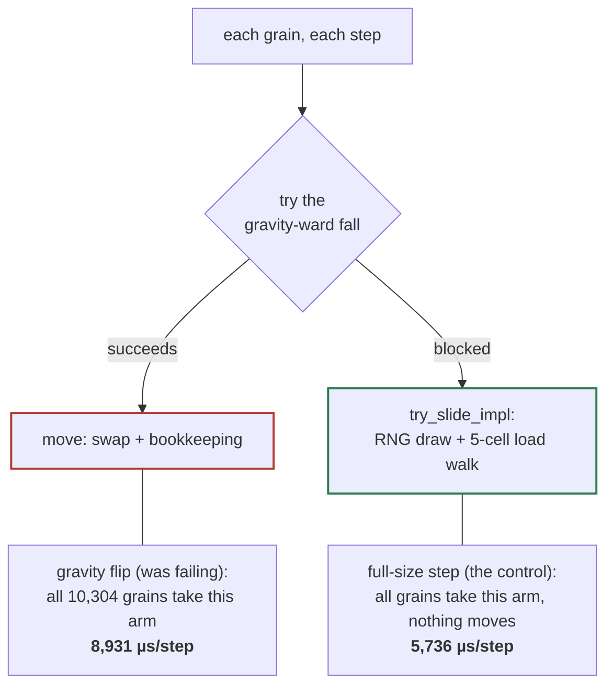

# Tuning at a Glance

The visual map of [`Performance-Tuning-Attempts.md`](Performance-Tuning-Attempts.md) —
twelve numbered attempts to make a 41,216-cell falling-sand simulation fit its frame
budgets on a 160 MHz single-core chip with no data cache. The tenth ended at **every
budget met, none ever raised**; a wave of new materials then put four back over, and
the eleventh sorted the accident from the feature. The prose file holds the full
derivations and is the authority when the two disagree; this page is for a first read,
a refresher, or finding which attempt taught the lesson you half-remember.

---

## The scoreboard

The last device capture (2026-08-25), each measurement as a share of its own
budget — `█` = 5%, the scale ends at the budget, `▶` means it ran off the end.
No budget here was ever raised to make a test pass.

| Test | Measured / budget | % of budget | |
|---|---|---|---|
| Settled screen, nothing moves | `█████████████████▊  ` 89% | 267 / 300 µs | pass |
| Gravity flip, settled pile | `██████████████████▎ ` 92% | 5,959 / 6,500 µs | pass |
| Full-size step, all falling | `███████████████████▌` 98% | 5,867 / 6,000 µs | pass — thinnest |
| Mixed scene flip | `████████████████████▶` 107% | 12,876 / 12,000 µs | **FAIL** |
| Fire cascade through gas | `████████████████████▶` 111% | 390,158 / 350,000 µs | **FAIL** |
| Screen of water collapsing | `████████████████████▶` 115% | 16,052 / 14,000 µs | **FAIL** |
| Full screen of fire, steady | `████████████████████▶` 115% | 286,720 / 250,000 µs | **FAIL** |
| Every material at once | `████████████████████▶` 111% | 60,091 / 54,000 µs | **FAIL** — by design, a reduction target |

**Read this table with two caveats, both found in attempt 11.** Its capture
reported `failures=4`, not 5: the build that was flashed predates the commit
that set the every-material budget to 54,000, so on the device that row passed
against an older 300,000. And that build is **fifty commits behind HEAD** — it
has none of glass, thermal shock, snow, ice, dirt, convection, percolation or
the plant work. It is the newest capture that exists; it is not a measurement
of the current tree.

Attempt 11 fixed the water and mixed regressions in full on the host and took
about 10% off each fire benchmark. **None of that is device-verified** — the
next capture is what settles it.

The suite now has **eleven** device frame-budget tests, not eight. Attempt 12
added three of them — four liquids, a lava stress scene, a screen of smoke
and steam — with provisional sanity ceilings guessed rather than measured,
and **none of the three has ever run on hardware.** Their rows cannot appear
in the scoreboard above until a capture exists; when one does, all three
ceilings still need re-pegging from that first measurement, whether they
pass or not.

Fixed RNG seeds make identical builds reproduce these numbers to the microsecond.
What moves them *between* builds is flash layout, not chance — see
[the layout lottery](#the-layout-lottery) below.

---

## The campaign, one line per attempt

🟢 shipped · 🔴 reverted or dropped · 🟠 mixed / turning point. The reverted rows
are kept deliberately — half the value of the record is negative results that stop
the next person from re-running them.

| # | | Attempt | What happened |
|--:|---|---|---|
| 01 | 🟢 | Unsigned division on the hot path | Signed `int / 16` is a five-instruction dance, not a shift. One cast at the per-move call site: **≈3 ms** back. Same bug found twice more by grepping for the shape. |
| 02 | 🔴 | Batch the neighbour wakes | Provably safe — a superset can't under-wake. Worse everywhere anyway. **Proven safe ≠ proven fast.** |
| 03 | 🔴 | Thread block indices instead of dividing | Strictly less arithmetic, measured worse twice, never fully diagnosed. Two failures on one path became the signal for 04. |
| 04 | 🟢 | Stop pushing wakes — pull them | Deleted the per-move notify machinery; the existing end-of-step pass asks instead. O(moves) → O(blocks). Flip **−26%**, water **−15%**, six functions deleted. |
| 05 | 🔴 | Stagger the mass wake-up | Three granularities measured; each won one axis, lost another. Kept on a branch, unmerged. **Correct and bounded still isn't worth it.** |
| 06 | 🟢 | Sweep the block size | It had shipped as a guess. Six `(W,H)` pairs on real hardware: 16×64 → **32×64**, the only pair clearing the settled-screen budget. |
| 07 | 🟠 | A fourth material vs. the inliner | Sharing movement code with gas regressed twice (un-inlined hot path +26%; 3.9 KB duplicated into flash, 2×). The split that shipped quietly planted 08's landmine. |
| 08 | 🟠 | Three good ideas, zero effect | Force-inline, IRAM, RNG early-out: all correct, all reverted — **the failing test never calls that function.** Moving a grain costs ~3.2 ms/step more than failing to move one. |
| 09 | 🟢 | Delete the row cache | `ROW_NO_LIQUID` cost **33,426 writes/step** to save 104 cheap row scans. The whole `row_state` buffer went. Failures **3 → 1**. |
| 10 | 🟢 | Tell the cross-flow pass where water isn't | The sweep already reads every awake cell — a per-block liquid bit is free. One neighbour ring makes it sound; the pass skips **41%** of its cells. Failures **1 → 0**. |
| 11 | 🟢 | A feature wave, and one branch in the wrong place | Rebuilt and re-timed all 75 commits of the wave on the host: water's whole regression is **one commit, one branch**, and the branch never even says no. GCC had spliced its cold blocks into the hot path — hinting them cold recovers **26%**, simulation byte-identical. Fire's is diffuse and genuine; the reactions pass **doubled**, and the gas pass nobody suspected is 60% of it. |
| 12 | 🟠 | A mask that measured nothing, and a gate that never closed | Three new benchmarks put the reaction engine under cross-material load for the first time. A per-cell "can this react" mask measured **−0.1%** where the counters promised 19.3% of cells were skippable — too cheap to be worth skipping. The real find: a convection gate that could never close on smoke or steam, costing **41,215 neighbour scans a step** on a screen of gas — fixed with a flag that arms and is never cleared, **−7.1%**. Measure-by-deleting also priced the gas pass's sight scan at **15-18%** of the fire benchmarks — the next round's target, not yet built. |

---

## The machine, as measured

Three facts about this chip decided most attempts — none match desktop-CPU intuition.

### There is no data cache — only an instruction cache



**Why it matters:** "optimize for cache locality" has nothing to bite on for the
grid — SRAM already runs at cache speed, so the only data-side lever is *touching
fewer bytes* (attempts 04, 09, 10 are all this lever). The cache that does exist
serves **code**, which is why code size and code *placement* kept deciding
benchmarks whose semantics never changed. Both "move it closer" experiments
measured neutral-to-worse: IRAM for code (08) and DRAM for the material table (10)
— the 32 KB cache was never missing on either.

### The layout lottery

Same code, **3.2 ms vs 3.9 ms** — two builds that never touched the hot function,
20% apart, purely because unrelated code shifted where things landed in flash.
This is the noise floor under every number here: differences under a few percent
are layout until they reproduce, and budgets carry margin so a rebuild alone
cannot flip them. The antidote (found in attempt 10): **keep control benchmarks in
every capture.** Three of the seven tests never touch liquid — when only the
liquid numbers moved, the cause had to be in the liquid path. A global layout
shift can't leave three tests byte-identical.

### The inlining cliff



`static inline` is a request. The *guarantee* exists only at exactly one call
site; a second caller — or even respelling an early `return` as an `if`/`else` —
hands the decision back to heuristics. This bit the campaign three times: attempt
07 created it, 08 found it, and 10 re-triggered it with a pure readability
tidy-up that cost **14% on water**. The only proof either way is `objdump -t`: a
symbol with its own `.text.<name>` section was not inlined. And forcing the inline
can cost more than the call — one level too far and the loop outgrows the 32 KB
i-cache and *everything* slows (attempts 07 and 08 both measured this).

---

## The three mechanisms that won

### 04 · Push → pull: relocate the question to where it's already cheap



Two attempts to make the push cheaper (02, 03) both regressed; the third asked
whether the push needed to exist. Flip 13,053 → 9,638 µs, water 19,703 → 16,540 µs,
and the entire precision machinery the push needed came out with it. **When a hot
path resists optimizing in place twice, the path — not the implementation — is
usually the problem.**

### 09 · The maintenance ledger: who pays to keep a flag true?

A skip structure bills its **maintenance** to writers and pays its **dividend** to
readers. Nobody had ever put the two sides of `ROW_NO_LIQUID`'s ledger next to
each other:

| Structure | Who pays to keep it true | Who benefits | Verdict |
|---|---|---|---|
| `ROW_NO_LIQUID` ("row holds no water") | every mover, every step — **33,426 byte-writes/step** | 104 row scans skipped — scans that bail on *one bitmask test per cell* | **deleted**, with the whole `row_state` buffer |
| Block sleeping (`block_state`) | one fixed **O(24)** pass per step | entire block walks skipped, read by the whole sweep | **kept** — earns it easily |

Deleting the cache beat every attempt at making its upkeep cheaper — including a
narrowing that provably did *strictly less work* and still measured slower (code
placement, again). Water 17,860 → 13,130 µs; every benchmark improved.

### 10 · Skip cells the sweep already knows are dry

The cross-flow (liquid-levelling) pass read **every cell of the grid** while only
15% held anything it could act on. The sweep already reads every cell of every
awake block, so noting "this block held liquid" is a register OR and one store —
nobody is charged per move:

```
        ┌──────┬──────┬──────┬──────┬──────┬──────┐
        │ skip │ skip │ skip │ skip │ skip │ skip │
        ├──────┼──────┼──────┼──────┼──────┼──────┤
        │ skip │ skip │ NEAR │ NEAR │ NEAR │ NEAR │
        ├──────┼──────┼──────┼──────┼──────┼──────┤
        │ skip │ skip │ NEAR │ NEAR │ ≈HAS │ ≈HAS │   ≈ = water
        ├──────┼──────┼──────┼──────┼──────┼──────┤
        │ skip │ skip │ NEAR │ NEAR │ ≈HAS │ ≈HAS │
        └──────┴──────┴──────┴──────┴──────┴──────┘
          the cross-flow pass skips 17,024 cells/step — 41%
```

The bit cannot be read raw: the sweep runs bottom-up, so water falling across a
block boundary lands in a block already scanned and found dry. Without the `NEAR`
ring (HAS expanded to 8 neighbours in one 24-block pass), one falling cell makes
the pass conclude the grid holds no water and **switches cross-flow off
permanently**. All 194 existing tests missed that; a new one was written and
verified to fail first. Mixed scene 12,675 → **11,167 µs** — the last failing
budget, closed.

---

## The most expensive lesson: profile *whether*, not just *where*

Attempt 08's three experiments were each correct, verified in the binary — and
aimed at code the failing test never executes:



Same grid, same 10,304 grains, one difference — and the arm with the RNG and the
load walk is the *cheap* one. **Moving a grain ≈ 3.2 ms/step more expensive than
deciding not to.** The campaign had been optimizing the cheap arm. In the flip's
measured window, `try_slide_impl` is called **zero times**.

What settled it wasn't the profiler (which truthfully said "the sweep") or
`objdump` (which truthfully said "un-inlined"): it was a host-side **call
counter** — ten seconds, no flash cycle — asking not "how expensive is this
function" but **"does it run at all."** The tell was an impossible result: an
RNG-stream-shifting change measuring byte-identical to the microsecond.

---

## The playbook, distilled

The board-agnostic versions live in
[`../Notes/Optimization-Playbook.md`](../Notes/Optimization-Playbook.md); each row
names the attempt that paid for it.

| Rule | Taught by |
|---|---|
| **Measure by deleting, not by reasoning.** Stub the suspect to a no-op, re-measure on device, revert win or lose. | throughout |
| **Check the code runs before making it faster.** A host call-counter costs ten seconds; three device rounds went to a function called zero times. | 08 |
| **Proven safe ≠ proven fast ≠ less work.** A superset wake lost; a bounded stagger lost; a counted-strictly-less-work build lost to code placement. | 02 · 05 · 09 |
| **Ask who pays to keep the flag true, versus who reads it.** If payers outnumber readers 50:1, delete the structure. | 09 |
| **Keep a control in every capture.** Benchmarks the change cannot touch turn "layout moved" into "only the liquid path moved — look there." | 10 |
| **Readability refactors are performance changes here.** An if/else respelling cost 14% via the inlining cliff. Ship the version you measured. | 10 |
| **Inlining has a ceiling, and it moves.** Verify with `objdump -t`; never trust the attribute name. | 07 · 08 |
| **Know which memory you actually have.** No data cache: touching fewer bytes is the whole game; IRAM/DRAM placement measured neutral-to-worse. | 08 · 10 |
| **Signed division isn't a shift.** Cast to unsigned where the range proves it — then grep for every sibling call site. | 01 |
| **Don't filter the live capture.** A `grep` on the one crashing run discarded the only lines that explained it. Save everything, filter after. | 03 |
| **A resisting hot path is information.** Two well-reasoned failures on one mechanism mean the mechanism is the wrong shape. | 04 |
| **A new test must fail first.** A test never seen red is not yet a test. | 09 · 10 |
| **Layout is not only about inlining — it is about block order.** A branch that costs nothing to evaluate can still cost 26% by sitting between the entry and the work. `objdump` the device object; look at what is *between*, not just at what exists. | 11 |
| **Bisect on the host.** Rebuilding and re-timing a commit range costs twenty minutes and no flash cycles, and answers the question a regression actually poses — *when did this start* — with a byte-identical simulation either side. | 11 |
| **A capture measures a tree, not a project.** Check the flashed build against the code before diagnosing anything with it. This one was fifty commits stale and said so nowhere. | 11 |
| **Count what skipping *saves*, not just what is skippable.** 19.3% of cells were provably idle and skipping them measured −0.1%, because the cells were already cheap to fall through. | 12 |

---

## Related

- [`Performance-Tuning-Attempts.md`](Performance-Tuning-Attempts.md) — the full
  chronicle this page maps; the authority when they disagree.
- [`Simulation-Lessons.md`](Simulation-Lessons.md) — how the simulation got built.
- [`../Notes/Optimization-Playbook.md`](../Notes/Optimization-Playbook.md) — the
  lessons above, made board-agnostic.
- [`Architecture.md`](Architecture.md) — how to reproduce any number here on real
  hardware, as one exact command sequence.
