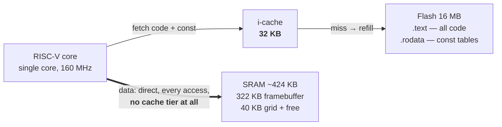
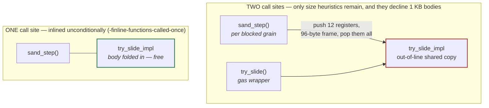
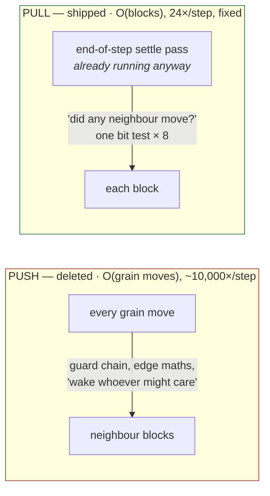
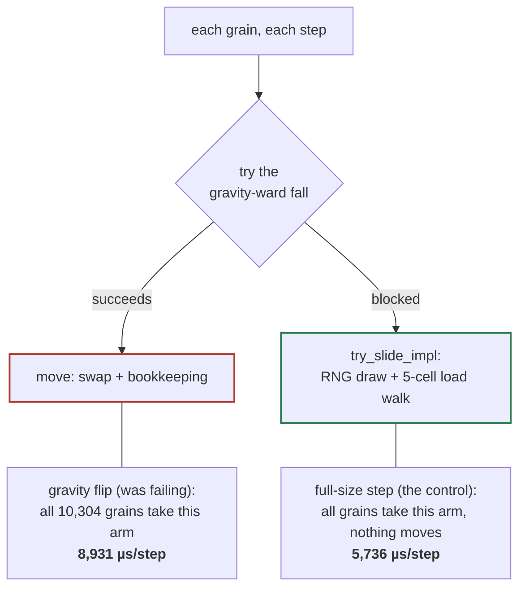

# Tuning at a Glance

The visual map of [`Performance-Tuning-Attempts.md`](Performance-Tuning-Attempts.md)
— seventeen numbered attempts to make a 41,216-cell falling-sand simulation
fit its frame budgets on a 160 MHz single-core chip with no data cache. The
prose file (now condensed to a table + negative-result lists) is the
authority when the two disagree; this page is for a first read, a
refresher, or finding which attempt taught the lesson you half-remember.
See [`Perf-Round-Guide.md`](Perf-Round-Guide.md) to run a new round.

---

## The scoreboard

**All thirteen of the original budgets are uniform reduction targets —
measured × 0.9, rounded — and, by design, all fail until their own tenth is
won.** A fourteenth row (wet earth) has since been added and is still
unpegged — see [`Perf-Round-Guide.md`](Perf-Round-Guide.md)'s open items.

| Test | Measured (2026-08-26 clean) | Target | To close |
|---|---:|---:|---:|
| Settled screen, nothing moves | 262 µs | 235 | 27 µs |
| Full-size step, all falling | 6,451 µs | 5,800 | 651 µs |
| Gravity flip, settled pile | 6,546 µs | 5,900 | 646 µs |
| Mixed scene flip | 14,391 µs | 11,700 | 2,691 µs |
| Screen of water collapsing | 18,667 µs | 14,400 | 4,267 µs |
| Boiler, sustained boil | 32,667 µs | 28,500 | 4,167 µs |
| Every material at once | 78,617 µs | 67,500 | 11,117 µs |
| Thermal shock lattice | 98,738 µs | 89,000 | 9,738 µs |
| Four liquids reacting | 124,336 µs | 112,000 | 12,336 µs |
| Lava stress scene | 127,386 µs | 109,000 | 18,386 µs |
| Smoke + steam screen | 141,444 µs | 127,000 | 14,444 µs |
| Full screen of fire, steady | 297,220 µs | 266,000 | 31,220 µs |
| Fire cascade through gas | 412,718 µs | 371,500 | 41,218 µs |

- A watchdog that used to charge its own console dump to whatever
  benchmark it landed inside (up to 2.6×, deterministically — attempt 15)
  is now off in the diag image; two contaminated rows (four liquids,
  thermal shock) were re-pegged from clean numbers.
- **2026-08-28: five rows moved, no target did.** The sixteenth attempt's
  inline fix took fire −10.4%, lava stress −6.5%, thermal shock −4.9%,
  four liquids −3.6% — reproduced twice to within 4 µs. Every-material
  flip didn't move, as predicted; its gap is the largest on the board.
- **Pending device verification:** the seventeenth attempt's gas
  sight-scan carry, host-measured at fire cascade −13.9% and full screen
  of fire −7.3%, byte-identical simulation. If confirmed, both close —
  the first since the tenth attempt.
- Fixed RNG seeds reproduce these numbers to the microsecond on an
  identical build; what moves them *between* builds is flash layout — see
  [the layout lottery](#the-layout-lottery), now six observations deep
  that it may have only **two tickets**, not a continuum.
- The fourteenth attempt spent host time on purpose, trading correctness
  for cost: water at the one gravity every budget here runs at moved
  ≈+8% (a no-op fix, pure code-shape cost); off-axis tilts, unmeasured by
  any row here, cost +29–37%. Paid at the 2026-08-26 re-base, unmoved
  since.

---

## Which pass owns which scene

Four builds, each with one of `sand_step()`'s passes stubbed out, host,
best of five interleaved. Deleting a pass changes behaviour and takes its
knock-on effects with it, so **this is a map, not a set of candidates** —
but as a map it sorts thirteen scenes into three clean groups, and every
round before the seventeenth that went hunting without one spent at least
one experiment in the wrong pass.

| scene | no reactions | no cross-flow | no gas | no main sweep |
|---|---:|---:|---:|---:|
| Screen of water collapsing | −2.2% | **−39.1%** | −0.7% | −98.7% |
| Mixed scene flip | +0.6% | **−32.5%** | +1.8% | −99.9% |
| Four liquids reacting | −33.8% | −16.1% | −6.1% | −72.7% |
| Lava stress scene | −58.2% | −17.7% | −16.5% | −73.3% |
| Every material at once | −44.3% | −14.7% | −33.8% | −25.5% |
| Thermal shock lattice | **−93.1%** | −11.6% | −21.0% | −41.1% |
| Boiler, sustained boil | **−88.7%** | −16.0% | −42.9% | −45.7% |
| Smoke + steam screen | −8.6% | −0.0% | **−88.0%** | −10.1% |
| Full screen of fire | −38.0% | +0.0% | **−62.7%** | −7.1% |
| Fire cascade through gas | −45.0% | −0.6% | **−54.0%** | −6.3% |

**Water and the mixed flip are the cross-flow pass. Thermal shock and the
boiler are the reactions pass, almost entirely. The three gas-heavy scenes
are the gas pass**, which is where the seventeenth attempt's win came from.
The every-material flip is genuinely diffuse: no pass owns more than 44%
of it.

---

## Metal: measured at last, and the hypothesis was wrong

This section used to claim the unpriced cost was metal's conduction WALK,
unmeasured because no scene paints an extended material. The sixteenth
attempt measured it and found both halves wrong:

- **Nothing paints metal — but a reaction makes it.** 300 cells exist by
  the end of the every-material flip's settle steps, smelted from dirt
  beside lava, before the benchmark's timed window even starts.
- **The walk costs nothing.** Host probes: `conducts` 248→220 (stone's own
  figure) moved the scene **−0.0%**; 248→0 (not a conductor) moved it
  −2.9 to −3.1%; dirt→metal off entirely cost −4.5%. `conduct_heat()`
  stops at the first non-conductor neighbour, so with conductors
  scattered rather than run together the walk ends at depth 1 whatever
  the roll says — a long `conducts` only buys distance across a real run
  (a rod, a wall), and no benchmark has one. The ~4.5% is the price of
  metal *existing*, not a regression.
- **Still not built:** a device scene with a real metal rod, walk at its
  full designed length (33 cells on host, one past the plan's stated 32).
  The host tripwire `test_a_metal_run_conducts_further_than_a_stone_one`
  pins the qualitative claim; the numbers above answer what it costs.

---

## The campaign, one line per attempt

🟢 shipped · 🔴 reverted or dropped · 🟠 mixed / turning point. The reverted
rows are kept deliberately — half the value of the record is negative
results that stop the next person from re-running them. Commit shas for
each row are in [`Performance-Tuning-Attempts.md`](Performance-Tuning-Attempts.md)'s
own table.

| # | | Attempt | What happened |
|--:|---|---|---|
| 01 | 🟢 | Unsigned division on the hot path | Signed `int / 16` is a five-instruction dance, not a shift. One cast at the per-move call site: **≈3 ms** back. Same bug found twice more by grepping for the shape. |
| 02 | 🔴 | Batch the neighbour wakes | Provably safe — a superset can't under-wake. Worse everywhere anyway. **Proven safe ≠ proven fast.** |
| 03 | 🔴 | Thread block indices instead of dividing | Strictly less arithmetic, measured worse twice, never fully diagnosed. Two failures on one path became the signal for 04. |
| 04 | 🟢 | Stop pushing wakes — pull them | Deleted the per-move notify machinery; the existing end-of-step pass asks instead. O(moves) → O(blocks). Flip **−26%**, water **−15%**, six functions deleted. |
| 05 | 🔴 | Stagger the mass wake-up | Three granularities measured; each won one axis, lost another. Kept on a branch, unmerged. **Correct and bounded still isn't worth it.** |
| 06 | 🟢 | Sweep the block size | It had shipped as a guess. Six `(W,H)` pairs on real hardware: 16×64 → **32×64**, the only pair clearing the settled-screen budget. |
| 07 | 🟠 | A fourth material vs. the inliner | Sharing movement code with gas regressed twice (un-inlined hot path +26%; 3.9 KB duplicated into flash, 2×). The split that shipped quietly planted 08's landmine. |
| 08 | 🟠 | Three good ideas, zero effect | Force-inline, IRAM, RNG early-out: all correct, all reverted — **the failing test never calls that function.** Moving a grain costs ~3.2 ms/step more than failing to move one. |
| 09 | 🟢 | Delete the row cache | `ROW_NO_LIQUID` cost **33,426 writes/step** to save 104 cheap row scans. The whole `row_state` buffer went. Failures **3 → 1**. |
| 10 | 🟢 | Tell the cross-flow pass where water isn't | The sweep already reads every awake cell — a per-block liquid bit is free. One neighbour ring makes it sound; the pass skips **41%** of its cells. Failures **1 → 0**. |
| 11 | 🟢 | A feature wave, and one branch in the wrong place | Rebuilt and re-timed all 75 commits of the wave on the host: water's whole regression is **one commit, one branch**, and the branch never even says no. GCC had spliced its cold blocks into the hot path — hinting them cold recovers **26%**, simulation byte-identical. Fire's is diffuse and genuine; the reactions pass **doubled**, and the gas pass nobody suspected is 60% of it. |
| 12 | 🟠 | A mask that measured nothing, and a gate that never closed | Three new benchmarks put the reaction engine under cross-material load for the first time. A per-cell "can this react" mask measured **−0.1%** where the counters promised 19.3% of cells were skippable — too cheap to be worth skipping. The real find: a convection gate that could never close on smoke or steam, costing **41,215 neighbour scans a step** on a screen of gas — fixed with a flag that arms and is never cleared, **−7.1%**. Measure-by-deleting also priced the gas pass's sight scan at **15-18%** of the fire benchmarks — the next round's target, not yet built. |
| 13 | 🟢 | Two scenes for the shape of load nothing had measured | Everything benchmarked so far was a transient; nothing measured a heat source left running. A thermal shock lattice (480 glass-ringed compartments) and a boiler (a stone basin held at a sustained boil) shipped as a pair, each with a host guard whose assertions were checked by breaking the scene: **24 of 33** individually turned red. Ten steps was a measured decision, not a round one — the only window where the last third of new cullet still clears **15%** of the total instead of trailing off. An earlier boiler draft's exact-conservation count held by **one step**; a floor replaced it. No optimisation shipped — two device ceilings added, both provisional. |
| 14 | 🟠 | Two rays, dithered in space instead of time | Cross-flow's nearest-axis fix (30335ae) was correct but unpriced: a settled surface could only ever be perpendicular to one of eight directions, so it quantised to 0/45/90 — measured as two values across the whole tilt range, ≈0.00 below 22.5° and ≈0.94 above. The near-vertical octant couldn't tilt at all: its ray is horizontal, and a horizontal ray moves mass only within a row. The fix moves the dither from TIME into SPACE — a fixed per-column pattern choosing between two rays — and compares gravitational potential rather than raw mass. Cost: **+8%** on host water at the axis gravity every benchmark uses, **+29-37%** off-axis, which no budget measures. Slow alternation was rejected on a measurement: switching axis on a settled pool costs **1,582** units of churn against the flicker guard's own ceiling of 60. |
| 15 | 🟠 | Two loose ends closed, and a watchdog counting itself in | An attribution round — no simulation code shipped. Pinned a stale capture to its exact commit by matching its 272 self-test names against `RUN_TEST()` declarations, then validated the method by rebuilding that commit fresh a day later: four rows exact, one off by **1 µs**. The liquid-free controls' **+9.6%**: byte-identical simulation and unchanged instruction count end to end, then isolated by device bisect to one commit — a line that **never executes** in either control, costing **~5%** purely from how GCC rescheduled `sand_step` around it once it existed. Round eleven's 28% host win: real on device too — but only **20%** of the gate's cost there, because the device's real water regression was `move_liquid_grain` **nearly tripling** across four separate commits, not the gate. Underneath both: a task watchdog silently charging its own console dump to the benchmark loop it shares a UART with, **up to 2.6×**, deterministically. |
| 16 | 🟢 | A function that fell out of its callers, and a heuristic at its ceiling | An unattributed drift, bisected over 45 commits on the host by compiling the repo's **own** `suite_sand.c` with `-DDEVICE_BUILD` against Unity/timer shims — no hand-copied scenes to drift. One step, controls flat across it: a commit grew `try_heat_transform()` past GCC's size heuristic and knocked it **out of four call sites at once**. Forcing it back in: device **fire −10.4%, lava −6.5%, thermal −4.9%, four liquids −3.6%**, two captures agreeing to 4 µs, and the host predicted every one including the null. Attempts 07/08's i-cache trap did not fire because the object got *smaller* — the compiler had been paying more to keep the call. Also retired this page's own metal hypothesis (`conducts` 248→220 measures **−0.0%**) after a mid-flight counter found **311 cells of metal** in a scene that paints none. Second half: `ROW_MAX_RUNS` × `LEAF_REFINE_MAX_RUNS`, fifteen builds, **byte-identical counters** — both inert; and an **oracle** marking the exact changed cells, uncapped, sends the same pixels as the shipped marking, so the gather path is at its ceiling, not failing. The win was a **third send path** nobody had written: a full-width box is contiguous in the framebuffer, so it goes out at its own height — **−10% pixels a frame**, no memory, no copy. |
| 17 | 🟢 | Three named suspects, all innocent, and a scan that pays | Convened against three simulation suspects with evidence already gathered. Mid-flight counters cleared all three: `anchored()` — a linear-scan flood fill, O(n²) worst case — is called **zero times by all thirteen benchmarks**; `find_water()` is 0.5% of cell visits at worst; and the dead reaction tail, which **99.998% of cells on the smoke screen walk without taking a single branch of**, is worth **2%** when deleted outright. Then stubbed each of the four passes in turn, which sorted the board into three clean groups — water and the mixed flip are **cross-flow**, thermal and boiler are **reactions**, the three gas scenes are **gas**. The win was the twelfth attempt's parked finding, re-run and still there: its "no cheap early-out exists" was right about a *spatial* index and wrong about the problem. The sweep advances by exactly `-px`, so the next cell's ray is this cell's ray shifted by one — three integers on the stack replace a `sight`-length walk per cell. **Cascade −13.9%, fire −7.3%**, simulation byte-identical (probe validated by failing first). A first spelling that armed the memo from every cell cost **+4.4%** on the alternating smoke/steam screen and is named in the code so nobody re-adds it. |

---

## The machine, as measured

Three facts about this chip decided most attempts — none match desktop-CPU
intuition.

### There is no data cache — only an instruction cache



SRAM already runs at cache speed, so the only data-side lever is *touching
fewer bytes* (attempts 04, 09, 10). The cache that exists serves **code**,
which is why size and *placement* kept deciding benchmarks whose semantics
never changed. Both "move it closer" experiments measured
neutral-to-worse — IRAM for code (08), DRAM for the material table (10) —
the 32 KB cache was never missing on either.

### The layout lottery

Same code, **3.2 ms vs 3.9 ms** — two builds that never touched the hot
function, 20% apart, purely because unrelated code shifted where things
landed in flash. Differences under a few percent are layout until they
reproduce. **It may not be a continuum**: across four device captures of
three builds the two liquid-free controls take one of exactly two
value-pairs — (6,005, 6,100) three times and (6,263, 6,356) once — never
anything between, and the sixteenth attempt's 46-build host sweep shows
the same two-level shape on a different machine with a different
compiler. If that holds, the useful test is not "is the delta inside the
floor" but "which state did the control land in." Four captures and one
sweep is an observation, not a proof. The antidote (attempt 10): **keep
control benchmarks in every capture** — three of the seven tests never
touch liquid, so when only the liquid numbers moved, the cause had to be
in the liquid path.

### The inlining cliff



`static inline` is a request. The *guarantee* exists only at exactly one
call site; a second caller — or even respelling an early `return` as an
`if`/`else` — hands the decision back to heuristics. This bit the campaign
four times: 07 created it, 08 found it, 10 re-triggered it with a pure
readability tidy-up (14% on water), 16 again on a wet-earth branch. The
only proof either way is `objdump -t`. And forcing the inline can cost
more than the call — one level too far and the loop outgrows the 32 KB
i-cache and *everything* slows (07 and 08 both measured this).

---

## The three mechanisms that won

### 04 · Push → pull: relocate the question to where it's already cheap



Two attempts to make the push cheaper (02, 03) both regressed; the third
asked whether the push needed to exist. Flip 13,053 → 9,638 µs, water
19,703 → 16,540 µs, and the entire precision machinery the push needed
came out with it. **When a hot path resists optimizing in place twice, the
path — not the implementation — is usually the problem.**

### 09 · The maintenance ledger: who pays to keep a flag true?

| Structure | Who pays to keep it true | Who benefits | Verdict |
|---|---|---|---|
| `ROW_NO_LIQUID` ("row holds no water") | every mover, every step — **33,426 byte-writes/step** | 104 row scans skipped — scans that bail on *one bitmask test per cell* | **deleted**, with the whole `row_state` buffer |
| Block sleeping (`block_state`) | one fixed **O(24)** pass per step | entire block walks skipped, read by the whole sweep | **kept** — earns it easily |

Deleting the cache beat every attempt at making its upkeep cheaper —
including a narrowing that provably did *strictly less work* and still
measured slower (code placement, again). Water 17,860 → 13,130 µs; every
benchmark improved.

### 10 · Skip cells the sweep already knows are dry

```
        ┌──────┬──────┬──────┬──────┬──────┬──────┐
        │ skip │ skip │ skip │ skip │ skip │ skip │
        ├──────┼──────┼──────┼──────┼──────┼──────┤
        │ skip │ skip │ NEAR │ NEAR │ NEAR │ NEAR │
        ├──────┼──────┼──────┼──────┼──────┼──────┤
        │ skip │ skip │ NEAR │ NEAR │ ≈HAS │ ≈HAS │   ≈ = water
        ├──────┼──────┼──────┼──────┼──────┼──────┤
        │ skip │ skip │ NEAR │ NEAR │ ≈HAS │ ≈HAS │
        └──────┴──────┴──────┴──────┴──────┴──────┘
          the cross-flow pass skips 17,024 cells/step — 41%
```

The sweep already reads every cell of every awake block, so noting "this
block held liquid" is a register OR and one store — nobody is charged per
move. The bit can't be read raw: the sweep runs bottom-up, so water
falling across a block boundary lands in a block already scanned and
found dry. Without the `NEAR` ring (`HAS` expanded to 8 neighbours in one
24-block pass), one falling cell makes the pass conclude the grid holds no
water and **switches cross-flow off permanently**. All 194 existing tests
missed that; a new one was written and verified to fail first. Mixed scene
12,675 → **11,167 µs** — the last failing budget, closed.

---

## The most expensive lesson: profile *whether*, not just *where*



Same grid, same 10,304 grains, one difference — and the arm with the RNG
and the load walk is the *cheap* one. **Moving a grain ≈ 3.2 ms/step more
expensive than deciding not to.** Attempt 08 had been optimizing the cheap
arm: in the flip's measured window, `try_slide_impl` is called **zero
times**. What settled it wasn't the profiler (which truthfully said "the
sweep") or `objdump` (which truthfully said "un-inlined") — it was a
host-side **call counter**, ten seconds, no flash cycle, asking not "how
expensive is this function" but **"does it run at all."** The tell was an
impossible result: an RNG-stream-shifting change measuring byte-identical
to the microsecond.

---

## The playbook, distilled

The board-agnostic versions live in
[`../Notes/Optimization-Playbook.md`](../Notes/Optimization-Playbook.md);
each row names the attempt that paid for it.

| Rule | Taught by |
|---|---|
| **Measure by deleting, not by reasoning.** Stub the suspect to a no-op, re-measure on device, revert win or lose. | throughout |
| **Don't filter the live capture.** A `grep` on the one crashing run discarded the only lines that explained it. Save everything, filter after. | 03 |
| **Layout is not only about inlining — it is about block order.** A branch that costs nothing to evaluate can still cost 26% by sitting between the entry and the work. `objdump` the device object; look at what is *between*, not just at what exists. | 11 |
| **Bisect on the host.** Rebuilding and re-timing a commit range costs twenty minutes and no flash cycles, and answers the question a regression actually poses — *when did this start* — with a byte-identical simulation either side. | 11 |
| **Count what skipping *saves*, not just what is skippable.** 19.3% of cells were provably idle and skipping them measured −0.1%, because the cells were already cheap to fall through. | 12 |
| **Count what a scene *contains*, not what it is built from.** A benchmark that paints no metal held 311 cells of it by the time it was timed, because a reaction makes them. Take the counter mid-flight. | 16 |
| **Forcing an inline is a trap when it overrides the compiler, a fix when it restores it.** If a symbol appeared out of line at a commit that was not about that function, and folding it back makes the object *smaller*, the compiler lost a decision rather than made one. | 07 · 08 · 16 |
| **Build the oracle before optimising the heuristic.** The uncapped, exact-changed-cell ideal sent the same pixels as the shipped code on two of three scenes — turning a three-way cap sweep into two negative results and a search elsewhere. | 16 |
| **Deleting a feature's work can under-state its cost.** Removing the branch measured −9.5% where fixing its code shape measured −12.1%: measure-by-deleting alone would have blamed the feature and left the real cost in place. | 16 |
| **Compile the suite, do not copy its scenes.** A hand-copied benchmark is a bisect that can attribute the wrong commit; three shim headers are cheaper and cannot drift. | 16 |
| **The skippable fraction predicts nothing about the win.** 19.3% skippable was worth −0.1%; 99.998% of cells walking six dead branches was worth 2%. Only deleting the work prices it. | 12 · 17 |
| **Map the passes before designing anything.** Four builds, one pass stubbed each, sorts the whole board into which pass owns which scene. Cheaper than one wrong experiment. | 17 |
| **Check whether the iteration order already answers the per-item query.** A spatial index for "is there an empty cell within sight" needs a maintained bit and a soundness ring; the sweep walks the ray one cell at a time, so the answer is the last one plus a cell. | 17 |
| **A memo must be armed by the expensive case only.** Arming from every cheap case cost 4.4% on a scene where the memo could never pay. Ask what armed it, not just who reads it. | 09 · 17 |
| **A deferred finding with a number attached is worth re-running, not re-deriving.** Five rounds and a materials wave later it reproduced almost exactly; what had gone stale was the conclusion, not the measurement. | 17 |

---

## Related

- [`Performance-Tuning-Attempts.md`](Performance-Tuning-Attempts.md) — the
  full chronicle this page maps; the authority when they disagree.
- [`Perf-Round-Guide.md`](Perf-Round-Guide.md) — start here to run a new
  performance round.
- [`Simulation-Lessons.md`](Simulation-Lessons.md) — how the simulation got
  built.
- [`../Notes/Optimization-Playbook.md`](../Notes/Optimization-Playbook.md)
  — the lessons above, made board-agnostic.
- [`Architecture.md`](Architecture.md) — how to reproduce any number here
  on real hardware, as one exact command sequence.
