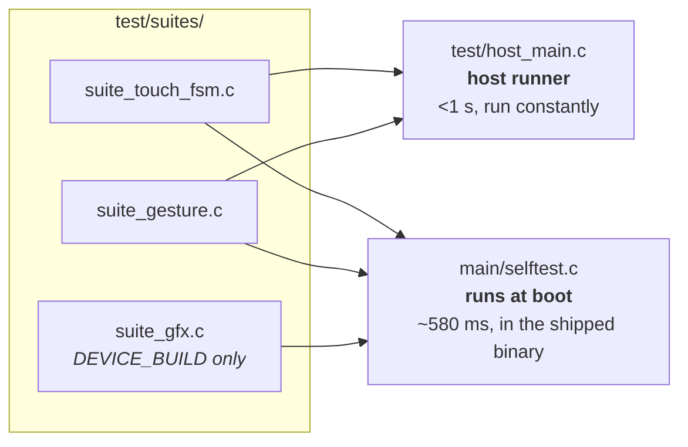
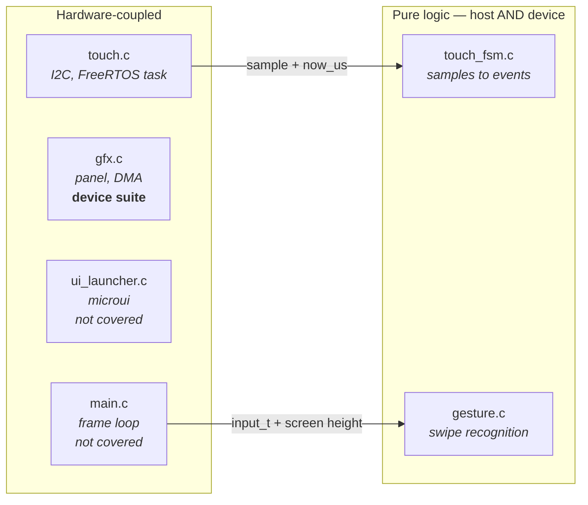
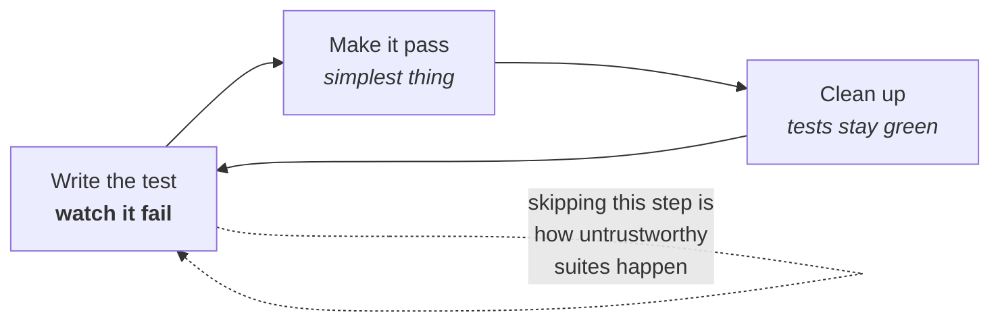

# Testing Guide

How this project tests firmware, and why it is set up the way it is. Read this
before adding a test or deciding something "can't be tested".

Living document: update it when the approach changes.

---

## Running them

```sh
./launcher/test/run_tests.sh          # portable suites, on this machine, <1 s
./launcher/test/run_device_tests.sh   # every suite, on the board, host-triggered
```

**On Windows, in Git Bash, use the wrappers instead** - `run_device_tests.sh`
needs `idf.py` for both its build and its collection step, and ESP-IDF
refuses to run under Git Bash at all (see
[`Sand/Architecture.md`](Sand/Architecture.md#verifying-performance-on-real-hardware)):

```sh
./launcher/tools/report_test_results.sh   # pass/fail for every suite  -> tools/results/
./launcher/tools/report_performance.sh    # frame-budget numbers       -> tools/results/
```

Both build and flash the diagnostics variant, capture the run, write a
markdown report, and restore `build.release` afterwards.

The second builds the diagnostics variant, flashes it, collects results over
the console and exits non-zero on failure — so it works in CI. On Windows,
ESP-IDF cannot be driven from Git Bash, so build and flash from PowerShell and
then use `--no-flash` to collect; the script says so rather than silently
reporting stale results.

POSIX sh — works under Git Bash or MSYS on Windows and natively on Linux and
macOS. It finds a compiler via `$CC`, then `PATH`, then the location winget
installs MinGW to on Windows, and tells you how to install one if there is
none.

Requires a **host** compiler, not the ESP32 toolchain:

| Platform | |
|---|---|
| Windows | `winget install BrechtSanders.WinLibs.POSIX.UCRT` |
| Debian/Ubuntu | `sudo apt install build-essential` |
| macOS | `xcode-select --install` |

---

## Two runners, one set of suites

The suites in `test/suites/` are compiled into **both** runners. Nothing is
written twice.



**The host runner is the TDD loop.** Under a second, so red-green-refactor is
actually practical — a ninety-second build-and-flash is not a loop anyone
sustains. It runs the portable suites only.

**The device run is the guarantee.** It runs *every* registered suite, including
the portable ones. That is deliberate: passing on a laptop only proves the logic is
right on x86, whereas running on-target proves the same source behaves
identically built by the RISC-V toolchain and executed on this chip.

### Release builds contain no test code

`CONFIG_LAUNCHER_SELFTEST` defaults **off**, and the CMake conditional leaves
the suites, the runner and **the Diagnostics app** out of the build entirely —
not `#ifdef`-ed out, simply never compiled.

Verified rather than assumed, by counting symbols in the two images:

```sh
riscv32-esp-elf-nm build/launcher.elf      | grep -ci 'unity\|suite_\|selftest\|app_diagnostics'   # 0
riscv32-esp-elf-nm build.diag/launcher.elf | grep -ci 'unity\|suite_\|selftest\|app_diagnostics'   # 39
```

That matters for more than size. The suites draw to the framebuffer and drive
the panel, which is fine in diagnostics and unacceptable in a product; and test
hooks in a shipped image are a liability rather than a feature.

The **Diagnostics app** is gated the same way, for the same reason. It is a
bench tool: entering it re-runs POST, which cycles the audio power rail and
drops the display off SPI2 mid-session. Reasonable while debugging, not
something to leave reachable in a shipped product. The boot POST still runs in
release — only this way *in* is compiled out.

### Development-only instrumentation is its own flag, not SELFTEST

`CONFIG_LAUNCHER_SELFTEST` answers "does this build carry the test suites."
It does not answer "is this a development build" — that is a broader
question, and `CONFIG_LAUNCHER_DEVELOPMENT` answers it instead.

This project does not do telemetry. Nobody downstream ever reads a frame
counter or a step-timing average; the only audience for that kind of number
is a developer at the device or watching its serial console while working on
it. So anything built purely for that audience — rolling averages, per-frame
timers, a summary logged on exit — is pure cost in a release image: flash for
the strings and the accounting, cycles for the bookkeeping, for output that
helps nobody. It gets guarded by `CONFIG_LAUNCHER_DEVELOPMENT`, the same way
test code is guarded by `CONFIG_LAUNCHER_SELFTEST` — see `app_sand.c`'s frame
timing for the pattern.

The two are related but not the same flag, because they answer different
questions and can genuinely diverge:

- `LAUNCHER_SELFTEST` `select`s `LAUNCHER_DEVELOPMENT` — a build carrying the
  test suites is a development build by definition, so turning on SELFTEST
  turns on DEVELOPMENT for free.
- The reverse is not forced. A build can want the profiling and logging
  without the test suites — watching real frame timings without also paying
  for Unity and the suites' own footprint.

Both live under one Kconfig `choice` (`main/Kconfig.projbuild`) alongside
`LAUNCHER_RELEASE`, so exactly one is ever true and neither is "off by
omission." Checking `CONFIG_LAUNCHER_DEVELOPMENT` means "not a release
build," not "development, or maybe some other thing nobody named yet."

**The rule going forward:** guard anything whose only reader is a developer —
a log line, a rolling average, a debug overlay — with
`CONFIG_LAUNCHER_DEVELOPMENT`. Guard the test suites themselves, and anything
that only makes sense alongside them, with `CONFIG_LAUNCHER_SELFTEST`. Neither
belongs ungated, and neither belongs gated on the other one just because they
currently happen to travel together in `build.diag/`.

### The Kconfig trap in REQUIRES

One thing must **not** be gated on `CONFIG_LAUNCHER_SELFTEST`: the `unity`
entry in `REQUIRES`.

ESP-IDF expands component requirements in an early pass where `CONFIG_*` is not
yet defined, so a Kconfig-gated `REQUIRES` silently evaluates false and does
nothing. `SRCS` and `target_compile_definitions` are evaluated in a later pass
and *do* work — which makes the failure genuinely confusing: the test sources
get compiled, `DEVICE_BUILD` is defined, and every one of them fails with
`fatal error: unity.h: No such file or directory`.

Worse, it only shows up on a **clean** build directory. An incremental build
already has a `sdkconfig`, so it appears to work — meaning this can sit latent
until CI, or until someone deletes `build.diag/`.

So `unity` is listed unconditionally. That costs release nothing: IDF puts unity
in the component graph either way, `REQUIRES` only decides whether `main` can
see its headers, and with no test sources compiled nothing references it and
`--gc-sections` drops it. Confirmed — the release binary is byte-for-byte the
same size with and without the entry.

```sh
idf.py build                          # build/       release, no test code
./test/run_device_tests.sh            # build.diag/  firmware + suites
```

The two use separate build directories so each keeps its own `sdkconfig` and
running the tests can never silently reconfigure your normal build.

This is the norm, not a compromise. Unit tests verify *units* - `touch_fsm.c`
compiles from identical sources with identical flags in both variants, and
linking a test framework beside it cannot change how it behaves. Verifying an
*image* is a separate activity (POST, functional tests, checksums) that unit
tests were never doing in either build.

If anything the direction favours release: the diagnostics variant carries more
code and less free RAM, so a suite passing there leaves release with more
headroom, not less.

A failing self test is logged, not fatal — the harness reads the result from
the console, and a board that still boots is easier to investigate than one
that refuses to.

---

## POST is a third thing

Separate from both runners is the **power-on self test** in `main/post.c`. It
answers a different question, so it lives in a different place and obeys
different rules.

| | POST | Test suites |
|---|---|---|
| Ships in release | **yes** | diagnostics builds only |
| Asks | "is this **board** working?" | "is this **code** correct?" |
| Side effects | none — probe and report | draws to the panel, mutates state |
| Cost | ~95 ms | ~580 ms |
| A failure means | this unit is faulty | this code is wrong |

It probes each I2C peripheral, checks flash size, heap headroom, MAC validity
and reads the on-die temperature — fifteen checks, printed as a table and
summarised on one machine-readable line (`POST_COMPLETE checks=N failures=N`)
so a production rig can grep it.

Keep it non-destructive. Anything that changes device state or takes real time
belongs in a suite, not here, because this runs on every boot of every unit.

It runs in two phases, because the SD card and the display cannot both hold
SPI2. The card is tested *before* `gfx_init()` takes the bus, which makes it a
real mount rather than an assumption, with nothing to tear down afterwards. An
absent card is optional, not a failure. The audio codec needs its power-amp
rail raised before it will answer, so POST raises it, probes, and lowers it
again — leaving the state the shell inherits unchanged.

---

## Making things testable

Two techniques carry almost all of it.

### Pass time in, never read a clock

`touch_fsm_update()` takes `now_us` as an argument rather than calling
`esp_timer_get_time()`:

```c
void touch_fsm_update(touch_fsm_t *fsm, bool have_point,
                      int x, int y, int64_t now_us);
```

That single choice is what lets a test assert a 60 ms debounce *instantly*
instead of sleeping, and lets it construct sequences — a dropout in the middle
of a touch — that are genuinely awkward to produce on real hardware.

Any timeout, debounce, animation or rate limit should take time as a parameter.

### Pass the environment in, don't reach for it

`gesture_is_home_swipe()` takes the screen height rather than including
`gfx.h`:

```c
bool gesture_is_home_swipe(const input_t *input, int screen_height);
```

So it depends on nothing, links against nothing, and can be tested at any
resolution including ones no real panel has.

### The resulting shape

Hardware access and interpretation live in separate files. The split is the
whole technique:



Note the direction of the arrows: the hardware side calls *into* the pure side
and hands it everything it needs. The pure modules never call back, never
include a hardware header, and never read a global. That is what makes them
linkable on their own.

When something feels untestable, it is usually one file doing both jobs. Split
it.

---

## Conventions

**Suites do not own the runner.** No suite defines `setUp`/`tearDown` or calls
`UNITY_BEGIN`/`UNITY_END`, because several share one binary. Each keeps a
`fixture()` helper and calls it at the top of every test, so a test never
inherits state from the one before it.

**A suite exercises one unit.** Needing a second is usually a sign the unit is
doing too much, so think before working around it.

**Warnings are errors.** A host compiler catches a class of mistake the target
build will happily miss, and strictness costs nothing in tests.

**Name tests as sentences about behaviour.** `test_brief_dropout_is_not_a_release`,
not `test_debounce_2`. The name should say what broke when it goes red.

**One behaviour per test.** Several assertions are fine when they describe one
behaviour; two unrelated behaviours should be two tests, or the second never
runs once the first fails.

**Put the why in the message**, not a comment:

```c
TEST_ASSERT_FALSE_MESSAGE(second.pressed,
    "an edge must be consumed by the frame that reads it");
```

That message is what a future reader sees at the moment of failure, which is
exactly when they need it.

---

## The loop



The failing step is not ceremony. A test never seen red might be asserting
nothing at all, and you will not find out until it fails to catch a regression.

---

## Prove a test can fail

A test that cannot fail is decoration, and a green suite that was never seen red
proves nothing. When adding one, **break the implementation deliberately and
watch it go red**, then restore.

This was done for the debounce: setting `TOUCH_RELEASE_QUIET_US` to `0` turned
exactly `test_brief_dropout_is_not_a_release` and
`test_contact_resuming_after_a_dropout_does_not_re_press` red, with their
messages explaining why, and the runner exited non-zero. That is the evidence
the rest of the suite is worth anything.

---

## What to test first

Bias toward the things that have already hurt. Every current test exists
because of a real bug:

- `test_brief_dropout_is_not_a_release` — the FT5x06's INT line signals "data
  ready", not "finger down", and drops mid-touch. Treating that as a lift made
  a held finger flicker.
- `test_contact_resuming_after_a_dropout_does_not_re_press` — the same fault
  seen from the other side.
- The gesture boundary tests — thresholds that must be forgiving enough to
  trigger with a fingertip and strict enough never to fire during normal use.

A bug found on hardware should become a test before it is fixed — a host one if
the logic can be extracted, a device one if it genuinely needs the chip. That is
the cheapest moment to capture it, and the only thing that stops it returning.

---

## What the device suite covers, and what is still untested

`suite_gfx.c` covers what a host structurally cannot:

- **Framebuffer read-back** — after `gfx_fill_rect`, count the pixels that
  actually changed and assert it is exactly `w*h`, with neighbours untouched.
- **Clipping at every edge**, including rectangles straddling the boundary. If
  clipping were wrong this would corrupt memory rather than fail politely.
- **Colour packing** under the target's real endianness and integer promotion.
- **DMA completion** — `gfx_present()` returning at all is the regression guard
  for the counting-semaphore deadlock, which was impossible to catch off-device.
  If it ever regresses the call never returns, boot hangs, and that is the
  correct, loud outcome.

Still untested: `ui_launcher.c`'s microui integration and the small3dlib
rendering. Both are verified by running the firmware and looking at the screen.
Worth being honest about rather than implying coverage we do not have.

The framework is Unity — the ThrowTheSwitch C library, no relation to the game
engine. The host runner uses a vendored copy; the device uses the one ESP-IDF
already bundles. Same API, so the suites do not care which they are built
against.

---

## Adding a suite

1. Create the file. A suite for shell code goes in `launcher/test/suites/`; a
   suite for an app goes **beside the app**, in `main/apps/<name>/`, so it is
   deleted along with it.
2. Write the tests, then a `void run_<name>_suite(void)` that calls
   `RUN_TEST(...)` for each. Do **not** define `setUp`/`tearDown` or call
   `UNITY_BEGIN`/`UNITY_END` — the runners own those, because several suites
   share one binary. Give the suite its own `fixture()` helper instead and call
   it at the top of each test.
3. Register it from inside itself: `SUITE_REGISTER(run_<name>_suite);`. That is
   all — there is no list in `suites.h`, no call in `host_main.c` and none in
   `selftest.c`. App suites are globbed by the build; shell suites are listed in
   `CMakeLists.txt` and `run_tests.sh`.
4. Guard anything needing hardware with `#ifdef DEVICE_BUILD`, including its
   `RUN_TEST` line. A suite can be portable and still have a device-only
   section — `suite_sand.c` runs its rules on a host and its performance check
   only on the chip.
5. Break the implementation, confirm red, restore.

---

## Related

- `docs/Launcher-Architecture.md` — how an app plugs into the shell, and the
  folder layout the app-suite convention above assumes.
- `docs/Sand/Sand-Simulation.md` — `suite_sand.c` is the largest suite in this
  codebase; this is what it is actually testing.
- `docs/Notes/` — the hardware constraints behind the device-only
  performance tests. Start at `docs/Notes/README.md`.
