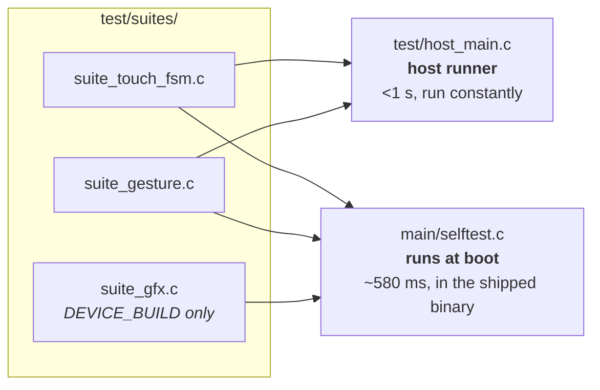
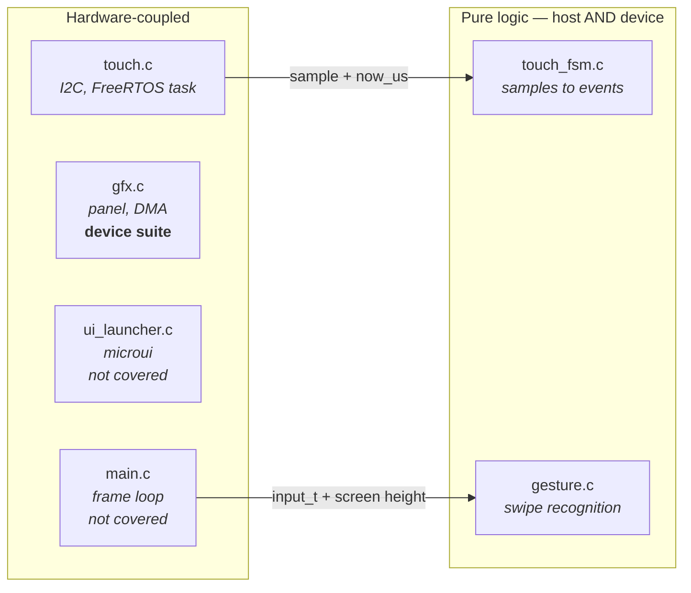
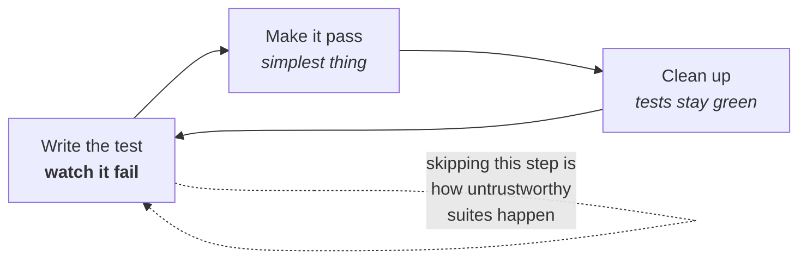

# Testing Guide

How this project tests firmware, and why it is set up the way it is. Read this
before adding a test or deciding something "can't be tested".

Living document: update it when the approach changes.

---

## Running them

```sh
./launcher/test/run_tests.sh     # the portable suites, on this machine
```

The device suites run themselves — flash the firmware and watch the console:

```sh
./monitor.sh                     # look for SELFTEST_COMPLETE failures=0
```

POSIX sh — works under Git Bash or MSYS on Windows and natively on Linux and
macOS. It finds a compiler via `$CC`, then `PATH`, then the location winget
installs MinGW to on Windows, and tells you how to install one if there is
none.

Requires a **host** compiler, not the ESP32 toolchain:

| Platform | |
|---|---|
| Windows | `winget install BrechtSanders.WinLibs.POSIX.UCRT` |
| Debian/Ubuntu | `sudo apt install build-essential` |
| macOS | `xcode-select --install` |

---

## Two runners, one set of suites

The suites in `test/suites/` are compiled into **both** runners. Nothing is
written twice.



**The host runner is the TDD loop.** Under a second, so red-green-refactor is
actually practical — a ninety-second build-and-flash is not a loop anyone
sustains. It runs the portable suites only.

**The device run is the guarantee.** It runs *every* suite, including the
portable ones. That is deliberate: passing on a laptop only proves the logic is
right on x86, whereas running on-target proves the same source behaves
identically built by the RISC-V toolchain and executed on this chip.

Critically, **there is no separate test firmware**. The suites ship inside the
launcher and run from `app_main` before the shell starts, so what gets verified
is byte-for-byte the binary that ships. A test-only build could drift from
production; this cannot.

A failing self test is logged, not fatal. A board with a broken clip rect is
still more useful than a board that refuses to boot.

---

## Making things testable

Two techniques carry almost all of it.

### Pass time in, never read a clock

`touch_fsm_update()` takes `now_us` as an argument rather than calling
`esp_timer_get_time()`:

```c
void touch_fsm_update(touch_fsm_t *fsm, bool have_point,
                      int x, int y, int64_t now_us);
```

That single choice is what lets a test assert a 60 ms debounce *instantly*
instead of sleeping, and lets it construct sequences — a dropout in the middle
of a touch — that are genuinely awkward to produce on real hardware.

Any timeout, debounce, animation or rate limit should take time as a parameter.

### Pass the environment in, don't reach for it

`gesture_is_home_swipe()` takes the screen height rather than including
`gfx.h`:

```c
bool gesture_is_home_swipe(const input_t *input, int screen_height);
```

So it depends on nothing, links against nothing, and can be tested at any
resolution including ones no real panel has.

### The resulting shape

Hardware access and interpretation live in separate files. The split is the
whole technique:



Note the direction of the arrows: the hardware side calls *into* the pure side
and hands it everything it needs. The pure modules never call back, never
include a hardware header, and never read a global. That is what makes them
linkable on their own.

When something feels untestable, it is usually one file doing both jobs. Split
it.

---

## Conventions

**Suites do not own the runner.** No suite defines `setUp`/`tearDown` or calls
`UNITY_BEGIN`/`UNITY_END`, because several share one binary. Each keeps a
`fixture()` helper and calls it at the top of every test, so a test never
inherits state from the one before it.

**A suite exercises one unit.** Needing a second is usually a sign the unit is
doing too much, so think before working around it.

**Warnings are errors.** A host compiler catches a class of mistake the target
build will happily miss, and strictness costs nothing in tests.

**Name tests as sentences about behaviour.** `test_brief_dropout_is_not_a_release`,
not `test_debounce_2`. The name should say what broke when it goes red.

**One behaviour per test.** Several assertions are fine when they describe one
behaviour; two unrelated behaviours should be two tests, or the second never
runs once the first fails.

**Put the why in the message**, not a comment:

```c
TEST_ASSERT_FALSE_MESSAGE(second.pressed,
    "an edge must be consumed by the frame that reads it");
```

That message is what a future reader sees at the moment of failure, which is
exactly when they need it.

---

## The loop



The failing step is not ceremony. A test never seen red might be asserting
nothing at all, and you will not find out until it fails to catch a regression.

---

## Prove a test can fail

A test that cannot fail is decoration, and a green suite that was never seen red
proves nothing. When adding one, **break the implementation deliberately and
watch it go red**, then restore.

This was done for the debounce: setting `TOUCH_RELEASE_QUIET_US` to `0` turned
exactly `test_brief_dropout_is_not_a_release` and
`test_contact_resuming_after_a_dropout_does_not_re_press` red, with their
messages explaining why, and the runner exited non-zero. That is the evidence
the rest of the suite is worth anything.

---

## What to test first

Bias toward the things that have already hurt. Every current test exists
because of a real bug:

- `test_brief_dropout_is_not_a_release` — the FT5x06's INT line signals "data
  ready", not "finger down", and drops mid-touch. Treating that as a lift made
  a held finger flicker.
- `test_contact_resuming_after_a_dropout_does_not_re_press` — the same fault
  seen from the other side.
- The gesture boundary tests — thresholds that must be forgiving enough to
  trigger with a fingertip and strict enough never to fire during normal use.

A bug found on hardware should become a test before it is fixed — a host one if
the logic can be extracted, a device one if it genuinely needs the chip. That is
the cheapest moment to capture it, and the only thing that stops it returning.

---

## What the device suite covers, and what is still untested

`suite_gfx.c` covers what a host structurally cannot:

- **Framebuffer read-back** — after `gfx_fill_rect`, count the pixels that
  actually changed and assert it is exactly `w*h`, with neighbours untouched.
- **Clipping at every edge**, including rectangles straddling the boundary. If
  clipping were wrong this would corrupt memory rather than fail politely.
- **Colour packing** under the target's real endianness and integer promotion.
- **DMA completion** — `gfx_present()` returning at all is the regression guard
  for the counting-semaphore deadlock, which was impossible to catch off-device.
  If it ever regresses the call never returns, boot hangs, and that is the
  correct, loud outcome.

Still untested: `ui_launcher.c`'s microui integration and the small3dlib
rendering. Both are verified by running the firmware and looking at the screen.
Worth being honest about rather than implying coverage we do not have.

The framework is Unity — the ThrowTheSwitch C library, no relation to the game
engine. The host runner uses a vendored copy; the device uses the one ESP-IDF
already bundles. Same API, so the suites do not care which they are built
against.

---

## Adding a suite

1. Create `launcher/test/suites/suite_<name>.c`.
2. Write the tests, then a `void run_<name>_suite(void)` that calls
   `RUN_TEST(...)` for each. Do **not** define `setUp`/`tearDown` or call
   `UNITY_BEGIN`/`UNITY_END` — the runners own those, because several suites
   share one binary. Give the suite its own `fixture()` helper instead and call
   it at the top of each test.
3. Declare it in `test/suites.h`. Guard it with `#ifdef DEVICE_BUILD` if it
   needs hardware.
4. Register it: in `test/host_main.c` if portable, and in `main/selftest.c`
   either way.
5. Add the source to `main/CMakeLists.txt`, and to `SOURCES` in
   `test/run_tests.sh` if portable.
6. Break the implementation, confirm red, restore.
