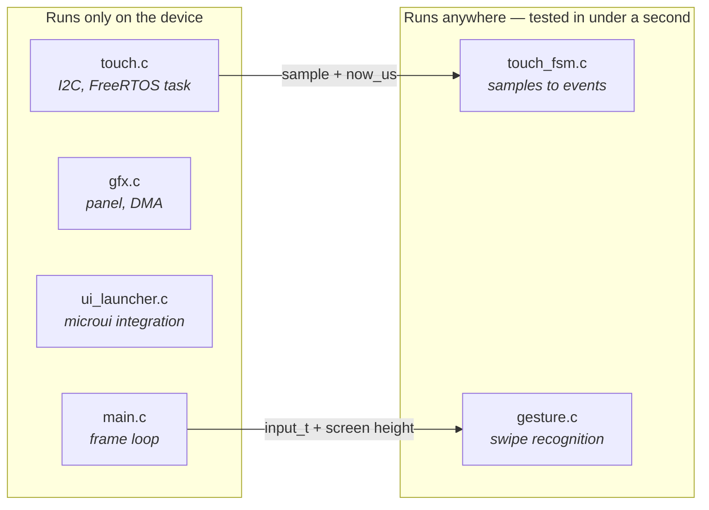
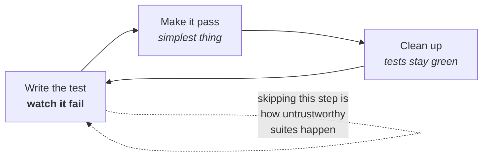

# Testing Guide

How this project tests firmware, and why it is set up the way it is. Read this
before adding a test or deciding something "can't be tested".

Living document: update it when the approach changes.

---

## Running them

```sh
./launcher/test/run_tests.sh          # everything
./launcher/test/run_tests.sh touch    # suites matching "touch"
./launcher/test/run_tests.sh -q       # summaries only
```

POSIX sh — works under Git Bash or MSYS on Windows and natively on Linux and
macOS. It finds a compiler via `$CC`, then `PATH`, then the location winget
installs MinGW to on Windows, and tells you how to install one if there is
none.

Requires a **host** compiler, not the ESP32 toolchain:

| Platform | |
|---|---|
| Windows | `winget install BrechtSanders.WinLibs.POSIX.UCRT` |
| Debian/Ubuntu | `sudo apt install build-essential` |
| macOS | `xcode-select --install` |

---

## The one rule: tests run on the host, not the device

Everything follows from this. A build-and-flash cycle is about ninety seconds;
the host suite is under a second. Red-green-refactor is not a practice you can
sustain at ninety seconds a turn — it is the difference between writing tests
and actually doing TDD.

The cost is that **only hardware-free logic can be tested**, which is not a
limitation so much as a design forcing function. It pushes decisions out of
hardware-coupled code and into units that can be reasoned about, which is where
the bugs were anyway.

---

## Making things testable

Two techniques carry almost all of it.

### Pass time in, never read a clock

`touch_fsm_update()` takes `now_us` as an argument rather than calling
`esp_timer_get_time()`:

```c
void touch_fsm_update(touch_fsm_t *fsm, bool have_point,
                      int x, int y, int64_t now_us);
```

That single choice is what lets a test assert a 60 ms debounce *instantly*
instead of sleeping, and lets it construct sequences — a dropout in the middle
of a touch — that are genuinely awkward to produce on real hardware.

Any timeout, debounce, animation or rate limit should take time as a parameter.

### Pass the environment in, don't reach for it

`gesture_is_home_swipe()` takes the screen height rather than including
`gfx.h`:

```c
bool gesture_is_home_swipe(const input_t *input, int screen_height);
```

So it depends on nothing, links against nothing, and can be tested at any
resolution including ones no real panel has.

### The resulting shape

Hardware access and interpretation live in separate files. The split is the
whole technique:



Note the direction of the arrows: the hardware side calls *into* the pure side
and hands it everything it needs. The pure modules never call back, never
include a hardware header, and never read a global. That is what makes them
linkable on their own.

When something feels untestable, it is usually one file doing both jobs. Split
it.

---

## Conventions

**A suite links only its own unit.** `test_foo.c` is compiled against
`main/foo.c` and nothing else. Adding a suite therefore needs no change to the
runner — but a suite that needs a second unit is a signal the unit is doing too
much, so think before working around it.

**Warnings are errors.** A host compiler catches a class of mistake the target
build will happily miss, and strictness costs nothing in tests.

**Name tests as sentences about behaviour.** `test_brief_dropout_is_not_a_release`,
not `test_debounce_2`. The name should say what broke when it goes red.

**One behaviour per test.** Several assertions are fine when they describe one
behaviour; two unrelated behaviours should be two tests, or the second never
runs once the first fails.

**Put the why in the message**, not a comment:

```c
TEST_ASSERT_FALSE_MESSAGE(second.pressed,
    "an edge must be consumed by the frame that reads it");
```

That message is what a future reader sees at the moment of failure, which is
exactly when they need it.

---

## The loop



The failing step is not ceremony. A test never seen red might be asserting
nothing at all, and you will not find out until it fails to catch a regression.

---

## Prove a test can fail

A test that cannot fail is decoration, and a green suite that was never seen red
proves nothing. When adding one, **break the implementation deliberately and
watch it go red**, then restore.

This was done for the debounce: setting `TOUCH_RELEASE_QUIET_US` to `0` turned
exactly `test_brief_dropout_is_not_a_release` and
`test_contact_resuming_after_a_dropout_does_not_re_press` red, with their
messages explaining why, and the runner exited non-zero. That is the evidence
the rest of the suite is worth anything.

---

## What to test first

Bias toward the things that have already hurt. Every current test exists
because of a real bug:

- `test_brief_dropout_is_not_a_release` — the FT5x06's INT line signals "data
  ready", not "finger down", and drops mid-touch. Treating that as a lift made
  a held finger flicker.
- `test_contact_resuming_after_a_dropout_does_not_re_press` — the same fault
  seen from the other side.
- The gesture boundary tests — thresholds that must be forgiving enough to
  trigger with a fingertip and strict enough never to fire during normal use.

A bug found on hardware should become a host test before it is fixed. That is
the cheapest moment to capture it, and it is the only thing that stops it
returning.

---

## What is deliberately not tested here

Anything needing the panel, I2C, DMA or FreeRTOS: `gfx.c`, `touch.c`'s polling
task, `ui_launcher.c`'s microui integration, and the small3dlib rendering.
Those are verified by running the firmware and looking at the screen.

That is a real gap, and worth being honest about rather than pretending
coverage. If it starts to bite, ESP-IDF bundles the same test framework
(Unity — the ThrowTheSwitch C library, no relation to the game engine) so an
on-target suite could share the assertion vocabulary. It would run at
flash speed, so it belongs as a pre-commit check rather than a TDD loop.

---

## Adding a suite

1. Create `launcher/test/src/test_<unit>.c`.
2. Provide `setUp()` and `tearDown()` — Unity requires both even if empty.
3. Write the tests, then a `main()` that calls `UNITY_BEGIN()`, each
   `RUN_TEST(...)`, and returns `UNITY_END()`.
4. Run `./launcher/test/run_tests.sh`. It picks the file up automatically and
   links `main/<unit>.c` by name.
5. Break the implementation, confirm red, restore.
